# Progettazione concettuale

## Proprietà

I tipi **primitivi** di dati sono:
- `int`
- `real`
- `bool`
- `date`
- `string`

I tipi **non primitivi**, invece, sono:
- `[A: T, B: S, ...]` (i.e. record), dove `A` e `B` sono etichette mentre `T` ed `S` sono tipi
- `(A; B; ...)` (i.e. enumerazione; e.g. `(M; F)`), dove `A` e `B` sono etichette
- `seq T` (i.e. sequenza; e.g. `seq int`), dove `T` è un tipo

Tra le limitazioni applicate ai dati, ci sono i **vincoli di integrità**:
- **statici**: il dominio del dato è limitato durante l'**inserimento**
- **dinamici**: il cambiamento è limitato durante la **modifica**

## Cardinalità

La **cardinalità** di un'associazione fra `X` e `Y` descrive la **molteplicità** di `X -> Y` e di `Y -> X`:

| | `[1:1]` | `[1:N]` | `[N:1]` | `[N:N]` |
|:-:|:-:|:-:|:-:|:-:|
| Ognuno di `X` con al massimo | uno di `Y` | molti di `Y` | uno di `Y` | molti di `Y` |
| Ognuno di `Y` con al massimo | uno di `X` | uno di `X` | molti di `X` | molti di `X` |

Nello schema, le **associazioni** sono rappresentate come,
- nel caso `[1:1]` **totale**:
	```dot process
	digraph {
		rankdir=LR
		node [shape=record]
		edge [arrowsize=0.5 dir=both]
		A -> B
	}
	```

- nel caso `[N:1]` **totale**:
	```dot process
	digraph {
		rankdir=LR
		node [shape=record]
		edge [arrowsize=0.5 dir=both]
		A -> B [arrowtail=normalnormal]
	}
	```

- nel caso `[1:N]` **parziale**, dove ognuno di `A` è associato con **zero o più** di `B`:
	```dot process
	digraph {
		rankdir=LR
		node [shape=record]
		edge [arrowsize=0.5 dir=both]
		A -> B [arrowhead=normalnormalnonetee]
	}
	```

Per esempio, nel caso di:
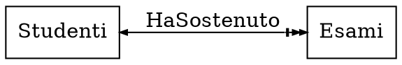
ogni studente ha sostenuto _zero o più_ esami, mentre ogni esame è sostenuto da _uno ed un solo_ studente.

## Associazioni

Nel caso in cui l'**associazione contenga proprietà**, come
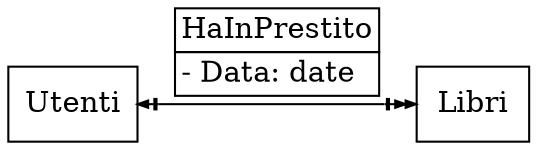
la relazione viene trasformata in un'ulteriore entità:
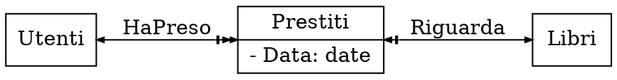

Se invece è **ricorsiva** vengono aggiunte delle etichette che determinano il **ruolo** dell'entità, per esempio:
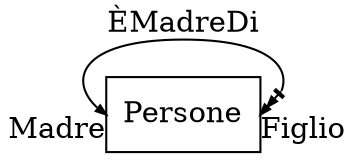
per cui _una persona può essere madre di più figli_ e _una persona è figlia di una e una sola madre_.

## Ereditarietà

L'**ereditarietà** permette di specializzare una classe in più _sottoclassi_.
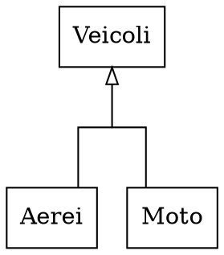

Perchè l'**integrità** sia preservata però, vanno imposti **vincoli**:
- **estensionali**: le _entry_ fanno parte della superclasse, quindi le **associazioni vengono ereditate**
- **intensionali**: i tipi delle _entry_ devono essere **sottotipi** di quelli nella superclasse

Per esempio, `Pixel` fa parte di `Spazio` (_vincolo estensionale_) e `int` è sottotipo di `real` (_vincolo intensionale_):
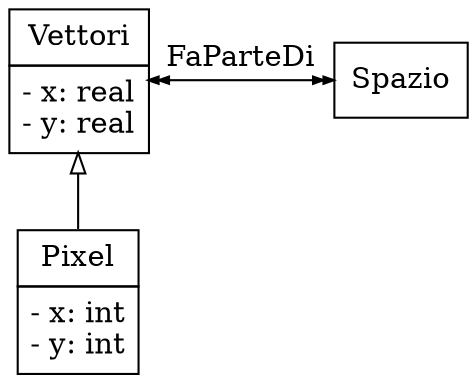

Di conseguenza, le _entità_ vengono estese partendo da altre **aggiungendo** o **ridefinendo** attributi:
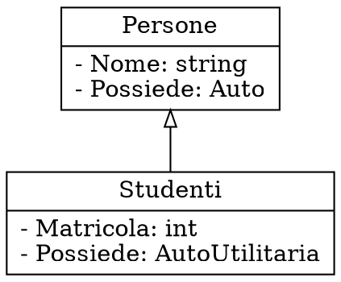

Oltre ad essere **singole**, le gerarchie possono anche essere **multiple** se è definita da più classi:
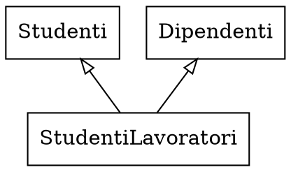

Inoltre, possono anche essere applicati dei **vincoli** di:
- **disgiunzione**, per cui $B \cap C = \emptyset$:
	```dot process
	digraph {
		rankdir=BT
		splines=ortho
		node [shape=record]
		edge [dir=none]

		subgraph {
			rank=same
			B
			C
		}

		0 [shape=point width=0.08]
		0 -> A [dir=forward arrowhead=onormal]
		B, C -> 0
	}
	```

- **copertura**, per cui $B \cup C = A$:
	```dot process
	digraph {
		rankdir=TB
		node [shape=record]
		edge [dir=none]

		{
			rank=same
			0, 1, 2 [shape=point width=0]
			1 [width=0.08]
			0 -> 1 -> 2
		}

		A -> 1 [dir=back arrowtail=onormal color="black:black"]

		{
			rank=same
			B
			C
		}

		0 -> B [weight=100]
		2 -> C [weight=100]
	}
	```

## Esempi

### Museo

```
Si vuole costruire una base di dati per memorizzare informazioni su un museo d’arte. Il museo
ha una collezione di oggetti d’arte. Ogni oggetto d’arte ha un numero identificativo, un
artista (se noto), un anno (in cui è stato creato), un titolo e una descrizione. Gli oggetti
d’arte sono classificati in base al loro tipo. I tre tipi principali sono: Dipinto, Scultura e
Statua, più un altro tipo detto Altro per accogliere oggetti che non rientrano in uno dei tre
tipi principali. Un dipinto ha un tipo-pittura (olio, acquarello, etc), un materiale su cui è
stato steso (carta, tela di canapa, legno, etc.), e uno stile (moderno, astratto etc.). Una
scultura o una statua ha un materiale con cui è stata creata (legno, pietra, etc.),
un’altezza, un peso e uno stile. Un oggetto d’arte nella categoria Altro ha un tipo (stampa,
foto etc) e uno stile. Il museo memorizza informazioni sugli artisti: nome, data di nascita,
data di morte (se non è vivente), paese di origine e lo stile principale. Nel museo sono
organizzate delle esposizioni, ognuna delle quali ha un nome, una data di inizio e una data di
fine, ed è collegata a tutti gli oggetti d’arte che sono stati esposti durante l’esposizione.
```

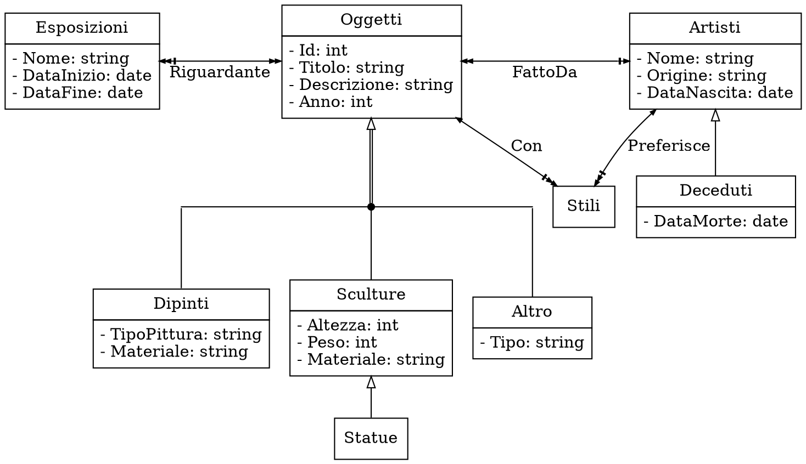

### Scacchi

```
Un'associazione scacchistica vuole costruire una base di dati per la propria gestione.
Nell'associazione ci sono soci ordinari e soci onorari. Un socio ha nome, cognome, anno di
nascita, telefono, indirizzo. Se un socio è ordinario vogliamo sapere anche se ha pagato la
quota associativa per l'anno in corso oppure no. L'associazione organizza tornei a cui
possono partecipare anche degli ospiti (cioè delle persone non dell'associazione: di questi
interessa nome, cognome, anno di nascita, nazionalità). In un torneo si svolgono delle
partite. Le partite hanno due giocatori che sono soci o ospiti e un arbitro, che è sempre un
socio, ha una data e un vincitore (oppure è una patta e non c'è vincitore). Un torneo ha
anche una data d'inizio e una di fine e il vincitore del torneo.
```

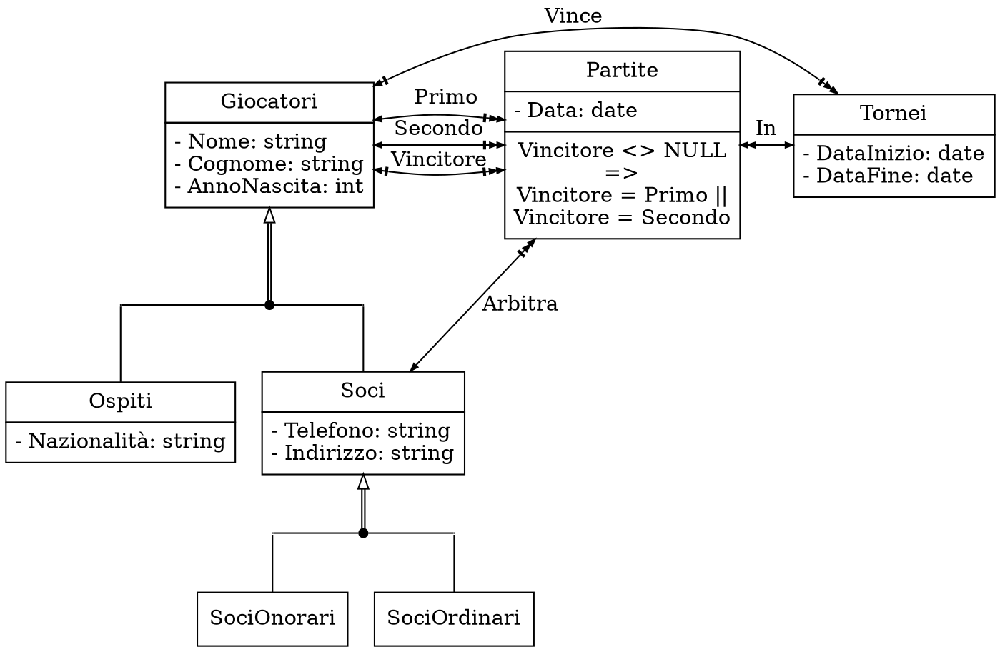

L'associazione `Vince`, da `Tornei` a `Giocatori` può essere zero nel caso in cui il torneo sia ancora in corso.

### Aeroporto privato

```
Si vuole realizzare una base di dati per gestire le informazioni relative a un piccolo
aeroporto privato. Ogni aeroplano ha un numero di matricola, che lo identifica, è di un certo
tipo ed è posto in un hangar specifico. Ogni tipo di aeroplano ha un numero di modello, una
capacità e un peso. Ogni hangar ha un numero, una capienza e un’ubicazione. Gli aerei hanno un
unico proprietario che può essere una persona fisica o un’azienda. Per un’azienda si è
interessati alla ragione sociale, all’indirizzo e all’email. Per le persone si vuole
memorizzare nome, cognome, l’indirizzo e più numeri di telefono. I proprietari possono
possedere più aerei e per ciascuno si vuole memorizzare la data di acquisto. Si vuole tenere
traccia delle manutenzioni effettuate agli aerei. Ogni aereo è sottoposto molte volte al
servizio di manutenzione e per ciascun intervento si vuole memorizzare la data di manutenzione,
il tipo di lavoro effettuato e i meccanici che hanno svolto l’intervento e le ore che vi hanno
dedicato (possono essere diverse per i vari meccanici). Per i meccanici si vuole memorizzare
il nome, cognome e lo stipendio e i tipi di aeroplani su cui possono lavorare.
```

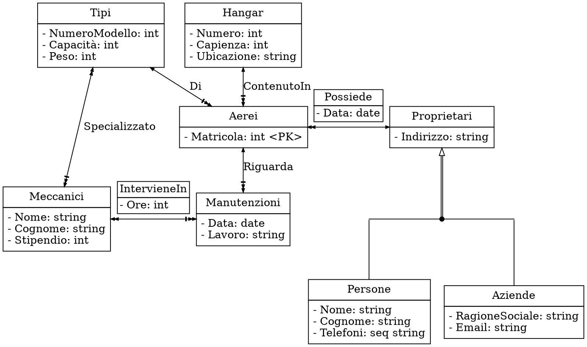

Dove `Di`, da `Tipi` ad `Aerei` può essere zero se un meccanico è specializzato in tipi di aerei non presenti.

### Scuola di canto

```
Si vuole costruire una base di dati per la gestione di una scuola di canto. La scuola di canto
dà la possibilità di certificare i livelli di preparazione per ciascun studente. Ogni livello
è identificato da un codice e possiede una descrizione che specifica gli obiettivi didattici
che devono essere raggiunti. Per ogni livello ci sono dei brani musicali che lo studente dovrà
interpretare per poter ricevere il certificato che attesta di aver raggiunto un certo livello
di preparazione. Per ogni studente della scuola, identificato dal codice fiscale, è necessario
sapere quando è stato superato un certo livello di preparazione. Ogni studente ha dei recapiti
telefonici per contattarlo e un proprio repertorio di brani, che non necessariamente devono
coincidere con quelli dei livelli di preparazione. Ogni brano deve avere il titolo, la durata
e l’autore che l’ha composto. Gli studenti della scuola si possono esibire in alcuni locali,
di cui si vuole memorizzare il nome e l’indirizzo e le serate organizzate. Per ogni studente
si vuole registrare la serata in cui si è esibito e le canzoni che ha cantato. Per ogni serata
si vuole sapere il numero di consumazioni vendute per poter permettere al locale di richiamare
i cantanti che attirano più pubblico.
```

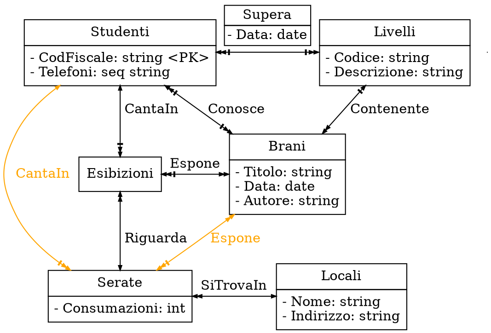

Dove le frecce _arancioni_ indicano lo schema senza `Esibizioni`, in cui le serate riguardano _un solo_ studente.
