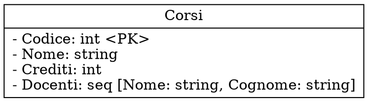
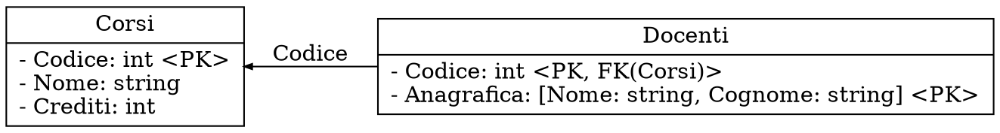
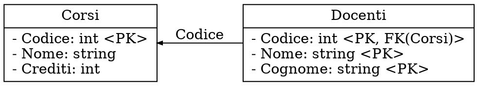

# Progettazione logica

Per avvicinarci alla _progettazione fisica_ il _modello ad oggetti_ va prima trasformato nel **modello relazionale**.

In questo _modello_, gli attributi sono **solamente primitivi**, e vengono introdotti i **vincoli** di:
- **Chiave**

	I sottoinsiemi degli attributi che costituiscono possibili chiavi sono dette **superchiavi**.
	Solamente quelle **minime**, i.e. composte da attributi che insieme la rendono unica, possono diventare **chiavi primarie**.

	Per esempio, di
	```
	Studenti(Matricola: int, Nome: string, Cognome: string)
	```
	le _superchiavi_ sono:
	- `(Matricola, Nome, Cognome)`: l'_intera ennupla_ è **sempre** superchiave
	- `(Matricola, Nome)`: non è _minima_ perchè rimane superchiave senza `Nome`, come per `Cognome`
	- `(Matricola)`: è _minima_ e quindi è **chiave** e può essere _chiave primaria_

- **Chiave esterna**

	Quando un attributo **punta** alla _chiave primaria_ di un ennupla **esistente** in un'altro oggetto.

- Valori **non nulli**

	Se un attributo **parziale** è sconosciuto o senza valore si utilizza `NULL`, mentre sugli attributi **totali** viene specificato il _vincolo non nullo_.
	La _chiave primaria_ invece, dovrà **sempre** essere _non nulla_.

Un'**istanza** dello schema viene detta **valida** quando rispetta tutti i vincoli e l'_integrità_ è rispettata.

## Trasformazione

1. **Associazioni** `[1:1]`

	```dot process
	digraph {
		rankdir=LR
		node [shape=record]
		edge [arrowsize=0.5 dir=both]
		A [label="A | - Attributi"]
		B [label="B | - Attributi"]
		A -> B [
			label=<<table border="0" cellborder="1" cellspacing="0">
				<tr><td>R</td></tr>
				<tr><td align="left">- Attributi</td></tr>
				<tr><td border="0"></td></tr>
			</table>>
			arrowtail=normalnonetee
		]
	}
	```
	diventa
	```dot process
	digraph {
		rankdir=LR
		node [shape=record]
		edge [arrowsize=0.5 dir=forward]
		A [label="A | - Attributi\l- R &lt;FK(B), NOT NULL, UNIQUE&gt;\l- R.Attributi\l"]
		B [label="B | - Attributi"]
		A -> B [label="R"]
	}
	```
	che specifica `NOT NULL` perchè **totale** da `A` a `B` e `UNIQUE` perchè per ogni `B` c'è un solo `A`.

	La relazione è preferibile inserirla in `A` per **non perdere l'informazione di totalità** da `A` a `B`.

2. **Associazioni** `[N:1]` e `[1:N]`

	```dot process
	digraph {
		rankdir=LR
		node [shape=record]
		edge [arrowsize=0.5 dir=both]
		A [label="A | - Attributi"]
		B [label="B | - Attributi"]
		A -> B [label="R" arrowhead=normalnonetee arrowtail=normalnormal]
	}
	```
	diventa
	```dot process
	digraph {
		rankdir=LR
		node [shape=record]
		edge [arrowsize=0.5 dir=forward]
		A [label="A | - Attributi\l- R &lt;FK(B)&gt;\l"]
		B [label="B | - Attributi"]
		A -> B [label="R" arrowhead=normalnonetee]
	}
	```

3. **Associazioni** `[N:N]`

	```dot process
	digraph {
		rankdir=LR
		node [shape=record]
		edge [arrowsize=0.5 dir=both]
		A [label="A | - Attributi"]
		B [label="B | - Attributi"]
		A -> B [
			label=<<table border="0" cellborder="1" cellspacing="0">
				<tr><td>R</td></tr>
				<tr><td align="left">- Attributi</td></tr>
				<tr><td border="0"></td></tr>
			</table>>
			arrowhead=normalnormal
			arrowtail=normalnormal
		]
	}
	```
	diventa
	```dot process
	digraph {
		rankdir=LR
		node [shape=record]
		edge [arrowsize=0.5]
		A [label="A | - Attributi"]
		B [label="B | - Attributi"]
		R [label="R | - A &lt;PK, FK(A)&gt;\l- B &lt;PK, FK(B)&gt;\l- Attributi\l"]
		A -> R [dir=back]
		R -> B [dir=forward]
	}
	```
	perdendo ogni riferimento di _totalità_.

	Nel caso **ricorsivo**, invece:
	```dot process
	digraph {
		rankdir=LR
		node [shape=record]
		edge [arrowsize=0.5 dir=both]

		Persone [label="Persone | - Id: int &lt;PK&gt;"]

		Persone:w -> Persone:e [
			label="ÈAmicoDi"
			arrowhead=normalnormalnonetee
			arrowtail=normalnormalnonetee
		]
	}
	```
	diventa
	```dot process
	digraph {
		rankdir=LR
		node [shape=record]
		edge [arrowsize=0.5 dir=back]

		Persone [label="Persone | - Id: int &lt;PK&gt;"]
		Amici [label="Amici | - Id: int &lt;PK, FK(Persone)&gt;\l- Amico: int &lt;PK, FK(Persone)&gt;\l"]

		Persone -> Amici
		Persone -> Amici
	}
	```

3. **Ereditarietà**

	L'ereditarietà ha **diversi modi** di essere risolta, infatti
	```dot process
	digraph {
		rankdir=TB
		node [shape=plain]
		edge [arrowsize=0.5 dir=none]

		{
			rank=same
			3, 4 [shape=point width=0 height=inf style=invis]
			A [
				label=<<table border="0" cellborder="1" cellspacing="0" cellpadding="5">
					<tr><td>A</td></tr>
					<tr><td align="left">- K &lt;PK&gt;<br align="left"/>- Attributi<br align="left"/>- R &lt;FK(...)&gt;</td></tr>
				</table>>
			]
		}

		3 -> A [label="S" dir=forward]
		A -> 4 [label="R" dir=forward]

		{
			rank=same
			0, 1, 2 [shape=point width=0 height=inf]
			0 -> 1 -> 2
		}

		A -> 1 [arrowsize=1 dir=back arrowtail=onormal]

		{
			rank=same
			5, 6 [shape=point width=0 height=inf style=invis]
			B [
				label=<<table border="0" cellborder="1" cellspacing="0" cellpadding="5">
					<tr><td>B</td></tr>
					<tr><td align="left">- Attributi</td></tr>
				</table>>
			]
			C [
				label=<<table border="0" cellborder="1" cellspacing="0" cellpadding="5">
					<tr><td>C</td></tr>
					<tr><td align="left">- Attributi<br align="left"/>- W &lt;FK(...)&gt;<br align="left"/></td></tr>
				</table>>
			]
		}

		5 -> B [label="T" dir=forward]
		B -> C [style=invis]
		C -> 6 [label="W" dir=forward]

		0 -> B [weight=100]
		2 -> C [weight=100]
	}
	```
	viene semplificata in:
	- **Relazione unica**, se le sottoclassi hanno pochi attributi:

		```dot process
		digraph {
			rankdir=LR
			node [shape=record]
			edge [arrowsize=0.5 dir=forward]

			A [label="A | - K &lt;PK&gt;\l- Attributi\l- R &lt;FK(...)&gt;\l- B.Attributi\l- C.Attributi\l- W &lt;FK(...)&gt;\l- Discriminatore\l"]

			{
				rank=same
				0, 1 [shape=point width=0 height=inf style=invis]
			}

			0 -> A [label="S"]
			1 -> A [label="T"]

			{
				rank=same
				2, 3 [shape=point width=0 height=inf style=invis]
			}

			A -> 2 [label="R"]
			A -> 3 [label="W"]
		}
		```
		dove `Discriminatore` specifica se `A` assume il ruolo di `B` o di `C`.

	- **Partizionamento verticale**, se `B` e `C` hanno dei vincoli propri:

		```dot process
		digraph {
			rankdir=TB
			node [shape=plain]
			edge [arrowsize=0.5 dir=forward]

			{
				rank=same
				3, 4 [shape=point width=0 height=inf style=invis]
				A [
					label=<<table border="0" cellborder="1" cellspacing="0" cellpadding="5">
						<tr><td>A</td></tr>
						<tr><td align="left">- K &lt;PK&gt;<br align="left"/>- Attributi<br align="left"/>- R &lt;FK(...)&gt;</td></tr>
					</table>>
				]
			}

			3 -> A [label="S"]
			A -> 4 [label="R"]

			A -> B [label="A.K" dir=back]
			A -> C [label="A.K" dir=back]

			{
				rank=same
				5, 6 [shape=point width=0 height=inf style=invis]
				B [
					label=<<table border="0" cellborder="1" cellspacing="0" cellpadding="5">
						<tr><td>B</td></tr>
						<tr><td align="left">- A.K &lt;PK, FK(A)&gt;<br align="left"/>- Attributi<br align="left"/></td></tr>
					</table>>
				]
				C [
					label=<<table border="0" cellborder="1" cellspacing="0" cellpadding="5">
						<tr><td>C</td></tr>
						<tr><td align="left">- A.K &lt;PK, FK(A)&gt;<br align="left"/>- Attributi<br align="left"/>- W &lt;FK(...)&gt;<br align="left"/></td></tr>
					</table>>
				]
			}

			5 -> B [label="T"]
			B -> C [style=invis]
			C -> 6 [label="W"]
		}
		```

	- **Partizionamento orizzontale**, se è di disgiunzione (i.e. $B \cap C = \emptyset$) e `S` non è presente:

		```dot process
		digraph {
			rankdir=LR
			node [shape=plain]
			edge [arrowsize=0.5 dir=forward]

			{
				rank=same
				A [
					label=<<table border="0" cellborder="1" cellspacing="0" cellpadding="5">
						<tr><td>A</td></tr>
						<tr><td align="left">- K &lt;PK&gt;<br align="left"/>- Attributi<br align="left"/>- R &lt;FK(...)&gt;</td></tr>
					</table>>
				]
				B [
					label=<<table border="0" cellborder="1" cellspacing="0" cellpadding="5">
						<tr><td>B</td></tr>
						<tr><td align="left">- A.K &lt;PK&gt;<br align="left"/>- A.Attributi<br align="left"/>- R &lt;FK(...)&gt;<br align="left"/>- Attributi<br align="left"/></td></tr>
					</table>>
				]
			}

			C [
				label=<<table border="0" cellborder="1" cellspacing="0" cellpadding="5">
					<tr><td>C</td></tr>
						<tr><td align="left">- A.K &lt;PK&gt;<br align="left"/>- A.Attributi<br align="left"/>- R &lt;FK(...)&gt;<br align="left"/>- Attributi<br align="left"/>- W &lt;FK(...)&gt;<br align="left"/></td></tr>
				</table>>
			]

			0, 1, 2, 3, 4 [shape=point width=0 height=inf style=invis]

			A -> B [style=invis]
			B -> 4 [label="R"]
			4 -> C [style=invis]

			A -> 0 [label="R"]

			1 -> B [label="T"]
			C -> 2 [label="R"]
			C -> 3 [label="W"]
		}
		```
		in cui `A` può essere omesso se è di **coperatura** (i.e. $A = B \cup C$).

4. **Chiavi primarie**

	Viene scelto un attributo che soddisfa il **vincolo di chiave**, cioè che rende l'ennupla unica. Nel caso non sia presente basterà creare una **chiave sintetica** con un nuovo attributo.

	Se la relazione è una **sottoclasse**, andrà copiata la chiave primaria della _superclasse_.
	Se è una relazione derivante da associazione **molti-a-molti** invece, andranno concatenate le chiavi esterne coinvolte.

5. **Attributi multivalore**

	```dot process
	digraph {
		rankdir=LR
		node [shape=record]

		A [label="A | - K &lt;PK&gt;\l- Attributi\l- S: seq T\l"]
	}
	```
	diventa
	```dot process
	digraph {
		rankdir=LR
		node [shape=record]
		edge [arrowsize=0.5 dir=back]

		A [label="A | - K &lt;PK&gt;\l- Attributi\l"]
		S [label="S | - A.K &lt;PK, FK(A)&gt;\l- S: T &lt;PK&gt;\l"]

		A -> S [label="A.K"]
	}
	```
	se le sequenze `S` **non condividono** elementi tra le varie ennuple di `A`, altrimenti diventa

	```dot process
	digraph {
		rankdir=LR
		node [shape=record]
		edge [arrowsize=0.5]

		A [label="A | - K &lt;PK&gt;\l- Attributi\l"]
		AS [label="A-S | - A.K &lt;PK, FK(A)&gt;\l- S.K &lt;PK, FK(S)&gt;\l"]
		S [label="S | - K &lt;PK&gt;\l- S: T\l"]

		A -> AS [label="A.K" dir=back]
		AS -> S [label="S.K"]
	}
	```
	creando una nuova _chiave sintetica_ su `S`.

6. **Attributi composti**

	```dot process
	digraph {
		rankdir=LR
		node [shape=record]

		A [label="A | - K &lt;PK&gt;\l- Attributi\l- R: [A: T, B: S, ...]\l"]
	}
	```
	diventa
	```dot process
	digraph {
		rankdir=LR
		node [shape=record]

		A [label="A | - K &lt;PK&gt;\l- Attributi\l- R.A: T\l- R.B: S\l- ...\l"]
	}
	```

### Esempio

Data la classe `Corsi` contenente una lista di docenti, si passa da:

rimuovendo gli _attributi multivalore_, a:

ed eliminando gli _attributi composti_ si arriva infine a:

