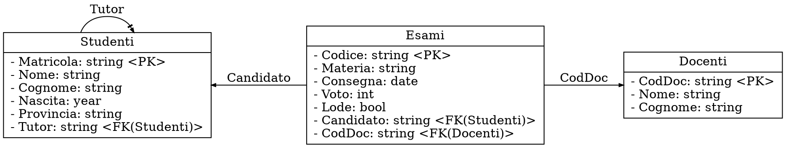

# SQL

## Manipolazione

Tra le **manipolazioni** applicabili alle relazioni, si considera il seguente schema relazionale [trasformato](../02/README.md#trasformazione):



- **Proiezione**

	- $\pi^b_{\text{Materia}, \text{Consegna}}(\text{Esami})$:

		```sql
		select Materia, Consegna from Esami;
		```

	- $\pi_{\text{Materia}, \text{Consegna}}(\text{Esami}) = \delta(\pi^b_{\text{Materia}, \text{Consegna}}(\text{Esami}))$:

		```sql
		select distinct Materia, Consegna from Esami;
		```

	- $\pi^b_{\text{curyear} - \text{Nascita} \text{ as } \text{Anni}}(\text{Studenti})$:

		```sql
		select curyear() - Nascita as Anni from Studenti;
		```

- **Ridenominazione**

	- $\rho_{\text{Anno} \leftarrow \text{Nascita}}(\text{Studenti})$:

		```sql
		select Nascita as Anno from Studenti;
		```

	- $s = \text{Studenti} \leadsto \pi^b_{\text{Matricola}}(s)$:

		```sql
		select s.Matricola from Studenti s;
		```

- **Restrizione**:

	- $\sigma_{\text{Voto} > 26}(\text{Esami})$:

		```sql
		select * from Esami where Voto > 26;
		```

	Supporta anche _condizioni_ come `between` e `like`:
	```sql
	select * from Studenti where Matricola between 71000 and 72000;
	select * from Studenti where Nome like 'A_%i';  -- Corrisponde alla regex /^A..*i$/
	```

- **Unione** e **differenza**:

	- $\sigma_{\text{Provincia} = \text{"VE"}}(\text{Studenti}) \cup \sigma_{\text{Nascita} > 2000}(\text{Studenti})$:

		```sql
		select * from Studenti where Provincia = 'VE'
		union
		select * from Studenti where Nascita > 2000;
		```

	- $\pi^b_{\text{Matricola}}(\text{Studenti}) - \rho_{\text{Matricola} \leftarrow \text{Tutor}}(\pi^b_{\text{Tutor}}(\text{Studenti}))$:

		```sql
		select Matricola from Studenti
		except
		select Tutor as Matricola from Studenti;
		```

- **Prodotto**

	- $\text{Studenti} \times \text{Esami}$:

		```sql
		select * from Studenti, Esami;
		select * from Studenti cross join Esami;
		```

- **Join**

	- $\text{Studenti} \underset{\text{Matricola} = \text{Candidato}}{\bowtie} \text{Esami}$:

		```sql
		select * from Studenti join Esami on Matricola = Candidato;
		```

	- $\text{Esami} \bowtie \text{Docenti}$:

		```sql
		select * from Esami natural join Docenti;
		select * from Esami join Docenti using (CodDoc);
		```

- **Outer join**:

	- $\text{Esami} \overset{\leftrightarrow}{\bowtie} \text{Docenti}$:

		```sql
		select * from Esami full outer join Docenti;
		```

	- $\text{Esami} \overset{\leftarrow}{\bowtie} \text{Docenti}$:

		```sql
		select * from Esami left outer join Docenti;
		```

	- $\text{Esami} \overset{\rightarrow}{\bowtie} \text{Docenti}$:

		```sql
		select * from Esami right outer join Docenti;
		```

- **Intersezione**:

	- $\pi_{\text{Candidato}}(\sigma_{\text{Voto} = 18}(\text{Esami})) \cap \pi_{\text{Candidato}}(\sigma_{\text{Voto} = 30}(\text{Esami}))$:

		```sql
		select Candidato from Esami where Voto = 18
		intersect
		select Candidato from esami where Voto = 30;
		```

- **Raggruppamento**

	- $\gamma_{\mathrm{count}(\text{Voto}),\mathrm{avg}(\text{Voto})}(\text{Esami})$:

		```sql
		select count(distinct Voto), avg(Voto) from Esami;
		```
		con `distinct` che rimuove i duplicati da `Voto` sul conteggio.

	- $_{\text{Candidato}}\gamma_{\text{Candidato}, \mathrm{count}(\ast), \mathrm{avg}(\text{Voto})}(\text{Esami})$:

		```sql
		select Candidato, count(*), avg(Voto) from Esami group by Candidato;
		```
		che permette la _proiezione_ di `Candidato` perchè presente nel `group by`.

	Per poter **restringere il raggruppamento** esiste `having` che agisce sulle funzioni di aggregazione:
	```sql
	select Materia, avg(Voto) from Esami group by Materia having avg(Voto) < 20;
	```

- **Order by**

	Permette di ordinare secondo un attributo in ordine **crescente** con `asc` e **decrescente** con `desc`.

	```sql
	select Nome, Cognome from Studenti order by Cognome asc, Nome asc;
	```

- **Quantificazione esistenziale**

	Sceglie le _tuple_ in cui **almeno un elemento** della _sottoquery_ rispetta una proprietà.

	```sql
	select * from Studenti s where exists (
	  select * from Esami e where e.Candidato = s.Matricola and e.Voto > 27
	);

	select * from Studenti s where s.Matricola = any (
	  select e.Candidato from Esami e where e.Voto > 27
	);

	select * from Studenti s where 27 < any (
	  select e.Voto from Esami e where e.Candidato = s.Matricola
	);

	select * from Studenti s where s.Matricola in (
	  select e.Candidato from Esami e where e.Voto > 27
	);
	```

- **Quantificatore universale**

	Sceglie le _tuple_ in cui **tutti gli elementi** della _sottoquery_ rispettano una proprietà.

	```sql
	select * from Studenti s where not exists (
	  select * from Esami e where e.Candidato = s.Matricola and e.Voto <> 30
	);

	select * from Studenti s where 30 = all (
	  select e.Voto from Esami e where e.Candidato = s.Matricola
	);
	```
	che contengono gli studenti senza esami dato che le _sottoquery_ sono **vuote**, ma si può risolvere con:
	```sql
	select * from Studenti s where not exists (
	  select * from Esami e where e.Candidato = s.Matricola and e.Voto <> 30
	) and exists (
	  select * from Esami e where e.Candidato = s.Matricola
	);
	```

- **Inserimento**, **aggiornamento** e **cancellazione**

	```sql
	insert into Studenti (Matricola, Nome, Cognome) values ('74324', 'Mario', 'Rossi');
	insert into Laureandi as select Matricola from Studenti where Matricola = '74324';

	update Studenti set Tutor = '74324' where Tutor is null;
	update Esami set Voto = Voto + 1 where Voto > 23 and Voto < 30;

	delete from Studenti where Matricola = '74324';
	delete from Studenti where Matricola not in (select Candidato from Esami);
	```

## Definizione

Una base di dati è composta da:
Su una base di dati è possibile definire:

- **Schemi**, cioè un raggruppamento di **tabelle**

	```sql
	create schema Università;
	drop schema Università;
	```

- **Tabelle**, formate da un insieme di **colonne** formate da un _nome_ e un _tipo_

	```sql
	create table Università.Studenti (
	  Nome varchar(10) not null,
	  Cognome varchar(10) not null,
	  Sesso char(1) check(Sesso in ('M', 'F')),
	  Matricola char(6)
	  Nascita date,
	  Provincia char(2) default 'VE',
	  Tutor char(6)
	);
	create table Università.Tutor as
	  select t.Matricola, t.Nome, t.Cognome from Università.Studenti t
	  where t.Matricola in (
	    select s.Tutor from Studenti s where s.Provincia = 'VE'
	  );

	alter table Studenti add column Nazionalità varchar(10) default 'Italiana';
	alter table Studenti drop column Provincia;

	drop table Università.Tutor;  -- Si blocca se ci sono riferimenti (restrict di default)
	drop table Università.Studenti cascade;  -- Cancella gli oggetti che gli riferiscono
	```

- **Vincoli**, per limitare i valori assunti dalle colonne

	```sql
	create table Esami (
	  Codice char(4) primary key,
	  Materia char(3),
	  Candidato char(6) not null,
	  Voto integer check(Voto >= 18 and Voto <= 30),
	  CodDoc char(3) not null,
	  unique (Materia, Candidato),
	  foreign key (Candidato) references Studenti(Matricola)
	    on update cascade
	    on delete set null,
	  foreign key (CodDoc) references Docenti(CodDoc)
	    on update cascade
	    on delete set default
	);

	alter table Studenti add primary key (Matricola);
	alter table Studenti alter column Provincia drop default;
	```

- **Viste**, cioè tabelle virtuali basate su _query_

	```sql
	create view VotiMedi (Matricola, Media) as
	  select e.Candidato, avg(Voto) from Esami e group by e.Candidato;
	create view ProvMax (Provincia, Max) as
	  select s.Provincia, max(e.Voto) from Studenti s
	  join Esami e on s.Matricola = e.Candidato
	  group by s.Provincia;

	select avg(Max) from ProvMax;  -- Media dei voti massimi tra province
	```
