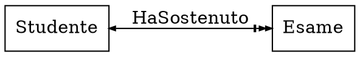
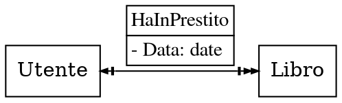
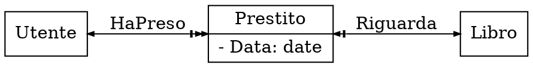
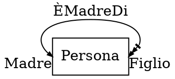
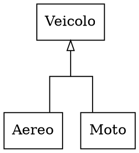
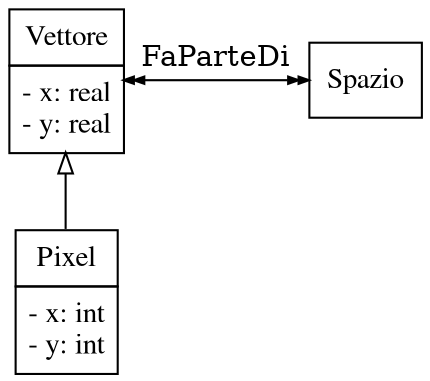
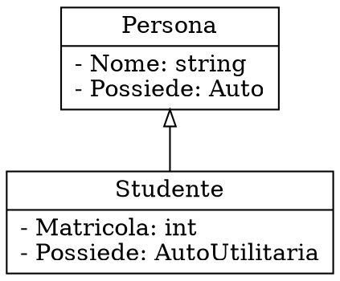
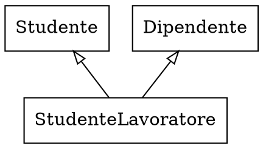
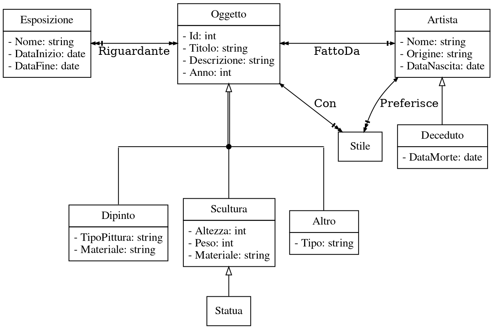

# Basi di dati

## Progettazione concettuale

### Proprietà

I tipi **primitivi** di dati sono:
- `int`
- `real`
- `bool`
- `date`
- `string`

I tipi **non primitivi**, invece, sono:
- `[A: T, B: S, ...]` (i.e. record), dove `A` e `B` sono etichette mentre `T` ed `S` sono tipi
- `(A; B; ...)` (i.e. enumerazione; e.g. `(M; F)`), dove `A` e `B` sono etichette
- `seq T` (i.e. sequenza; e.g. `seq int`), dove `T` è un tipo

Tra le limitazioni applicate ai dati, ci sono i **vincoli di integrità**:
- **statici**: il dominio del dato è limitato durante l'**inserimento**
- **dinamici**: il cambiamento è limitato durante la **modifica**

### Cardinalità

La **cardinalità** di un'associazione fra `X` e `Y` descrive la **molteplicità** di `X -> Y` e di `Y -> X`:

| | `[1:1]` | `[1:N]` | `[N:1]` | `[N:N]` |
|:-:|:-:|:-:|:-:|:-:|
| Ognuno di `X` con al massimo | uno di `Y` | molti di `Y` | uno di `Y` | molti di `Y` |
| Ognuno di `Y` con al massimo | uno di `X` | uno di `X` | molti di `X` | molti di `X` |

Nello schema, le **associazioni** sono rappresentate come,
- nel caso `[1:1]`:
	```dot process
	digraph {
		rankdir=LR
		node [shape=record]
		edge [arrowsize=0.5 dir=both]
		A -> B
	}
	```

- nel caso `[N:1]`:
	```dot process
	digraph {
		rankdir=LR
		node [shape=record]
		edge [arrowsize=0.5 dir=both]
		A -> B [arrowtail=normalnormal]
	}
	```

- nel caso `[1:N]`, dove ognuno di `A` è associato con **zero o più** di `B`:
	```dot process
	digraph {
		rankdir=LR
		node [shape=record]
		edge [arrowsize=0.5 dir=both]
		A -> B [arrowhead=normalnormalnonetee]
	}
	```

Per esempio, nel caso di:

ogni studente ha sostenuto _zero o più_ esami, mentre ogni esame è sostenuto da _uno ed un solo_ studente.

### Associazioni

Nel caso in cui l'**associazione contenga proprietà**, come

la relazione viene trasformata in un'ulteriore entità:


Se invece è **ricorsiva** vengono aggiunte delle etichette che determinano il **ruolo** dell'entità, per esempio:

per cui _una persona può essere madre di più figli_ e _una persona è figlia di una e una sola madre_.

### Ereditarietà

L'**ereditarietà** permette di specializzare una classe in più _sottoclassi_.


Perchè l'**integrità** sia preservata però, vanno imposti **vincoli**:
- **estensionali**: le _entry_ fanno parte della superclasse, quindi le **associazioni vengono ereditate**
- **intensionali**: i tipi delle _entry_ devono essere **sottotipi** di quelli nella superclasse

Per esempio, `Pixel` fa parte di `Spazio` (_vincolo estensionale_) e `int` è sottotipo di `real` (_vincolo intensionale_):


Di conseguenza, le _entità_ vengono estese partendo da altre **aggiungendo** o **ridefinendo** attributi:


Oltre ad essere **singole**, le gerarchie possono anche essere **multiple** se è definita da più classi:


Inoltre, possono anche essere applicati dei **vincoli** di:
- **disgiunzione**, per cui $B \cap C = \emptyset$:
	```dot process
	digraph {
		rankdir=BT
		splines=ortho
		node [shape=record]
		edge [dir=none]

		subgraph {
			rank=same
			B
			C
		}

		0 [shape=point width=0.1]
		0 -> A [dir=forward arrowhead=onormal]
		B, C -> 0
	}
	```

- **copertura**, per cui $B \cup C = A$:
	```dot process
	digraph {
		rankdir=BT
		splines=ortho
		node [shape=record]
		edge [dir=none]

		0 [shape=point width=0]
		0 -> A [dir=forward arrowhead=onormal color="black:invis:black"]

		{
			rank=same
			B
			C
		} -> 0
	}
	```

### Esempi

#### Museo

```
Si vuole costruire una base di dati per memorizzare informazioni su un museo d’arte. Il
museo ha una collezione di oggetti d’arte. Ogni oggetto d’arte ha un numero
indetificativo, un artista (se noto), un anno (in cui è stato creato), un titolo e una
descrizione. Gli oggetti d’arte sono classificati in base al loro tipo. I tre tipi principali
sono: Dipinto, Scultura e Statua, più un altro tipo detto Altro per accogliere oggetti che
non rientrano in uno dei tre tipi principali. Un dipinto ha un tipo-pittura (olio, acquarello,
etc), un materiale su cui è stato steso (carta, tela di canapa, legno, etc.), e uno stile
(moderno, astratto etc.). Una scultura o una statua ha un materiale con cui è stata
creata (legno, pietra, etc.), un’altezza, un peso e uno stile. Un oggetto d’arte nella
categoria Altro ha un tipo (stampa, foto etc) e uno stile. Il museo memorizza
informazioni sugli artisti: nome, data di nascita, data di morte (se non è vivente), paese
di origine e lo stile principale. Nel museo sono organizzate delle esposizioni, ognuna
delle quali ha un nome, una data di inizio e una data di fine, ed è collegata a tutti gli
oggetti d’arte che sono stati esposti durante l’esposizione.
```


