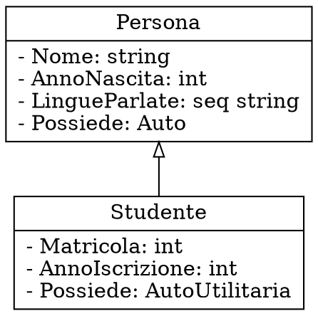

# Basi di Dati

## Progettazione concettuale

### Proprietà

I tipi **primitivi** di dati sono:
- `int`
- `real`
- `bool`
- `date`
- `string`

I tipi **non primitivi**, invece, sono:
- `[A: T, B: S, ...]` (i.e. record), dove `A` e `B` sono etichette mentre `T` ed `S` sono tipi
- `(A; B; ...)` (i.e. enumerazione; e.g. `(M; F)`), dove `A` e `B` sono etichette
- `seq T` (i.e. sequenza; e.g. `seq int`), dove `T` è un tipo

Tra le limitazioni applicate ai dati, ci sono i **vincoli di integrità**:
- **statici**: il dominio del dato è limitato durante l'**inserimento**
- **dinamici**: il cambiamento è limitato durante la **modifica**

### Cardinalità

La **cardinalità** di un'associazione fra `X` e `Y` descrive la **molteplicità** di `X -> Y` e di `Y -> X`:

| | `[1:1]` | `[1:N]` | `[N:1]` | `[N:N]` |
|:-:|:-:|:-:|:-:|:-:|
| Ognuno di `X` con al massimo | uno di `Y` | molti di `Y` | uno di `Y` | molti di `Y` |
| Ognuno di `Y` con al massimo | uno di `X` | uno di `X` | molti di `X` | molti di `X` |

Nello schema, le **associazioni** sono rappresentate come,
- nel caso `[1:1]`:
	```dot process
	digraph {
		rankdir=LR
		node [shape=record]
		edge [arrowsize=0.5 dir=both]
		A -> B
	}
	```

- nel caso `[1:N]`:
	```dot process
	digraph {
		rankdir=LR
		node [shape=record]
		edge [arrowsize=0.5 dir=both]
		A -> B [arrowhead=normalnormal]
	}
	```

- nel caso `[N:1]`, dove ognuno di `A` è associato con **al minimo** uno di `B`:
	```dot process
	digraph {
		rankdir=LR
		node [shape=record]
		edge [arrowsize=0.5 dir=both]
		A -> B [arrowtail=normalnormalnonetee]
	}
	```

Per esempio, nel caso di:

ogni studente può aver sostenuto più esami, mentre ogni esame è sostenuto da uno ed un solo studente.

### Associazioni

Nel caso in cui l'**associazione contenga proprietà**, come

la relazione viene trasformata in un'ulteriore entità:


Se invece è **ricorsiva** vengono aggiunte delle etichette che determinano il **ruolo** dell'entità, per esempio:

per cui _una persona è madre di più figli_ e _una persona è figlia di una e una sola madre_.

### Ereditarietà

Con l'**ereditarietà** è possibile estendere le _entità_ partendo da altre **aggiungendo** o **ridefinendo** attributi:


Oltre ad essere **singole**, le gerarchie possono anche essere **multiple** se è definita da più classi:


Inoltre, possono anche essere applicati dei **vincoli** di:
- **disgiunzione**, per cui $B \cap C = \emptyset$:
	```dot process
	digraph {
		rankdir=BT
		splines=ortho
		node [shape=record]
		edge [dir=none]

		subgraph {
			rank=same
			B
			C
		}

		0 [shape=point width=0.1]
		0 -> A [dir=forward arrowhead=onormal]
		B, C -> 0
	}
	```

- **copertura**, per cui $B \cup C = A$:
	```dot process
	digraph {
		rankdir=BT
		splines=ortho
		node [shape=record]
		edge [dir=none]

		0 [shape=point width=0]
		0 -> A [dir=forward arrowhead=onormal color="black:invis:black"]

		{
			rank=same
			B
			C
		} -> 0
	}
	```
