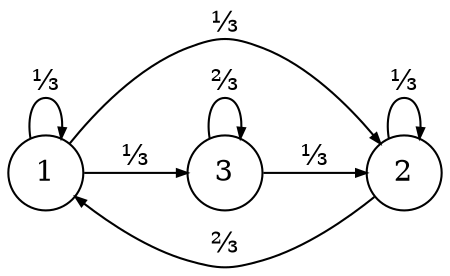

# Catene di Markov

Una **catena di Markov** definisce le relazioni tra $n + 1$ variabili **discrete** con valori $S = \{1, 2, ..., M\}$:
$$
P(X_{n+1} = j \mid X_n = i, X_{n-1} = i_{n-1}, ..., X_0 = i_0) = P(X_{n+1} = j \mid X_n = i) = p_{ij}
$$
e cioè che il **futuro** $X_{n+1}$ dipende solo dal **presente** $X_n$ e non dal **passato** $X_{n-1}, ..., X_0$.

Dato che $i, j \in S$ si può definire la **matrice di transizione**:
$$
P = \begin{pmatrix}
p_{11} & p_{12} & \cdots & p_{1M} \\
p_{21} & p_{22} & \cdots & p_{2M} \\
\vdots & \vdots & \ddots & \vdots \\
p_{M1} & p_{M2} & \cdots & p_{MM}
\end{pmatrix}
$$
in cui la riga $i$ è lo **stato attuale** che contiene le probabilità di ogni **stato futuro** ovvero le colonne $j$, infatti:
- $p_{ij} \geq 0,\ \forall i,j \in S$
- $\sum\limits_{j = 1}^M p_{ij} = 1,\ \forall i \in S$

Per esempio, partendo dallo stato iniziale $\pi^{(0)} = (0, 1, 0)$ su:
$$
P = \begin{pmatrix}
\frac{1}{3} & \frac{1}{3} & \frac{1}{3} \\
\frac{2}{3} & \frac{1}{3} & 0 \\
0 & \frac{1}{3} & \frac{2}{3}
\end{pmatrix}
$$
allora da $\pi^{(0)}$ passo per forza allo stato $2$, quindi $X_0 = 2$ e poi su $\left(\frac{2}{3}, \frac{1}{3}, 0\right)$ scelgo a caso tra lo stato $1$ e $2$:

## Transizione a $n$ passi

In generale, la **probabilità di transizione** in $n$ passi da uno stato $i$ ad uno stato $j$ è:
$$
P(X_n = j \mid X_0 = i) = (\underbrace{P^n}_{P \cdot P \cdot ... \cdot P})_{ij} = p_{ij}^{(n)}
$$
che in **due passi** diventa $P_i \cdot P^j$, per l'esempio precedente:
$$
p_{31}^{(2)} = P(X_2 = 1 \mid X_0 = 3) =
\begin{pmatrix}0 & \frac{1}{3} & \frac{2}{3}\end{pmatrix}
\begin{pmatrix}\frac{1}{3} \\ \frac{2}{3} \\ 0\end{pmatrix} =
\frac{2}{9}
$$

## Probabilità congiunta

Data una successione di variabili, la **probabilità congiunta** corrisponde a:
$$
P(X_0 = i, X_1 = j, X_2 = k, X_3 = m) = \pi_i^{(0)} p_{im}^{(3)} = \underbrace{\pi_i^{(0)}}_{P(X_0 = i)} p_{ij} p_{jk} p_{km}
$$

## Distribuzioni marginali

Dalla **distribuzione marginale** si ricava la probabilità $\pi_i^{(n)} = P(X_n = i)$ di essere allo stato $i$ dopo $n$ passi:
$$
\pi^{(n)} = \pi^{(0)} \cdot P^n = \begin{pmatrix}\pi_1^{(n)} & \pi_2^{(n)} & \cdots & \pi_{M}^{(n)}\end{pmatrix}
$$

## Catene regolari

Una catena si dice **regolare** se esiste un $n$ per cui:
$$
p_{ij}^{(n)} > 0,\ \forall i, j \in S
$$
che è possibile se **esiste sempre un cammino** da un qualsiasi nodo ad un altro.

## Distribuzione stazionaria

Se $P$ è _regolare_ allora possiede una **distribuzione stazionaria** $\pi = (\pi_1, ..., \pi_M)$ per cui:
$$
\lim_{n \to \infty} P^n = \begin{pmatrix}
\pi_1 & \pi_2 & \cdots & \pi_M \\
\pi_1 & \pi_2 & \cdots & \pi_M \\
\vdots & \vdots & \ddots & \vdots \\
\pi_1 & \pi_2 & \cdots & \pi_M
\end{pmatrix}
$$
che rispetterà le proprietà per cui:
- $\pi P = \pi$
- $\sum\limits_{i = 1}^M \pi_i = 1$
