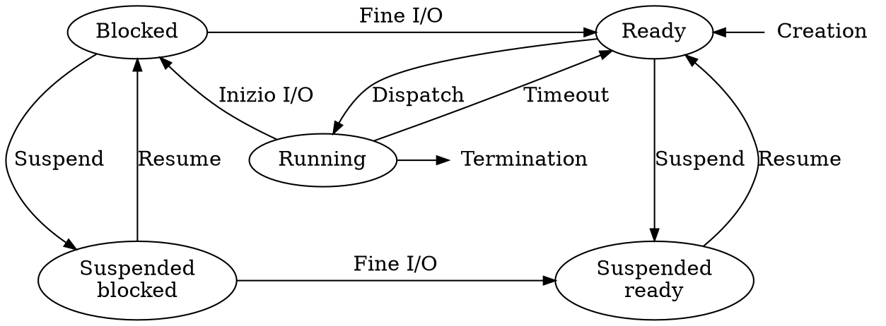

# Processi

Quando una _singola CPU_ è presente viene usato lo **pseudo parallelismo**, per cui ad ogni processo è assegnato uno alla volta una _CPU virtuale_ con _registri_ isolati.

Anche lo **spazio di indirizzamento** è isolato, e contiene le regioni:
- `text`: contente il **codice** del programma
- `data`: contente le **variabili** del programma
- `stack`: contente gli **stack frame** (i.e. variabili locali) delle chiamate delle funzioni in esecuzione

L'**utilizzo** della _CPU_ si può stimare con la [probabilità](../../ct0111/01/README.md#proprietà) che sia _in uso da almeno un processo_ con:
$$
1 - p^n
$$
dove $p$ è la probabilità che un processo sia _in attesa I/O_ mentre $n$ è il _numero di processi_.

## Descrittore

Contenuto nel **Process Control Block** ci sono:
- **PID** (_Process ID_)
- **PPID** (_Parent Process ID_)
- **Stato** del processo
- **Registri** come il _Program Counter_ e lo _Stack Pointer_
- **Priorità** per lo _scheduler_
- **Permessi**
- Puntatore ai segmenti di **memoria**
- Lista dei **dispositivi I/O** allocati

Nel S.O. è salvata una **tabella dei processi** contenente le corrispondenze tra _PID_ e rispettivi _PCB_, per lo _scheduling_ e il **rapido** accesso alle informazioni di ogni processo.

## Operazioni

Su ogni _processo_, il S.O. permette operazioni tra cui:
- **Creazione**

	Un processo è _creato_ durante l'**inizializzazione** del sistema o tramite una **chiamata di sistema**.

	Sono considerati in **foreground** se in uso da utenti, altrimenti sono in **background** (o _demoni_) se forniscono servizi come la gestione di stampa.

	Su _Unix_ un processo può essere **clonato** con la funzione `fork`, copiando l'intera memoria e registri ma mantenendo _spazi di indirizzi_ separati, mentre su _Windows_ può essere **generato** con `CreateProcess`.

- **Chiusura**

	Un processo può essere _chiuso_ per un uscita:
	- **normale**: come `exit(0)`
	- **con errore**: come `exit(1)`
	- **forzata con un'eccezione**: come con `SIGSEGV` (i.e. _Segmentation fault_)
	- **forzata da un altro processo**: come con `SIGKILL`

	All'uscita di un processo con _figli_, il S.O. può o **distruggere i figli** o **consentire la loro esecuzione**.
	Contrariamente a _Unix_, _Windows_ non possiede un concetto di _gerarchia di processi_.

- **Blocco**

	Durante l'attesa della fine di un'**operazione I/O**, il processo viene _bloccato_ per risparmiare _tempo CPU_.

	Nel frattempo un'altro processo continuerà la sua esecuzione, fino alla fine dell'_operazione I/O_.

- **Sospensione** e **ripresa**

	Ad un processo _sospeso_ è **impedita l'esecuzione** all'arrivo del segnale `SIGSTOP` da parte di **un'altro** processo o **se stesso**.
	La _ripresa_ invece, avviene solamente con il segnale `SIGCONT` inviato da un'altro.

## Ciclo di vita

Il S.O. mantiene una **lista ready** per scegliere i processi da eseguire, ed una **lista blocked** per quelli _bloccati_.

Durante il **dispatch** il S.O. assegna il processore ad uno dei processi _pronti_.
Attraverso un _timer ad intervalli_, il S.O. riprende il controllo e causa il **timeout** (o _prelazione_) del processo in esecuzione.

Passando dall'_esecuzione_ a _pronto_ avviene un **cambio di contesto**, in cui viene salvato lo stato del processo nel rispettivo **descrittore** per essere poi caricato alla prossima _esecuzione_.

## Segnali

I processi possono ricevere dei **segnali**, che notificano un evento, come _interruzioni software_.
Il processo può:
- **riceverli**: esegue una funzione per la gestione del _segnale_
- **ignorarli**: lascia la gestione al S.O.
- **mascherarli**: evita che il S.O. li consegni fino alla rimozione del mascheramento

## Comunicazione fra processi

La **IPC** (_Inter-process Communication_) avviene attraverso lo **scambio di messaggi**.
Sono definiti **bloccanti** se il processo che li invia aspetta la conferma di chi li riceve.

Di solito il canale è una **pipe**, cioè un _buffer_ in memoria in cui i processi scrivono i messaggi.

Nei _sistemi distribuiti_ le perdite di messaggi sono evitate con [_acknowledgement_](../../ct0615-2/05/README.md#bus-sincrono-e-asincrono) e _timeout_ per la ritrasmissione.
