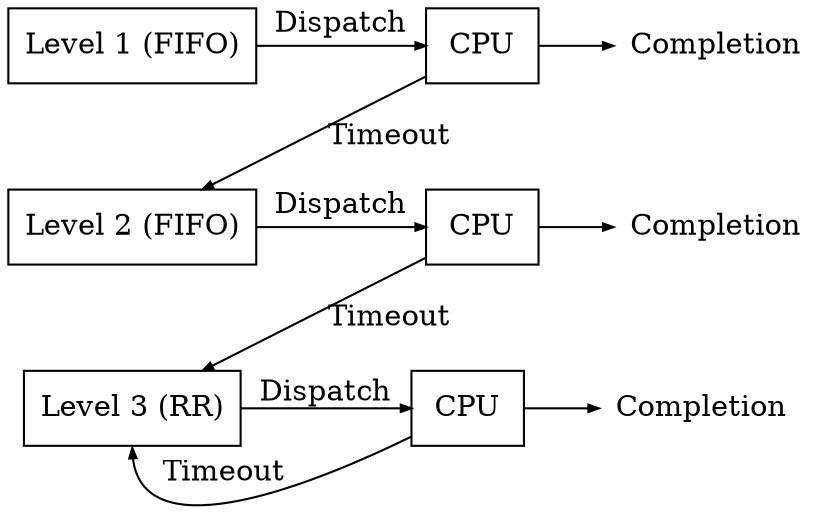

# Scheduling

Lo **scheduler** del S.O. ha il compito di decidere **quale** processo eseguire e per **quanto** tempo.

I **criteri** di _scheduling_ si basano sul tipo di processo, tra cui:
- **Processor-bound**: usa tutto il tempo CPU disponibile
- **I/O-bound**: genera velocemente richieste _I/O_ e lascia il processore
- **Batch**: lavorano senza interazione dell'utente
- **Interattivi**: richiedono frequenti input dell'utente

e ha come **obbiettivi**,
- per **sistemi generali**: l'equità del tempo _CPU_ per ogni processo
- per **sistemi batch**: massimizzare il _throughput_ e l'uso _CPU_
- per **sistemi interattivi**: minimizzare il _tempo di risposta_
- per **sistemi real-time**: rispettare le _scadenze_

## Priorità

Ad ogni _processo_ può essere assegnata **priorità statica**, che ha **basso overhead** perchè **non cambia** nel tempo, oppure **dinamica**, per **aumentare la reazione** in cambio di maggior _overhead_.

Nel caso siano presenti **più utenti** si usa una politica di **fair share**, dove i processi di ogni utente rientrano in un determinato **gruppo**, ognuno dei quali avrà percentuali diverse di risorse utilizzabili.

## Livelli

Lo _scheduler_ può essere suddiviso in **livelli**, per la scelta di quali _processi_ eseguire e quali no:
- **Alto**: sceglie i _job_ di cui cominciare lo _scheduling_
- **Intermedio**: determina quali _processi_ **sospendere** dall'uso della _CPU_
- **Basso**: assegna le **priorità** ed effettua **dispatch** e **timeout**

## Algoritmi

Ogni **algoritmo** di _scheduling_ gestisce **quando** e **quanto** eseguire ogni processo in modo differente.

Lo _scheduling_ può avvenire **senza prelazione**, eseguendo _fino al completamento_ (bloccando altri processi):
- **First In First Out** (_FIFO_, o _First Come First Serve_)

	La scelta di quale processo eseguire avviene **sequenzialmente** in base al suo tempo di arrivo.

	Per esempio, dati i processi $P_1 = 10\text{us}$, $P_2 = 1000\text{us}$ e $P_3 = 5\text{us}$ il loro tempo di **risposta media** sarà $T_m = \frac{10\text{us} + 1010\text{us} + 1015\text{us}}{3} = \frac{2035\text{us}}{3} \approx 678\text{us}$.

- **Shortest Job First** (_SJF_)

	Migliora il _FIFO_ scegliendo il processo con il **minimo tempo stimato**, che può essere però **inaccurato**.

	Dato l'esempio precedente, la _risposta media_ sarà $T_m = \frac{5\text{us} + 15\text{us} + 1015\text{us}}{3} = \frac{1035\text{us}}{3} = 345\text{us}$.

- **Highest Response Ratio Next** (_HRRN_)

	Estende il _SJF_ tenendo conto anche del **tempo di attesa**, per cui più tempo viene eseguito più la priorità si abbassa e più tempo attende più si alza.

Altrimenti può essere **con prelazione**, per migliorare il _tempo di risposta_ (e.g. nei _sistemi interattivi_):
- **Shortest Remaining Time First** (_SRT_)

	Estende il _SJF_ causando il **prelascio** dei processi in esecuzione quando ne è in arrivo uno più corto.

	Migliora il _tempo di risposta medio_, ma **aumenta il tempo** dei processi già lunghi e può anche **aumentare l'overhead** se avvengono _cambi di contesto_ per processi corti o su processi quasi finiti.

- **Round Robin** (_RR_)

	Comincia come il _FIFO_, ma **prelascia** il processo dopo un **quanto di tempo**, mettendolo poi per ultimo.

	La dimensione del _quanto_ va **bilanciata**, perchè se è _troppo piccola_ il _cambio di contesto_ occupa più tempo che l'esecuzione mentre se è _troppo grande_ la reattività del sistema si riduce.

	Idealmente con $n \to \infty$ processi il tempo per tornare ad eseguire il primo sarà $T \to \infty$, ma dato che la memoria è finita, $n \leq M \in \mathbb{N}$ e quindi sarà possibile stimare il massimo tempo richiesto.

- **Priority**

	Consiste nell'assegnare ad ogni processo una **classe di priorità**, che può essere **fissa** o **variabile** (e.g. in base alla dimensione dell'ultimo _quanto_ assegnato).

	Un'implementazione si basa sull'utilizzo di istanze di _round robin_ separate su ogni _classe_ di processi.
	Se però i processi ad _alta priorità_ non terminano, avviene l'**attesa infinita** di quelli a _bassa priorità_.

- **Selfish Round Robin** (_SRR_)

	Gestisce i processi esistenti con _round robin_ e **aumenta la priorità** dei processi nuovi con l'età fino ad entrare in coda.
	Per favorire i processi importanti sarà sufficiente **aumentare la velocità di crescita**.

	In questo modo si evita di fermare i processi più anziani troppo a lungo.

### Code multilivello

Un'alternativa agli algoritmi precedenti sono le **code multilivello**, in cui i processi corti terminano mentre quelli più lunghi scalano di livello, su ognuno dei quali ci saranno tempi di _prelazione_ più lunghi.

Lo _scheduler_ passerà all'esecuzione dei livelli _inferiori_ solamente se quelli _superiori_ si **svuotano**.
All'arrivo di un nuovo processo in un livello _superiore_ invece, verrà forzato il **prelascio** di quello nel livello _inferiore_.

Dato che l'algoritmo si **adatta** ai processi, avrà una migliore sensibilità a costo di un _overhead_ maggiore.

## Real-time

Nei sistemi con processi con **vincoli temporali** si usa lo scheduling **a scadenza**, che richiede di **conoscere i requisiti** dei processi per eseguire prima quelli con scadenza più vicina, cosa che comporta _overhead_.

Se i _vincoli temporali_ non sono garantiti (e.g. riproduzione multimediale) si tratta di **soft** real-time scheduling, altrimenti (e.g. controllo del traffico aereo) si tratta di **hard** real-time scheduling.

Nel caso il sistema usi eventi [periodici](../../ct0615-2/05/02/README.md#polling), è richiesto che di $n$ processi:
$$
\sum_{i = 1}^n \frac{C_i}{T_i} \leq 1
$$
dove $C_i$ è il tempo di esecuzione dell'$i$-esimo processo e $T_i$ il suo periodo che corrisponde alla sua _deadline_.

Durante l'esecuzione l'algoritmo di scheduling può essere:
- **Statico**

	Non adegua le priorità alle condizioni di esecuzione, ed è quindi pratico per i sistemi con condizioni che **cambiano raramente**, come per l'_hard_ real-time scheduling.

	Tra gli algoritmi di scheduling ci sono:
	- **Rate monotonic** (_RM_): sfrutta il _RR_, aumentando la priorità con la frequenza di esecuzione
	- **Deadline rate monotonic**: per i processi la cui _deadline_ non coincide con il periodo

- **Dinamico**

	Adatta le priorità col tempo, assicurandosi che l'_overhead_ risultante non porti a scadenze mancate.

	In base alle _deadline_ si hanno:
	- **Earliest deadline first** (_EDF_): sceglie il processo con la scadenza più vicina dopo il _prelascio_
	- **Least laxity first** (_LLF_): tipo _EDF_ ma in base al tempo che rimarrà, dopo l'esecuzione, alla _deadline_
