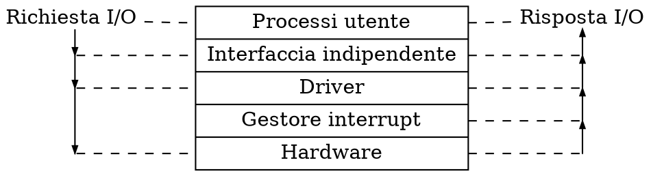
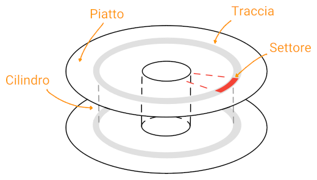

# Dischi

Una tecnica molto usata per la comunicazione con i [controller](../../ct0615-2/05/02/README.md) delle unità esterne è il **memory mapped I/O**.

Anche se **esclude l'uso della cache**, dato che verrebbe invalidata senza che la _CPU_ lo sappia, semplifica lo **sviluppo** dei driver con linguaggi ad alto livello, avendo accesso alla memoria, e la **protezione** su gli indirizzi.

La parte del S.O. volta alla **gestione** dell'I/O è suddivisa in livelli,

dove l'**interfaccia indipendente** verso l'utente ha come obbiettivo **astrarre** operazioni come allocazione e rilascio delle risorse, buffering (che può avvenire sia a livello _kernel_ che _utente_) e segnalazione degli errori.

La gestione delle richieste dipende dal **metodo** utilizzato, ovvero con [polling](../../ct0615-2/05/02/README.md#polling), [interrupt](../../ct0615-2/05/02/README.md#interrupt-driven) o [DMA](../../ct0615-2/05/02/README.md#direct-memory-access).

## Struttura

Un disco è composto da più **piatti** magnetici, ognuno dei quali contiene più **tracce** che verticalmente formano dei **cilindri** su cui si allineeranno le **testine**, che poi procederanno alla lettura di un **settore**.

Ogni _settore_ contiene un preambolo, i dati e un **error correcting code** (_ECC_) per rimediare a errori di lettura.
Inoltre, se un settore diventa difettoso il disco può mapparlo su un **settore di riserva**.

Le **prestazioni** di lettura e scrittura sono direttamente influenzate da:
- **tempo di ricerca** (o _seek_), ovvero quanto la testina ci mette a muoversi su un altro cilindro
- **latenza rotazionale**, cioè il tempo di rotazione del disco perchè il giusto settore arrivi alla testina
- **tempo di trasferimento**, cioè quanto ci mettono i settori ad essere letti

Durante lo spostamento della _testina_ da un _cilindro_ ad un altro il disco **ruota**, portandola su un altro _settore_.
Questo è risolvibile con il **cylinder skew**, cioè il posizionamento dei _settori_ a **spirale** verso l'esterno.

Inoltre, nel tempo che passa da una lettura alla successiva, il disco potrebbe aver saltato il _settore_ richiesto.
Di conseguenza, i _settori_ possono anche essere disposti a **interleaving**, cioè consecutivi ogni due o più.

## RAID

Attraverso il **RAID** (_Redundant array of independent disks_) il S.O. vede più unità come un **unico disco**, cosa che permette la **ridondanza** dei dati e migliori prestazioni per l'accesso parallelo ai dati distribuiti sui dischi.

Ogni [livello](https://www.prepressure.com/library/technology/raid) _RAID_ è ottimizzato per una situazione specifica, e viene detto in **stripe** quando i dischi sono uniti senza copie presenti, e in **mirror** se i dischi sono solamente copiati:
- **Livello 0**: solo _striping_
- **Livello 1**: solo _mirroring_, quindi metà dei dischi contiene la copia dell'altra metà
- **Livello 5**: _striping_ con blocchi di parità sparsi su tutti i dischi
- **Livello 6**: come il _livello 5_ ma con il doppio dei blocchi di parità
- **Livello 1+0**: _striping_ di più gruppi di dischi ognuno formato da dischi in _mirroring_

## Scheduling

Tra gli **algoritmi** che cercano di minimizzare i **tempi di risposta** e massimizzare il **throughput**, ci sono:
- **First Come First Serve** (_FCFS_)

	Tratta le richieste **sequenzialmente** in ordine di arrivo.

	Riduce l'_overhead_ ma porta ad un _throughput_ molto basso per via dei **continui** _seek_.

- **Shortest Seek Time First** (_SSTF_)

	Tratta per prime le richieste che portano ad un **minor tempo di ricerca**.

	Anche se migliora il _throughput_, i _tempi di risposta_ diventano molto variabili e permette l'**attesa infinita**.

- **SCAN**

	Come _SSTF_ ma, come un ascensore, **non cambia direzione** fino a quando non arriva alla fine del disco.

	Diminuisce la varianza dei _tempi di risposta_ ma permette comunque l'_attesa infinita_.

- **C-SCAN**

	Come _SCAN_, ma invece di invertire la direzione **salta** direttamente al primo cilindro da cui era partito.

- **FSCAN**

	Come _SCAN_, ma **pospone** le richieste in arrivo e tratta solo le ultime ricevute fino al cambio direzione.

	Riduce la varianza dei _tempi di risposta_ e **previene l'attesa infinita**.

- **N-Step SCAN**

	Come _FSCAN_, ma su ogni turno processa al più $N$ richieste e pospone le altre.

- **LOOK**

	Come _SCAN_, ma cambia direzione quando **raggiunge l'ultima richiesta** nel verso percorso.

	Migliora il _throughput_ evitando operazioni di ricerca inutili.

- **C-LOOK**

	Combina _LOOK_ e _C-SCAN_, saltando al lato opposto al raggiungimento dell'ultima richiesta.

	Riduce la varianza dei _tempi di risposta_ di _LOOK_ ma peggiora il _throughput_.

Inoltre, _algoritmi_ più moderni cercano anche di ottimizzare la **latenza rotazionale**, tra cui:
- **Shortest Latency Time First** (_SLTF_)

	Tratta per prime le richieste che portano ad una **minor latenza di rotazione**.

	Facilita l'implementazione perchè la _testina_ leggerà i settori in ordine sul disco, evitando attese infinite.

- **Shortest Positioning Time First** (_SPTF_)

	Tratta prima le richieste con **minor tempo di posizionamento**, cioè il tempo per la _ricerca_ e _rotazione_.

	Rischia l'**attesa infinita**, perchè tenderà a restare sul centro arrivando raramente ai cilindri sui bordi.

- **Shortest Access Time First** (_SATF_)

	Come _SPTF_, ma conta anche il **tempo di trasmissione**.

	Permette _throughput_ elevato, ma rischia comunque l'_attesa infinita_.

Altre tecniche sfruttano **molteplici copie** dei dati per velocizzare il _tempo di ricerca_, **compressione** per velocizzare il _tempo di trasferimento_ e **previsione** della posizione della prossima lettura nei periodi inattivi.
