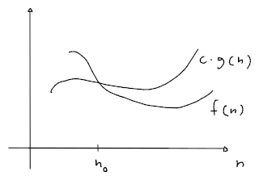
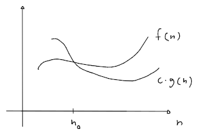
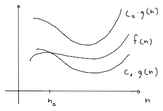
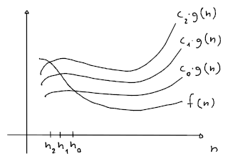
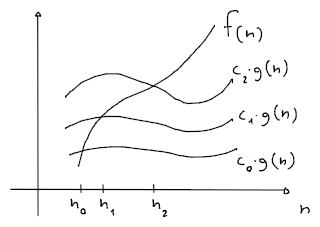

# Classi asintotiche

Una **classe asintotica** specifica il comportamento della [complessità](../README.md) rispetto ad una funzione $g(n)$.

| Classe | Significato |
|:-:|:-:|
| $f(n) \in$ [$O(g(n))$](#classe-o) | $f(n)$ **sotto un** $c \cdot g(n)$ dopo $n_0$ |
| $f(n) \in$ [$\Omega(g(n))$](#classe-Ω) | $f(n)$ **sopra un** $c \cdot g(n)$ dopo $n_0$ |
| $f(n) \in$ [$\Theta(g(n))$](#classe-Θ) | $f(n)$ **sopra un** $c_1 \cdot g(n)$ e **sotto un** $c_2 \cdot g(n)$ dopo $n_0$ |
| $f(n) \in$ [$o(g(n))$](#classe-o-1) | $f(n)$ **sotto ogni** $c \cdot g(n)$ dopo _certi_ $n_0$ |
| $f(n) \in$ [$\omega(g(n))$](#classe-ω) | $f(n)$ **sopra ogni** $c \cdot g(n)$ dopo _certi_ $n_0$ |

Indichiamo che $f(n) = O(g(n))$ per intendere che $f(n)$ fa parte della **famiglia di funzioni** $O(g(n))$.

## Classe $O$

$$
O(g(n)) = \{f(n) \mid \exists c > 0, n_0 \in \mathbb{N} : \forall n \geq n_0, f(n) \leq c \cdot g(n)\}
$$

Per esempio $\frac{1}{2}n^2 - 3n = O(n^2)$, e quindi:
$$
\begin{split}
\frac{1}{2}n^2 - 3n \leq c \cdot n^2 &\Leftrightarrow \frac{1}{2}n - 3 \leq cn \\
&\Leftrightarrow \frac{1}{2}n - cn \leq 3 \\
&\Leftrightarrow n\left(\frac{1}{2} - c\right) \leq 3 \\
&\Leftrightarrow \frac{1}{2} - c \leq 0 \\
&\Rightarrow c \geq \frac{1}{2}
\end{split}
$$

## Classe $\Omega$

$$
\Omega(g(n)) = \{f(n) \mid \exists c > 0, n_0 \in \mathbb{N} : \forall n \geq n_0, c \cdot g(n) \leq f(n)\}
$$

Per esempio $\frac{1}{2}n^2 - 3n = \Omega(n^2)$, e quindi:
$$
\begin{split}
\frac{1}{2}n^2 - 3n \geq c \cdot n^2 &\Leftrightarrow n\left(\frac{1}{2} - c\right) \geq 3 \\
&\Leftrightarrow \frac{1}{2} - c > 0 \\
&\Rightarrow c < \frac{1}{2}
\end{split}
$$
e che per definizione $c > 0$.

## Classe $\Theta$

$$
\Theta(g(n)) = \{f(n) \mid \exists c_{1,2} > 0, n_0 \in \mathbb{N} : \forall n \geq n_0, c_1 \cdot g(n) \leq f(n) \leq c_2 \cdot g(n)\}
$$

Per esempio $\frac{1}{2}n^2 - 3n = \Theta(n^2)$ è già dimostrato perchè:
$$
\frac{1}{2}n^2 - 3n = \Omega(n^2)\ \land\ \frac{1}{2}n^2 - 3n = O(n^2)
$$

Mentre, per esempio $\sqrt{n + 10} = \Theta(\sqrt{n})$:
$$
\begin{split}
c_1\sqrt{n} \leq \sqrt{n+10} \leq c_2\sqrt{n} &\Leftrightarrow {c_1}^2n \leq n+10 \leq {c_2}^2n \\
&\Leftrightarrow {c_1}^2n \leq n+10\ \land\ n+10 \leq {c_2}^2n \\
&\Leftrightarrow n({c_1}^2 - 1) \leq 10\ \land\ n({c_2}^2 -1) \geq 10 \\
&\Leftrightarrow {c_1}^2 - 1 \leq 0\ \land\ {c_2}^2 - 1 > 0 \\
&\Rightarrow c_1 \leq 1\ \land c_2 > 1
\end{split}
$$
per cui, se $c_1 = 1$ e $c_2 = \sqrt{2}$:
$$
n_1(1^2 - 1) \leq 10\ \land\ n_2(\sqrt{2}^2 - 1) \geq 10
$$
si ha che $n_0 = \max(n_1, n_2) = 10$.

## Classe $o$

$$
o(g(n)) = \{f(n) \mid \forall c > 0, \exists n_0 \in \mathbb{N} : \forall n \geq n_0, f(n) < c \cdot g(n)\}
$$

Per cui, indipendentemente da quanto $g(n)$ venga scalato, $f(n)$ gli sarà comunque sotto dopo un certo $n_0$.

## Classe $\omega$

$$
\omega(g(n)) = \{f(n) \mid \forall c > 0, \exists n_0 \in \mathbb{N} : \forall n \geq n_0, c \cdot g(n) < f(n)\}
$$
