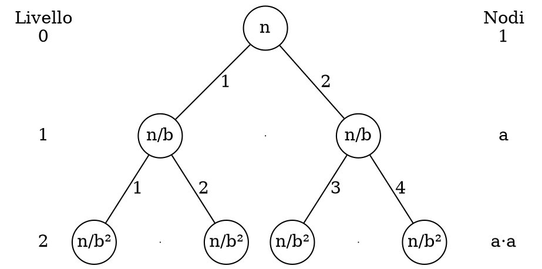

# Ricorrenze

Attraverso i metodi delle **ricorrenze** è possibile **risolvere la ricorsione** nelle complessità degli algoritmi.

## Metodo dell'iterazione

La procedura consiste nell'**esplodere** la ricorsione fino a trovare un _pattern_, come:

$$
T(n) = \begin{cases}
c + T\left(\frac{n}{2}\right) & \text{se } n \geq 2 \\
1 & \text{se } n = 1
\end{cases} \\
\Downarrow \\[0.5em]
\begin{split}
T(n) &= c + \left(c + T\left(\frac{n}{2}\right)\right) = \\
&= 2c + T\left(\frac{n}{2^2}\right) = \\
&= 2c + \left(c + T\left(\frac{n}{2^3}\right)\right) = \\
&= 3c + T\left(\frac{n}{2^3}\right) = \\
&= kc + T\left(\frac{n}{2^k}\right)
\end{split}
$$
che viene _esploso_ fino ad arrivare al **caso base**, quando l'argomento è $1$, cioè:
$$
\frac{n}{2^k} = 1 \Leftrightarrow n = 2^k \Leftrightarrow k = \log_2 n
$$
quindi dopo essere stato _esploso_ fino al **caso base** con $k = \log_2 n$, si ottiene:
$$
\begin{split}
T(n) &= kc + T\left(\frac{n}{2^k}\right) = c\log_2 n + T(1) = \\
&= c\log_2 n + 1 = \Theta(\log_2 n)
\end{split}
$$

Per esempio, se
$$
T(n) = \begin{cases}
9T\left(\frac{n}{3}\right) + n & \text{se } n \geq 2 \\
1 & \text{se } n = 1
\end{cases} \\
\Downarrow \\[0.5em]
\begin{split}
T(n) &= 9\left(9T\left(\frac{n}{3^2}\right) + \frac{n}{3}\right) + n = \\
&= 9^2T\left(\frac{n}{3^2}\right) + 3n + n = \\
&= 9^3T\left(\frac{n}{3^3}\right) + 3^2n + 3n + n = \\
&= 9^3T\left(\frac{n}{3^3}\right) + n(3^2 + 3 + 1) = \\
&= 9^kT\left(\frac{n}{3^k}\right) + n\sum_{i = 0}^{k-1} 3^i = \\
&= 9^kT\left(\frac{n}{3^k}\right) + n \cdot \frac{3^k - 1}{3 - 1}
\end{split}
$$
per la [serie geometrica](../../../ct0432/09/README.md#serie-geometrica), fino al _caso base_ in cui:
$$
\frac{n}{3^k} = 1 \Leftrightarrow k = \log_3 n \\[0.5em]
\Downarrow \\[0.5em]
T(n) = 9^{\log_3 n} \cdot T(1) + n \cdot \frac{3^{\log_3 n} - 1}{2} = n^2 + \frac{n(n-1)}{2} = \Theta(n^2)
$$

## Metodo della sostituzione

In questo caso si **indovina** la _complessità_ e si dimostra **per induzione**, come per:
$$
T(n) = \begin{cases}
T\left(\left\lfloor\frac{n}{2}\right\rfloor\right) + n & \text{se } n \geq 2 \\
1 & \text{se } n = 1
\end{cases}
$$
si dimostra che $T(n) = O(n)$, cioè che:
$$
\exists c > 0, n_0 \in \mathbb{N} : \forall n \geq n_0, T(n) \leq c \cdot n
$$
per il **caso base** ipotizzando sia $n_0 = 1$ allora $T(1) \leq c \cdot 1 \Leftrightarrow c \geq 1$, quindi:
$$
\begin{split}
T(n) &= T\left(\left\lfloor\frac{n}{2}\right\rfloor\right) + n \\
&\leq c \cdot \left\lfloor\frac{n}{2}\right\rfloor + n \\
&\leq c \cdot \frac{n}{2} + n \\
&\leq \left(\frac{c}{2} + 1\right) \cdot n \\
\end{split}
$$
dove $T\left(\left\lfloor\frac{n}{2}\right\rfloor\right) \leq c \cdot \left\lfloor\frac{n}{2}\right\rfloor$ perchè il _caso base_ ha **provato la proprietà fino** a $n - 1$ e $\left\lfloor\frac{n}{2}\right\rfloor \leq n - 1$, mentre $c \cdot \left\lfloor\frac{n}{2}\right\rfloor \leq c \cdot \frac{n}{2}$ perchè l'intero prima è sempre più piccolo.
Va quindi dimostrato che $\left(\frac{c}{2} + 1\right) \cdot n \leq c \cdot n$:
$$
\frac{c}{2} + 1 \leq c \Leftrightarrow 2 \leq c
$$
che è **valido** perchè $c \geq 2 \geq 1$ dal _caso base_.

## Teorema Master

Se consideriamo un algoritmo come la **suddivisione** in sottoproblemi, si ha:
$$
\begin{split}
T(n) &= T_{\text{split}}(n) + \sum_{i=1}^a T\left(\frac{n}{b}\right) + T_{\text{merge}}(n) = \\
&= T\left(\frac{n}{b}\right) \cdot \sum_{i = 1}^a 1 + f(n) = \\
&= a \cdot T\left(\frac{n}{b}\right) + f(n)
\end{split}
$$
dove $f(n) = T_{\text{split}}(n) + T_{\text{merge}}(n)$ è il tempo della _suddivisione_ in $a$ sottoproblemi grandi $\frac{n}{b}$.
Quindi:
$$
T(n) = \begin{cases}
a\cdot T\left(\frac{n}{b}\right) + f(n) & \text{se } n \geq 2 \\ 1 & \text{se } n = 1 \end{cases} \\
\Updownarrow \\[0.5em]
a \geq 1\ \land\ b > 1\ \land\ f(n) \geq 0
$$

Allora dato un $d = \log_b a$, si ha:
- **Caso 1**

	$$\exists \epsilon > 0 : f(n) = O(n^{d - \epsilon}) \\ \Downarrow \\ T(n) = \Theta(n^d)$$
	per cui la _complessità_ è **dominata dalla parte ricorsiva** $a \cdot T\left(\frac{n}{b}\right)$.

	Per esempio, se
	$$T(n) = 9T\left(\frac{n}{3}\right) + n$$
	allora $a = 9 \geq 1$, $b = 3 > 1$ e $f(n) = n \geq 0$ per cui:
	$$d = \log_3 9 = 2$$
	e $f(n) = O(n^{2 - \epsilon})$ se per esempio $\epsilon = 1$ allora $n = O(n^{2-1}) = O(n)$ quindi $T(n) = \Theta(n^2)$.

- **Caso 2**

	$$f(n) = \Theta(n^d) \\ \Downarrow \\ T(n) = \Theta(n^d \log n)$$
	allora la _complessità_ della **parte di suddivisione e ricorsiva si equivalgono**.

	Per esempio, se
	$$T(n) = T\left(\frac{n}{2}\right) + c$$
	allora $a = 1 \geq 1$, $b = 2 > 1$ e $f(n) = c \geq 0$ per cui:
	$$d = \log_2 1 = 0$$
	e $f(n) = \Theta(n^d) \Leftrightarrow c = \Theta(1)$ che corrisponde al _caso 2_, di conseguenza $T(n) = \Theta(\log n)$.

- **Caso 3**

	$$\exists \epsilon > 0 : f(n) = \Omega(n^{d + \epsilon})\ \land\ \exists 0 < c < 1 : a \cdot f\left(\frac{n}{b}\right) \leq c \cdot f(n) \\ \Downarrow \\ T(n) = \Theta(f(n))$$
	per cui, se ci vuole **più tempo per dividere il padre** in $a$ figli che per dividere tutti gli $a$ figli (per la _condizione ausiliaria_), allora la _complessità_ è **dominata dalla parte di suddivisione** $f(n)$.

	Per esempio, se
	$$T(n) = 3T\left(\frac{n}{9}\right) + n$$
	allora $a = 3 \geq 1$, $b = 9 > 1$ e $f(n) = n \geq 0$ per cui:
	$$d = \log_9 3 = \frac{1}{2}$$
	e $f(n) = \Omega(n^{\frac{1}{2} + \epsilon})$ se per esempio $\epsilon = \frac{1}{2}$ allora $n = \Omega(n)$ e va trovata $0 < c < 1$ per cui:
	\
$$
\begin{split}
a \cdot f\left(\frac{n}{b}\right) \leq c \cdot f(n) &\Leftrightarrow 3 \cdot f\left(\frac{n}{9}\right) \leq c \cdot f(n) \\
&\Leftrightarrow \frac{n}{3} \leq c \cdot n \\
&\Leftrightarrow \frac{1}{3} \leq c
\end{split}
$$
	che è valido perchè $0 < \frac{1}{3} \leq c < 1$ dalla _condizione_, quindi $T(n) = \Theta(f(n)) = \Theta(n)$.

### Dimostrazione

Esplodendo il tempo $T(n) = aT(\frac{n}{b}) + f(n)$ si trova che, e.g. con $a = 2$:

ovvero che al livello $i \leq l$ ci sono $a^i$ **nodi** e i sottoproblemi sono **grandi** $\frac{n}{b^i}$, per cui:
$$
T(n) = f(n) + 2f\left(\frac{n}{b}\right) + 4f\left(\frac{n}{b^2}\right) + ... = \sum_{i = 0}^{l} a^i f\left(\frac{n}{b^i}\right)
$$
dove $a^if(\frac{n}{b^i})$ è il **tempo per finire** le chiamate al livello $i$, e all'**ultimo livello** $i = l$:
$$
\frac{n}{b^l} = 1 \Leftrightarrow n = b^l \Leftrightarrow l = \log_b n
$$
da cui si può ricavare il **numero di foglie**:
$$
a^{\log_b n} = a^{\frac{\log_a n}{\log_a b}} = a^{\log_a n \cdot \log_b a} = n^{\log_b a} = n^d
$$
da cui deriva la $d = \log_b a$ del _teorema_, e con cui si può trovare il **numero di nodi**:
$$
\sum_{i = 0}^{\log_b n} a^i = \frac{a^{\log_b n + 1} - 1}{a - 1} = \frac{a \cdot n^d - 1}{a - 1} = \Theta(n^d)
$$

- **Caso 1**

	Per **ipotesi** $f(n) = O(n^{d - \epsilon})$, quindi va dimostrato che $T(n) = \Theta(n^d)$:
	$$
	a^i f\left(\frac{n}{b^i}\right) = a^i O\left(\left(\frac{n}{b^i}\right)^{d - \epsilon}\right)
	= O\left(a^i \frac{n^{d - \epsilon}}{(b^i)^{d - \epsilon}}\right)
	= O\Biggl(\cancel{a^i} \frac{n^{d - \epsilon}}{\underbrace{\cancel{(b^d)^i}}_{d = \log_b a} (b^i)^{-\epsilon}}\Biggr)
	= O(n^{d - \epsilon} (b^\epsilon)^i)
	$$
	con cui si può trovare che:
	$$
	\begin{split}
	T(n) &= \sum_{i = 0}^{\log_b n} a^i f\left(\frac{n}{b^i}\right)
	= \sum_{i = 0}^{\log_b n} O((b^\epsilon)^i n^{d - \epsilon})
	= O\left(n^{d - \epsilon}\sum_{i = 0}^{\log_b n} (b^\epsilon)^i\right) = \\
	&= O\left(n^{d - \epsilon}\frac{(b^\epsilon)^{\log_b n + 1} - 1}{b^\epsilon - 1}\right)
	= O\biggl(n^{d - \epsilon} \cdot \underbrace{\frac{n^\epsilon \cdot b^\epsilon - 1}{b^\epsilon - 1}}_{O(n^\epsilon)}\biggr)
	= O(n^{d - \epsilon} \cdot n^\epsilon) = O(n^d)
	\end{split}
	$$
	e anche $T(n) = \Omega(n^d)$ è verificato perchè $n^d$ è il _numero di foglie_ che verranno sicuramente visitate.

- **Caso 2**

	Per **ipotesi** $f(n) = \Theta(n^d)$, quindi va dimostrato che $T(n) = \Theta(n^d \log n)$:
	$$
	a^i f\left(\frac{n}{b^i}\right) = a^i \Theta\left(\left(\frac{n}{b^i}\right)^d\right)
	= \Theta\left(\cancel{a^i} \frac{n^d}{\cancel{(b^d)^i}}\right) = \Theta(n^d)
	$$
	da cui si trova che:
	$$
	T(n) = \sum_{i = 0}^{\log_b n} a^i f\left(\frac{n}{b^i}\right)
	= \sum_{i = 0}^{\log_b n} \Theta(n^d) = \Theta\left(n^d \sum_{i = 0}^{\log_b n} 1\right)
	= \Theta(n^d (\log_b n + 1)) = \Theta(n^d \log n)
	$$

- **Caso 3**

	Per **ipotesi** $f(n) = \Omega(n^{d + \epsilon})$ e $\exists 0 < c < 1 : af\left(\frac{n}{b}\right) \leq c \cdot f(n)$ cioè, che per ogni livello $i$:
	$$
	a^i f\left(\frac{n}{b^i}\right) \leq c^i f(n)
	$$
	e va quindi dimostrato che $T(n) = \Theta(f(n))$, per cui:
	$$
	T(n) = \sum_{i = 0}^{\log_b n} a^i f\left(\frac{n}{b^i}\right)
	\leq \left(\sum_{i = 0}^{\log_b n} c^i f(n) = f(n)\sum_{i = 0}^{\log_b n} c^i\right)
	\leq \left(f(n) \sum_{i = 0}^\infty c^i = f(n) \frac{1}{1 - c}\right)
	$$
	e quindi $T(n) = O(f(n))$ dato che $\frac{1}{1 - c} \in (1, \infty)$. Inoltre $T(n) = \Omega(f(n))$ perchè si sa che:
	$$
	T(n) = \underbrace{aT\left(\frac{n}{b}\right)}_{\geq 0} + f(n) \geq f(n)
	$$
