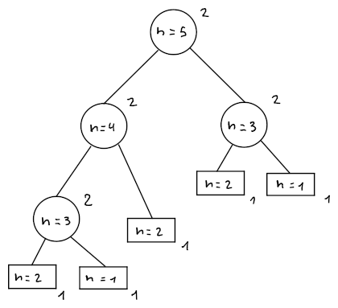

# Complessità asintotica

La **complessità asintotica** di un algoritmo descrive l'andamento temporale per input di grandezza $n \to \infty$.

## Sequenza di Fibonacci

Per esempio, data la **sequenza di Fibonacci** definita come
$$
F_n = \begin{cases}
1 & \text{se } n = 1,2 \\
F_{n-1} + F_{n-2} & \text{se } n \geq 3
\end{cases}
$$
esistono diversi algoritmi per trovare l'$n$-esimo numero:

| | Correttezza | Complessità temporale | Complessità spaziale |
|:-:|:-:|:-:|:-:|
| [**Binet**](#binet) | Incorretto | $T(n) \approx 1$ | $S(n) \approx 1$ |
| [**Ricorsivo**](#ricorsivo) | Corretto | $T(n) \approx F_n$ | $S(n) \approx n$ |
| [**Iterativo con array**](#iterativo-con-array) | Corretto | $T(n) \approx n$ | $S(n) \approx n$ |
| [**Iterativo**](#iterativo) | Corretto | $T(n) \approx n$ | $S(n) \approx 1$ |

### Binet

La **formula di Binet** lega la [sezione aurea](https://en.wikipedia.org/wiki/Golden_ratio) all'$n$-esimo numero di Fibonacci:
$$
F_n = \frac{1}{\sqrt{5}} \left(\varphi^n - \hat{\varphi}^n\right)
$$
dove $\varphi$ e $\hat{\varphi}$ sono le soluzioni a $x^2 = x + 1$.

Di conseguenza, l'algoritmo risulta semplicemente essere:
```c
Fib1(int n) -> int
	return 1/sqrt(5) * (pow(phi, n) - pow(1 - phi, n))
```

#### Complessità temporale e spaziale

In questo caso, $T(n) \approx S(n) \approx 1$ dato che l'algoritmo è composto da un `return` e l'unico dato salvato è $n$.

#### Correttezza

Per verificane la correttezza, bisogna **dimostrare** che:
$$
F_n = \frac{1}{\sqrt{5}}(\varphi^n - \hat{\varphi}^n)
$$

Proseguendo [per induzione](../../ct0434/05/README.md), i **casi base** sono:
- Per $n = 1$,
$$
\frac{1}{\sqrt{5}}(\varphi^1 - \hat{\varphi}^1) = \frac{1}{\sqrt{5}}\left(\frac{1 + \sqrt{5} - 1 + \sqrt{5}}{2}\right) = 1 = F_1
$$
- Per $n = 2$,
$$
\frac{1}{\sqrt{5}}(\varphi^2 - \hat{\varphi}^2) = \frac{1}{\sqrt{5}}\left(\frac{1 + 2\sqrt{5} + 5 - 1 + 2\sqrt{5} - 5}{4}\right) = 1 = F_2
$$

Per cui va verificato il **passo induttivo**:
$$
F_{n-1} + F_{n-2} = \frac{1}{\sqrt{5}}(\varphi^n - \hat{\varphi}^n)
$$
di conseguenza, dati i _casi base_, si suppone che la formula sia valida per $F_{n-1}$ e $F_{n-2}$, per cui:
$$
\begin{split}
F_{n-1} + F_{n-2}
&= \frac{1}{\sqrt{5}}(\varphi^{n-1} - \hat{\varphi}^{n-1}) + \frac{1}{\sqrt{5}}(\varphi^{n-2} - \hat{\varphi}^{n-2}) =
\frac{1}{\sqrt{5}}(\varphi^{n-1} - \hat{\varphi}^{n-1} + \varphi^{n-2} - \hat{\varphi}^{n-2}) \\
&= \frac{1}{\sqrt{5}}((\varphi^{n-1} + \varphi^{n-2}) - (\hat{\varphi}^{n-1} + \hat{\varphi}^{n-2}))
\end{split}
$$
che va trasformata in $\frac{1}{\sqrt{5}}(\varphi^n - \hat{\varphi}^n)$, cioè:
$$
\begin{cases}
\varphi^n = \varphi^{n-1} + \varphi^{n-2} \\
\hat{\varphi}^n = \hat{\varphi}^{n-1} + \hat{\varphi}^{n-2} \\
\end{cases} \Leftrightarrow
\begin{cases}
\frac{\varphi^n}{\varphi^{n-2}} = \frac{\varphi^{n-1}}{\varphi^{n-2}} + 1 \\
\frac{\hat{\varphi}^n}{\hat{\varphi}^{n-2}} = \frac{\hat{\varphi}^{n-1}}{\hat{\varphi}^{n-2}} + 1 \\
\end{cases} \Leftrightarrow
\begin{cases}
\varphi^2 = \varphi + 1 \\
\hat{\varphi}^2 = \hat{\varphi} + 1 \\
\end{cases}
$$
e siccome $\varphi$ e $\hat{\varphi}$ sono le uniche soluzioni del sistema, la formula è verificata.

Seppur dimostrato, `Fib1` rimane **incorretto** perchè l'[imprecisione](../../ct0615-1/01/05/README.md#errori-di-precisione) aumenta con il crescere di $n$.

### Ricorsivo

Nel caso ricorsivo, l'algoritmo risulta essere:
```c
Fib2(int n) -> int
	if n <= 2
		return 1
	return Fib2(n - 1) + Fib2(n - 2)
```

#### Complessità temporale e spaziale

I passaggi che fa questo algoritmo sono:
$$
T(n) = \begin{cases}
1 & \text{se } n = 1,2 \\
2 + T(n-1) + T(n-2) & \text{se } n \geq 3
\end{cases}
$$
dove $1$ è per l'`if`/`return`, mentre $2$ è per l'`if` più l'`else`/`return`.

Per trovare il valore di $T(n)$ si può usare un **albero ricorsivo** $T_n$.
Per $n = 5$, l'albero $T_5$ sarà:


Contando i pesi sui nodi dell'albero, si può ricavare il costo:
$$
T(n) = 2 \cdot 4 + 1 \cdot 5 = 2 \cdot i(T_n) + f(T_n)
$$
dove $i(T_n)$ è il **numero di nodi interni** e $f(T_n)$ è il **numero di foglie**.

Si può quindi dimostrare che:
1. $f(T_n) = F_n$, per induzione:

	Tra i _casi base_, se:
	- $n = 1 \Rightarrow f(T_1) = 1 = F_1$
	- $n = 2 \Rightarrow f(T_2) = 1 = F_2$

	Per cui, supponendo che $f(T_{n-1}) = F_{n-1} \land f(T_{n-2}) = F_{n-2}$ sia vero per **ipotesi induttiva**, allora:
	$$f(T_n) = f(T_{n-1}) + f(T_{n-2})$$
	dato che $T_n$ non possiede altri sottoalberi oltre che $T_{n-1}$ e $T_{n-2}$.
	Di conseguenza:
	$$f(T_n) = F_{n-1} + F_{n-2} = F_n$$

2. $i(T_n) = f(T_n) - 1 = F_n - 1$

	Tra i _casi base_, se:
	- $n = 1 \Rightarrow i(T_1) = 0 = F_1 - 1 = f(T_1) - 1$
	- $n = 2 \Rightarrow i(T_2) = 0 = F_2 - 1 = f(T_2) - 1$

	Supponendo $i(T_{n-1}) = f(T_{n-1}) - 1 \land i(T_{n-2}) = f(T_{n-2}) - 1$ vero per **ipotesi induttiva**, allora:
$$
\begin{split}
i(T_n) &= i(T_{n-1}) + i(T_{n-2}) + 1 = \\
&= f(T_{n-1}) - 1 + f(T_{n-2}) - 1 + 1 = \\
&= f(T_n) - 1
\end{split}
$$
	visto che per la precedente dimostrazione $f(T_n) = f(T_{n-1}) + f(T_{n-2})$.

Perciò, la **complessità temporale** di `Fib2` sarà:
$$
T(n) = 2 \cdot (F_n - 1) + F_n = 3F_n - 2 \approx F_n
$$
e la **complessità spaziale** $S(n) \approx n$.

È anche possibile che la _complessità_ cresce più velocemente che esponenzialmente:
$$
F_n \geq 2^{\frac{n}{2}},\ \forall n \geq 6
$$
infatti per induzione, il _caso base_ per $n = 6 \Rightarrow F_6 \geq 2^3$ e il _passo induttivo_ per $n > 6$:
$$
F_n =
\overbrace{F_{n-1}}^{\geq 2^{\frac{n-1}{2}}} +
\overbrace{F_{n-2}}^{\geq 2^{\frac{n-2}{2}}} \\
\Downarrow \\
\begin{split}
F_n &\geq 2^{\frac{n-1}{2}} + 2^{\frac{n-2}{2}} \\
&\geq 2^{\frac{n}{2}} \cdot 2^{-\frac{1}{2}} + 2^{\frac{n}{2}} \cdot 2^{-1} \\
&\geq 2^{\frac{n}{2}} \biggl(\underbrace{\frac{1}{\sqrt{2}} + \frac{1}{2}}_{\geq 1}\biggr) \geq 2^{\frac{n}{2}}
\end{split}
$$

### Iterativo con array

Sfruttando un array, si possono salvare i valori di $F_n$ senza doverli ricalcolare su $F_{n+1}$:
```c
Fib3(int n) -> int
	int F[n]
	F[1] = F[2] = 1
	for i = 3 to n
		F[i] = F[i-1] + F[i-2]
	return F[n]
```

#### Complessità temporale e spaziale

Il numero di istruzioni eseguite sono
$$
T(n) = 3 + (n - 3 + 1) + (n - 3 + 1 + 1) = 2n \approx n
$$
dove $3$ sono per l'inizializzazione di `F` e il `return`, mentre:
- $n - 3 + 1$ sul contenuto del ciclo: eseguito per $i = 3$ e per il resto delle $n - 3$ volte
- $n - 3 + 1 + 1$ sulla condizione: per $i = 3$, per il resto delle $n - 3$ volte e una alla fine per $i = n+1$

Mentre lo spazio occupato sarà $S(n) \approx n$, dato che viene salvato $F_n$ per ogni $n$.

### Iterativo

La precedente versione si può ottimizzare ulteriormente, salvando solamente $F_{n-1}$ e $F_{n-2}$:
```c
Fib4(int n) -> int
	int f1 = 1, f2 = 1, f
	for i = 3 to n
		f = f1 + f2
		f1 = f2
		f2 = f
	return f
```
per cui rimane che $T(n) = 4n - 5 \approx n$, mentre la **complessità spaziale** diventa $S(n) \approx 1$.
