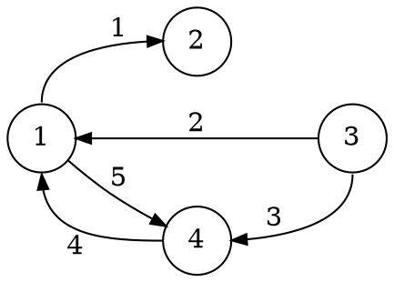

# Rappresentazioni

Un grafo **sparso** conviene venga rappresentato attraverso una **lista di adiacenza** attraverso un array di $n = |V|$ celle, in ognuna delle quali c'è una _lista concatenata_ contenente i nodi _adiacenti_.

Per un grafo **denso** invece, è più conveniente usare una [**matrice di adiacenza**](../../../../ct0435/06/README.md#matrice-di-adiacenza) $A$ di dimensione $|V| \times |V|$, in cui $a_{ij} > 0$ rappresenta la presenza di un arco, e che nei grafi _non orientati_ è [simmetrica](../../../../ct0435/04/README.md#proprietà), cioè $A^T = A$.

Un'altra rappresentazione è la **matrice di incidenza** di dimensione $|V| \times |E|$,
in cui $a_{ij}$ assume il valore $-1$ quando l'arco assegnato a $j$ che parte dal nodo $i$ è **uscente** e il valore $+1$ quando è **entrante**.

Per esempio, il grafo

avrà _matrice di incidenza_:
$$
A = \begin{bmatrix}
-1 & 1 & 0 & 1 & -1 \\
1 & 0 & 0 & 0 & 0 \\
0 & -1 & -1 & 0 & 0 \\
0 & 0 & 1 & -1 & 1
\end{bmatrix}
$$
