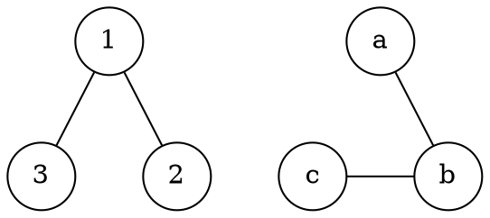
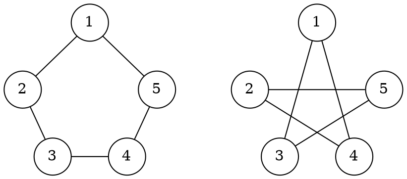

# Isomorfismo

Una funzione $\phi\colon V_1 \to V_2$ è un **isomorfismo** di $G_1 = (V_1, E_1)$ e $G_2 = (V_2, E_2)$ se:
- $\phi$ è **biunivoca**
- $(u, v) \in E_1$ sse $(\phi(u), \phi(v)) \in E_2$, quindi l'_adiacenza_ è **preservata**

Per esempio, esiste una funzione che può trasformare il primo grafo nel secondo:

Perchè due grafi siano **isomorfi**, ovvero $G_1 \simeq G_2$, è **necessario** che:
$$
|V_1| = |V_2| \land |E_1| = |E_2| \land \text{deg-seq}(G_1) = \text{deg-seq}(G_2) \land \mathrm{NCC}(G_1) = \mathrm{NCC}(G_2)
$$
dove $\text{deg-seq}(G)$ sono gli $n$ gradi dei nodi di $G$ in ordine crescente.

Per esempio, dati $G_1$ e $G_2$ come:

si ha che la funzione
$$
\phi(u) = \begin{cases}
2 & \text{se } u = 1 \\
4 & \text{se } u = 2 \\
1 & \text{se } u = 3 \\
3 & \text{se } u = 4 \\
5 & \text{se } u = 5
\end{cases}
$$
è un valido _isomorfismo_ per $G_1$ e $G_2$.
Questo è vero perchè $\phi(u)$ è _biunivoca_, dato che ogni $v_2 \in V_2$ è assegnato ad un solo $v_1 \in V_1$ e perchè le _adiacenze_ sono preservate:
- $(1, 2) \in E_1$ e $(\phi(1), \phi(2)) = (2, 4) \in E_2$
- $(2, 3) \in E_1$ e $(\phi(2), \phi(3)) = (4, 1) \in E_2$
- ...

In questo caso si ha anche che $G_1 \simeq G_1^C$, infatti $G_2 = G_1^C$ e $E_2 = E_1^C$.
