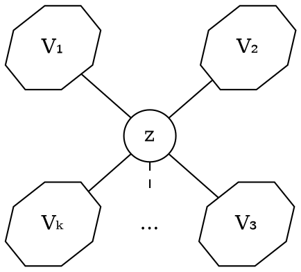

# Condizioni

Le condizioni sono più facilmente definite immaginando il grafo _connesso_ $G$ come:

dove $V_1, ... V_k$ sono $k$ _componenti connesse_ collegate da un singolo nodo $z \in V$.

## Connettività

Se un grafo $G$ _non orientato_ è **connesso**, allora è rispettata la condizione **necessaria** per cui:
$$
|E| \geq |V|-1
$$
che è dimostrabile per induzione su $n = |V|$:
- **Caso base**, per $|V| = 1$: non essendoci altri nodi $|E| = 0$ e quindi $0 \geq 1 - 1$
- **Caso base**, per $|V| = 2$: essendo connessi $|E| = 1$ e quindi $1 \geq 2-1$
- **Passo induttivo** assumendo che valga fino a $n-1$: \
	Rimuovendo $z$ si ottiene il sottografo $G[V \setminus \{z\}]$ che potrebbe però non essere connesso, ma se si considerano le $k$ _componenti connesse_ come $G_i = (V_i, E_i)$ si ha che:
	$$
	|E| = \left(\sum_{i = 1}^k |E_i|\right) + \deg(z)
	$$
	che per _ipotesi induttiva_ diventa:
	$$
	\begin{split}
	|E| &\geq \left(\sum_{i = 1}^k |V_i| - 1\right) + \deg(z) \\
	&= \sum_{i = 1}^k |V_i| - k + \deg(z) \\
	&= \overbrace{|V| - 1} + \deg(z) - k \geq |V| - 1
	\end{split}
	$$
	che è vero solo se $\deg(z) - k \geq 0$, ma è assurdo dire che $\deg(z) < k$ perchè vorrebbe dire che $z$ non è collegato con le $k$ _componenti connesse_, per cui $G$ non sarebbe connesso.

Quest'ultima condizione non basta per considerare un grafo come **connesso**, ma è possibile considerarlo tale se la condizione **sufficiente** è soddisfatta, ovvero se:
$$
\forall u \in V,\ \deg(u) \geq \frac{n-1}{2}
$$
che è dimostrabile per _assurdo_, infatti se fosse vero e $z$ non fosse presente, allora con $k = 2$:
$$
|V_1| \geq \deg(u_1) + \overbrace{1}^{u_1}\ \land\ |V_2| \geq \deg(u_2) + \overbrace{1}^{u_2} \\
\Downarrow \\[0.4em]
\begin{split}
|V| &= |V_1| + |V_2| \\
&\geq \deg(u_1) + \deg(u_2) + 2 \\
&= n - 1 + 2 = |V| + 1
\end{split}
$$
che è assurdo, con $u_1 \in V_1$ e $u_2 \in V_2$.

## Aciclicità

Se un grafo $G$ _non orientato_ è **aciclico**, allora è rispettata la condizione **necessaria** per cui:
$$
|E| \leq |V| - 1
$$
che è dimostrabile in maniera analoga alla _connettività_, da cui si ottiene:
$$
|E| \leq |V| - 1 + \deg(z) - k \leq |V| - 1
$$
che è vero, infatti sarebbe assurdo che $\deg(z) > k$ perchè altrimenti sarebbero presenti cicli.
