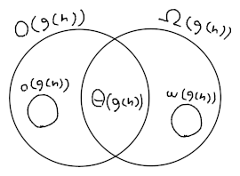

# Proprietà

- $$\boxed{\Theta(g(n)) = O(g(n)) \cap \Omega(g(n))}$$

- $$\boxed{f(n) = O(g(n)) \Leftrightarrow \Omega(f(n)) = g(n)}$$

	Assumendo $f(n) = O(g(n))$ vero, si ha:
	- **Ipotesi**: $\exists c > 0, n_0 \in \mathbb{N} : \forall n \geq n_0, f(n) \leq c \cdot g(n)$, quindi $\frac{1}{c} \cdot f(n) \leq g(n)$ dato che $c > 0$

	- **Tesi**: $\exists c' > 0, n_0' \in \mathbb{N} : \forall n \geq n_0', c' \cdot f(n) \leq g(n)$

	Per cui con $c' = \frac{1}{c}$ e $n_0' = n_0$ la [_condizione sufficiente_](../../ct0434/01/README.md#doppia-implicazione) è verificata e la _condizione necessaria_ è analoga.

- $$\boxed{f(n) = O(g(n)) \land g(n) = O(h(n)) \Rightarrow f(n) = O(h(n))}$$

	Assumendo la _condizione sufficiente_ per vera, si ha che:
	- **Ipotesi**:
		- $\exists c_1 > 0, n_1 \in \mathbb{N} : \forall n \geq n_1, f(n) \leq c_1 \cdot g(n)$
		- $\exists c_2 > 0, n_2 \in \mathbb{N} : \forall n \geq n_2, g(n) \leq c_2 \cdot h(n)$, quindi $c_1 \cdot g(n) \leq c_1c_2 \cdot h(n)$

	- **Tesi**: $\exists c_3 > 0, n_3 \in \mathbb{N} : \forall n \geq n_3, f(n) \leq c_3 h(n)$

	Per cui $f(n) \leq c_1 \cdot g(n) \leq c_1c_2 \cdot h(n)$ quindi $c_3 = c_1c_2$ e $n_3 = \max(n_1, n_2)$.

- $$
\boxed{\begin{gather}
o(g(n)) \subset O(g(n)) \\
\omega(g(n)) \subset \Omega(g(n)) \\
o(g(n)) \cap \Omega(g(n)) = \emptyset \\
\omega(g(n)) \cap O(g(n)) = \emptyset
\end{gather}}
$$

	La terza proprietà è dimostrabile per _assurdo_, supponendo che $\exists f(n) \in o(g(n)) \cap \Omega(g(n))$, allora:
$$
\forall c > 0, \exists n_0 \in \mathbb{N} : \forall n \geq n_0, f(n) < c \cdot g(n) \\
\land \\
\exists c' > 0, n_0' \in \mathbb{N} : \forall n \geq n_0', c' \cdot g(n) \leq f(n)
$$
	cioè, esiste una $c'$ per cui ad un certo punto $c' \cdot g(n) \leq f(n)$, seppur $f(n) < c \cdot g(n)$ per _tutte_ le $c$.
	Che significa che,
	$$f(n) < c' \cdot g(n) \leq f(n)$$
	per $n \geq \max(n_0, n_0')$ e per quel particolare $c'$, che è assurdo.

	Da cui si può ricavare che $f(n) = O(g(n)) \not\Rightarrow f(n) = o(g(n))$, infatti:

	

- $$
\boxed{\lim_{n \to +\infty} \frac{f(n)}{g(n)} =
\begin{cases}
0 & \Leftrightarrow f(n) = o(g(n)) \\
l \in \mathbb{R}^+ & \Rightarrow f(n) = \Theta(g(n)) \\
+\infty & \Leftrightarrow f(n) = \omega(g(n))
\end{cases}}
$$

	Inoltre se $\lim\limits_{n \to +\infty} \frac{f(n)}{g(n)} = 0 \Rightarrow f(n) = O(g(n))$ dato che $o(g(n)) \subset O(g(n))$.
	Stesso per $\omega(g(n))$.

	Per esempio, $3n^3 + 2n^2 + 6n + 5 = \Theta(n^3)$ è verificato per $\lim\limits_{n \to +\infty} \frac{3n^3 + 2n^2 + 6n + 5}{n^3} = 3$.

- $$\boxed{P_k(n) = \Theta(n^k)}$$

	Anche chiamata **regola dei polinomi**, per esempio $27n^2 + n^2\log n + \sqrt{n} + \log n^2 = \Theta(n^2\log n)$.

- $$\boxed{g(n) = f(n) + o(f(n)) = \Theta(f(n))}$$

	Per cui la somma di $f(n)$ con una funzione inferiore $o(f(n))$ avrà l'_andamento asintotico_ di $f(n)$.
