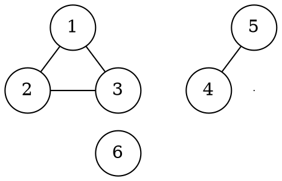

# Algoritmo generico

Un algoritmo **ideale** su cui basare la ricerca di un _MST_ trova tutti gli archi di un grafo $G$ che sono **sicuri**:
```c
generic_mst(G, w)
  A = {}  // Un set, i.e. tabella hash senza valori
  while not is_mst(G.V, A)  // Oppure, in questo caso, finchè A.length < G.V.length - 1
    ...  // Trova un arco sicuro (u, v) per A
    add(A, (u, v))
  return A
```

## Componenti connesse

Un modo per trovare le _componenti connesse_ è quello di **raggruppare** tutti i nodi connessi da un arco:
```c
connected_components(G)
  C = map(G.V, v -> {v})
  for each (u, v) in G.E
    U = find(C, s -> contains(s, u))  // Trova l'insieme di C che contiene u
    V = find(C, s -> contains(s, v))
    if U != V
      remove(C, U)
      remove(C, V)
      append(C, union(U, V))
  return C
```

Per esempio, dal grafo

si va da `C = [{1}, {2}, {3}, {4}, {5}, {6}]` a `C = [{1, 2, 3}, {4, 5}, {6}]`.
