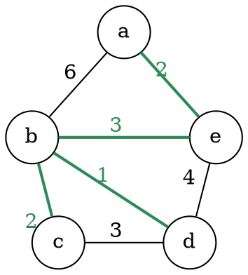

# Algoritmo di Kruskal

L'algoritmo trova l'_MST_ estraendo un arco alla volta, che tiene se **non crea un ciclo** con quelli già estratti:
```c
kruskal(G, w)
  A = {}
  C = map(G.V, v -> {v})
  sort(G.E, w)  // Ordina in base al peso degli archi dato da w
  for each (u, v) in G.E
    U = find(C, s -> contains(s, u))
    V = find(C, s -> contains(s, v))
    if U != V
      remove(C, U)
      remove(C, V)
      append(C, union(U, V))
      add(A, (u, v))
```
che è **corretto** perchè si considerano prima gli _archi leggeri_ e quindi `A` è sempre sottoinsieme di un _MST_.

La **complessità** invece, è data da $O(n)$ per `map`, $O(m\log m)$ per `sort` e $O(\log m)$ per `find` e `union`:
$$
T(n, m) = O(n + m\log m + m\log m) = O(m\log m)
$$
perchè essendo [connesso](../../01/04/README.md#connettività) $m \geq n - 1$ e quindi $n = O(m)$.

Per esempio, dato il grafo

i passaggi effettuati dall'algoritmo sono:

| Step | $A$ | Insiemi | Arco |
|:-:|:-:|:-:|:-:|
| 0 | $\emptyset$ | $\{a\}, \{b\}, \{c\}, \{d\}, \{e\}$ | $(b, d)$ |
| 1 | $\{(b, d)\}$ | $\{a\}, \{b, d\}, \{c\}, \{e\}$ | $(b, c)$ |
| 2 | $\{(b, d), (b, c)\}$ | $\{a\}, \{b, c, d\}, \{e\}$ | $(a, e)$ |
| 3 | $\{(b, d), (b, c), (a, e)\}$ | $\{a, e\}, \{b, c, d\}$ | $(c, d)$ |
| 4 | $\{(b, d), (b, c), (a, e)\}$ | $\{a, e\}, \{b, c, d\}$ | $(b, e)$ |
| 5 | $\{(b, d), (b, c), (a, e), (b, e)\}$ | $\{a, b, c, d, e\}$ | |
