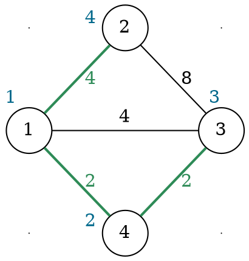

# Algoritmo di Prim

L'algoritmo trova l'_MST_ partendo da $r \in V$ e **propagando** la creazione dell'albero sugli archi con pesi minori:
```c
prim(G, w, r)
  Q = G.V  // Coda di minima priorità
  C = {}   // Contiene il peso C[v] più piccolo per la connessione al nodo v
  P = {}   // Contiene il nodo P[v] (vicino di v) da cui è originato il peso C[v]
  for each u in G.V
    C[u] = +∞
    P[u] = NIL
  C[r] = 0

  while Q.heap_size > 0
    u = extract_min(Q)  // Sceglie il nodo u con C[u] più piccolo
    for each v in neighbors(u)
      if contains(Q, v) and w(u, v) < C[v]
        C[v] = w(u, v)  // Potrebbe causare un riordinamento di Q
        P[v] = u

  A = {}
  for each v in G.V
    e = (P[v], v)
    if contains(G.E, e) and v != r  // Evita P[v] = P[r] = NIL
      add(A, e)
  return A
```
che è **corretto** perchè rispetta il _teorema fondamentale_ degli _MST_.
Infatti, ad ogni istante, si ha che:
$$
A = \Set{(P_v, v) \in E \mid u \in V \setminus Q \setminus \{r\}}
$$
e dato che $P_v \in V \setminus Q$, l'arco $(P_v, v)$ **non attraverserà mai** il _taglio_ $(V \setminus Q, Q)$, cioè il bordo tra i nodi **già visitati** e quelli **ancora da visitare**.
Inoltre, il prossimo $u$ proviene sicuramente dall'_arco leggero_ del _taglio_.

La **complessità** si ricava con, sapendo che $m \geq n-1$:
$$
T(n, m) = n + n\log n + \sum_{i = 1}^n \deg(u_i) \cdot \log n = O(m\log n)
$$
dove, il primo $\log n$ è dato dal costo della `extract_min` su `Q`, il $\deg(u_i)$ dalle `neighbors(u)` iterazioni per il nodo estratto `u` (che si somma a $2m$ per la [stretta di mano](../../01/02/README.md#proprietà)) e l'ultimo $\log n$ dall'assegnamento a `C[v]`.

Per esempio, partendo dal nodo $r = 1$ nel grafo

i passaggi effettuati dall'algoritmo sono:

| Step | `C[1]`, `P[1]` | `C[2]`, `P[2]` | `C[3]`, `P[3]` | `C[4]`, `P[4]` |
|:-:|:-:|:-:|:-:|:-:|
| 0 | `0`, `NIL` | `∞`, `NIL` | `∞`, `NIL` | `∞`, `NIL` |
| 1 | >`0`, `NIL`< | `4`, `1` | `4`, `1` | `2`, `1` |
| 2 | `0`, `NIL` | `4`, `1` | `2`, `1` | >`2`, `1`< |
| 3 | `0`, `NIL` | `4`, `1` | >`2`, `1`< | `2`, `1` |
| 4 | `0`, `NIL` | >`4`, `1`< | `2`, `1` | `2`, `1` |
