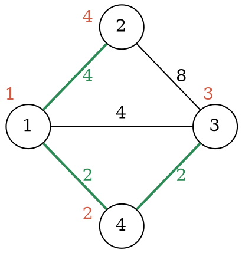

# Algoritmo di Prim

L'algoritmo trova l'_MST_ partendo da $r \in V$ e **propagando** la creazione dell'albero sugli archi con pesi minori:
```c
prim(G, w, r)
  Q = G.V  // Coda di minima priorità
  d = {}   // Contiene il peso d[v] pi√π piccolo per la connessione al nodo v
  𝜋 = {}   // Contiene il nodo 𝜋[v] (vicino di v) da cui è originato il peso d[v]
  for each u in G.V
    d[u] = +‚àû
    ùúã[u] = NIL
  d[r] = 0

  while Q.heap_size > 0
    u = extract_min(Q)  // Sceglie il nodo u con d[u] pi√π piccolo
    for each v in neighbors(G, u)
      if contains(Q, v) and w(u, v) < d[v]
        d[v] = w(u, v)  // Potrebbe causare un riordinamento di Q
        ùúã[v] = u

  A = {}
  for each v in G.V
    e = (ùúã[v], v)
    if contains(G.E, e) and v != r  // Evita ùúã[v] = ùúã[r] = NIL
      add(A, e)
  return A
```
che è **corretto** perchè rispetta il _teorema fondamentale_ degli _MST_.
Infatti, ad ogni istante, si ha che:
$$
A = \Set{(\pi_v, v) \in E | v \in V \setminus Q \setminus \{r\}}
$$
e dato che $\pi_v \in V \setminus Q$, l'arco $(\pi_v, v)$ **non attraverserà mai** il _taglio_ $(V \setminus Q, Q)$, cioè il bordo tra i nodi **già visitati** e quelli **ancora da visitare**.
Inoltre, il prossimo $u$ proviene sicuramente dall'_arco leggero_ del _taglio_.

La **complessità** si ricava con, sapendo che $m \geq n-1$:
$$
T(n, m) = n + n\log n + \sum_{i = 1}^n \deg(u_i) \cdot \log n = O(m\log n)
$$
dove, il primo $\log n$ è dato dal costo della `extract_min` su `Q`, il $\deg(u_i)$ dalle `neighbors(u)` iterazioni per il nodo estratto `u` (che si somma a $2m$ per la [stretta di mano](../../01/02/README.md#proprietà)) e l'ultimo $\log n$ dall'assegnamento a `d[v]`.

Per esempio, partendo dal nodo $r = 1$ nel grafo

```dot process
digraph {
	ranksep=0.4
	nodesep=0.4
	node [shape=circle]
	edge [dir=none]

	_0, _1, _2, _3 [shape=point width=0 height=inf style=invis]

	{
		edge [color="seagreen4" fontcolor="seagreen4" penwidth=2]
		2 -> 1 [label="4"]
		1 -> 4 [label="2"]
		3 -> 4 [label="2"]
	}

	2 -> 3 [label="8"]
	{
		rank=same
		1 -> 3 [label="4"]
	}

	{
		edge [color="invis"]
		{
			rank=same
			_0 -> 2 [headlabel=<<font color="coral3">4 </font>>]
			2 -> _1
		}
		_0 -> 1 [headlabel=<<font color="coral3">1  </font>> weight=100]
		_1 -> 3 [headlabel=<<font color="coral3">3</font>> weight=100]
		{
			rank=same
			_2 -> 4 [headlabel=<<font color="coral3"><br/>2 </font>>]
			4 -> _3
		}
		1 -> _2 [weight=100]
		3 -> _3 [weight=100]
	}
}
```
i passaggi effettuati dall'algoritmo sono:

| Step | `d[1]`, `ùúã[1]` | `d[2]`, `ùúã[2]` | `d[3]`, `ùúã[3]` | `d[4]`, `ùúã[4]` |
|:-:|:-:|:-:|:-:|:-:|
| 0 | `0`, `NIL` | `‚àû`, `NIL` | `‚àû`, `NIL` | `‚àû`, `NIL` |
| 1 | >`0`, `NIL`< | `4`, `1` | `4`, `1` | `2`, `1` |
| 2 | `0`, `NIL` | `4`, `1` | `2`, `4` | >`2`, `1`< |
| 3 | `0`, `NIL` | `4`, `1` | >`2`, `4`< | `2`, `1` |
| 4 | `0`, `NIL` | >`4`, `1`< | `2`, `4` | `2`, `1` |
