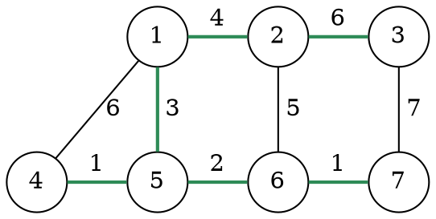
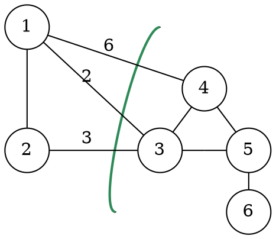

# Alberi di copertura

Un [albero](../../../ct0371-2/02/README.md) è un grafo **aciclico** e **connesso**, che ha le caratteristiche di una struttura **fragile**, ovvero che rimuovendo un arco si ottengono due _componenti connesse_ e aggiungendone uno si formerebbe un _ciclo_.

Le **caratterizzazioni sugli alberi** sono modi diversi di affermare la stessa cosa, cioè che $G$ è un _albero_:
1. Esiste **un solo cammino** tra qualsiasi coppia di nodi
2. Diventa **disconnesso** rimuovendo un qualsiasi arco
3. È connesso o aciclico e $|E| = |V| - 1$
4. Diventa **ciclico** aggiungendo un qualsiasi arco

Un **albero di copertura** di un grafo $G = (V, E)$ è un insieme di archi $T \subseteq E$ per cui $(V, T)$ è un _albero_.
Dato un grafo pesato $G = (V, E, w)$ invece, si dice **albero di copertura minimo** (_MST_, _Minimum Spanning Tree_) quell'_albero di copertura_ che minimizza la somma totale dei pesi:
$$
W(T) = \sum_{(u, v) \in T} w(u, v)
$$

Per esempio, nel grafo seguente l'albero in verde è minimo:

## Fatto cruciale

Si dice **taglio** una partizione $(S, V \setminus S)$ di $V$, e l'arco con peso minore coinvolto è detto **arco leggero**.

Per esempio, nel grafo seguente l'_arco leggero_ è quello con peso $2$:

In particolare, il **fatto cruciale** degli _MST_ afferma che ogni _arco leggero_ appartiene ad **almeno un** _MST_.

Dati quindi un _arco leggero_ $(u, v) \in E$ e un _albero di copertura minimo_ $T$, si può dimostrare con i casi:
- Se $(u, v) \in T$ allora è dimostrato
- Se $(u, v) \not\in T$ allora va cercato un altro albero $T'$ che lo contenga:

	Non basta aggiungere $(u, v)$ a $T$ perchè si **formerebbe un ciclo**.
	Questo però assicura che **almeno un altro arco** $(x, y)$ passi attraverso il taglio, e quindi potrà essere **rimosso** per trovare un altro albero.

	Dal nuovo _albero di copertura_ $T' = T \cup \{(u, v)\} \setminus \{(x, y)\}$ si sa che:
	$$
	W(T') = W(T) + w(u, v) - w(x, y) \Rightarrow W(T) \geq W(T')
	$$
	dato che $w(u, v) - w(x, y) \leq 0$, perchè $(u, v)$ è un _arco leggero_ e quindi ha peso più piccolo.

	Siccome $T$ è minimo si sa anche che $W(T) \leq W(T')$, da cui si ricava che:
	$$
	W(T) = W(T')
	$$
	e quindi anche $T'$ è **minimo**.

## Teorema fondamentale

Dato un $G$ _n.o._ e connesso, un _albero di copertura minimo_ $T$, un $A \subseteq T$ i cui archi non attraversano un dato taglio e un _arco leggero_ $(u, v)$ che invece lo attraversa, allora il **teorema fondamentale** esprime che:
> L'arco $(u, v)$ è **sicuro** per $A$, ovvero che $A \cup \{(u, v)\}$ appartiene ad un qualche _MST_

Come il [fatto cruciale](#fatto-cruciale) si dimostra che $(u, v) \in T'$, e $A \subseteq T'$ perchè per ipotesi $(x, y)$ non faceva parte di $A$.

Dal _teorema fondamentale_ si ricava il **corollario** per cui, dato un _albero di copertura minimo_ $T$ e un $A \subseteq T$, se un arco $(u, v) \not\in A$ connette due _componenti connesse_ del grafo $(V, A)$ allora l'arco è _sicuro_ per $A$.
