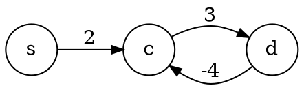

# Cammini minimi

Tra le proprietà di un [cammino](../../../ct0371-2/02/README.md) $p = (n_0, ..., n_k)$ è definita la **lunghezza**:
$$
w(p) = \sum_{i = 1}^k w(n_{i-1}, n_i)
$$
l'**insieme di cammini** $\mathscr{C}(u, v)$, che contiene tutti i cammini da $u$ a $v$, e la **distanza**:
$$
\delta(u, v) = \begin{cases}
\min\limits_{p \in \mathscr{C}(u, v)} w(p) & \text{se } \mathscr{C}(u, v) \neq \emptyset \\
\infty & \text{se } \mathscr{C}(u, v) = \emptyset
\end{cases}
$$
che diventerebbe $-\infty$ se ci fosse un **ciclo negativo**, perchè allora esisterebbe sempre un $w(p)$ minore.

Per esempio, il cammino da $s$ a $c$ possiede un _ciclo negativo_ e quindi $\delta(s, c) = -\infty$:

## Proprietà

<!-- TODO: Da spostare (con le funzioni ausiliarie, dopo le proprietà (?)) -->
Gli algoritmi principali memorizzano due campi per ogni vertice $u \in V$:
- La **stima della distanza minima** `d[u]`, che alla fine dovrà essere uguale a $\delta(s, u)$
- Il **predecessore** `𝜋[u]`, da cui è partito l'arco verso $u$ che porta al peso finale `d[u]`

Inoltre, sia sui grafi _orientati_ che _non orientati_ valgono le proprietà:
- **Proprietà dei sottocammini minimi**
- **Grafo dei predecessori**
- **Albero dei predecessori**
- **Disuguaglianza triangolare**
- **Proprietà del limite inferiore**
- **Proprietà della convergenza**
