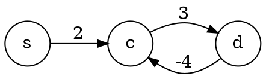

# Cammini minimi

Tra le proprietà di un [cammino](../../../ct0371-2/02/README.md) $p = (n_0, ..., n_k)$ è definita la **lunghezza**:
$$
w(p) = \sum_{i = 1}^k w(n_{i-1}, n_i)
$$
l'**insieme di cammini** $\mathscr{C}(u, v)$, che contiene tutti i cammini da $u$ a $v$, e la **distanza**:
$$
\delta(u, v) = \begin{cases}
\min\limits_{p \in \mathscr{C}(u, v)} w(p) & \text{se } \mathscr{C}(u, v) \neq \emptyset \\
\infty & \text{se } \mathscr{C}(u, v) = \emptyset
\end{cases}
$$
che diventerebbe $-\infty$ se ci fosse un **ciclo negativo**, perchè allora esisterebbe sempre un $w(p)$ minore.

Per esempio, il cammino da $s$ a $c$ possiede un _ciclo negativo_ e quindi $\delta(s, c) = -\infty$:


## Struttura

Gli algoritmi principali, come per [quello di Prim](../02/03/README.md), memorizzano due campi per ogni vertice $u \in V$:
- La **stima della distanza minima** `d[u]`, che alla fine dovrà essere uguale a $\delta(s, u)$
- Il **predecessore** `𝜋[u]`, da cui è partito l'arco verso $u$ che porta al peso finale `d[u]`

Inoltre, gli algoritmi fanno uso delle **funzioni ausiliarie**:
- **Init Single Source**

	```c
	init_ss(G, s)
	  for each u in G.V
	    d[u] = +infty
	    𝜋[u] = NIL
	  d[s] = 0
	  return d, 𝜋
	```
	con costo $\Theta(1)$.

- **Relax**

	```c
	relax(u, v, w, d, 𝜋)
	  if d[v] > d[u] + w(u, v)
	    d[v] = d[u] + w(u, v)
	    𝜋[v] = u
	```
	che diventa $O(\log n)$ per l'assegnamento a `d[v]`, se `d` è usato in una coda di priorità.

## Proprietà

Sia sui grafi _orientati_ che _non orientati_ valgono le proprietà:
- **Grafo dei predecessori**

	Il grafo $G_\pi = (V_\pi, E_\pi)$ è detto **dei predecessori** se dipende da $\pi$, ovvero se è costruito tale che:
	$$
	\begin{split}
	V_\pi &= \Set{u \in V | \exists\pi_u} \\
	E_\pi &= \Set{(\pi_u, u) \in E | u \in V_\pi \setminus \{s\}}
	\end{split}
	$$
	ovvero un'istanza dello stato dell'algoritmo, che alla fine diventerà l'**albero dei cammini minimi**.

- **Albero dei cammini minimi**

	Il sottografo $G' = (V', E')$ del grafo $G$ rappresenta i **cammini minimi** quando:
	- $V' = \Set{u \in V | \delta(s, u) \neq \infty}$, ovvero l'insieme dei nodi **raggiungibili** in $G$ da $s$
	- $G'$ forma un **albero** con radice $s$
	- Il cammino tra $s$ e qualsiasi $u$ in $G'$ è **minimo** in $G$

- **Proprietà dei sottocammini minimi**

	Ogni sottocammino del **cammino minimo** $p$ è anch'esso **minimo**, perchè altrimenti $p$ non lo sarebbe.

- **Disuguaglianza triangolare**

	Dato $G = (V, E)$ ed un arco $(u, v) \in E$, allora:
	$$
	\delta(s, v) \leq \delta(s, u) + w(u, v)
	$$

	Che è dimostrato perchè nel caso di
	- $\delta(s, u) = \infty$ allora $\delta(s, v) \leq \infty$
	- $\delta(s, u) = -\infty$ allora è presente il _ciclo negativo_ anche tra $s$ e $v$, quindi $\delta(s, v) = -\infty$
	- $\delta(s, u) \in \mathbb{R}$ allora, sia che $(u, v)$ sia il migliore o peggiore tra gli archi entranti di $v$, è verificata

- **Proprietà del limite inferiore**

	Su qualsiasi algoritmo che usa `init_ss` e che modifica $d$ e $\pi$ solamente con `relax` vale che:
	$$
		\delta(s, v) \leq d_v,\; \forall v \in V
	$$

	Inoltre, se ad un certo punto $d_v = \delta(s, v)$, ulteriori chiamate a `relax` **non cambieranno più** $d$.

	La dimostrazione si concentra sui principali momenti che coinvolgono $d$:
	- Dopo `init_ss`, se:
		- $v \neq s$, allora $\delta(s, v) \leq d_v = +\infty$
		- $v = s$, allora $\delta(s, s) \leq d_s = 0$ anche in presenza di _cicli negativi_, i.e. $\delta(s, s) = -\infty$
	- Dopo `relax` su $(u, v)$, supponendo _per assurdo_ che causi per la **prima volta** $d_v < \delta(s, v)$:

		Siccome la `relax` dev'essere **entrata nell'`if`** perchè le ipotesi siano vere:
		$$
		d_u + w(u, v) = d_v
		\hspace{0.4em} < \hspace{0.4em}
		\delta(s, v) \leq \delta(s, u) + w(u, v)
		$$
		per l'ipotesi e per la _disuguaglianza triangolare_, ovvero che $d_u < \delta(s, u)$ che è assurdo perchè $v$ **non sarebbe il primo** ad aver infranto la proprietà, ma lo sarebbe $u$.

- **Proprietà della convergenza**
