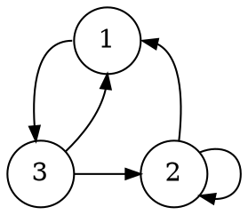
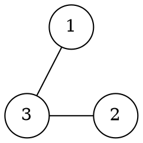

# Grafi

Un [grafo](../../ct0435/06/README.md) $G = (V, E)$ ha **cardinalità** $n = |V|$ e $m = |E|$.

Viene definito **orientato** se le coppie $(v_1, v_2) \in E \subseteq V \times V$ sono **ordinate**, da cui:
$$
|V \times V| = |V^2| = |V|^2
$$

Per esempio, se $V = \{1, 2, 3\}$ e $E = \{(1, 3), (2, 1), (2, 2), (3, 1), (3, 2)\}$:

Viene detto **non orientato** (_n.o._), se soddisfa le proprietà di:
- **Simmetria**, se $\forall (v, u) \in E, (u, v) \in E$
- **Non riflessività**, se $\forall v \in V, (v, v) \not\in E$ per cui non sono ammessi **cappi**

In alternativa è definito _n.o._ se $E \subseteq {V \choose 2}$, cioè l'insieme dei **sottoinsiemi** di $V$ formati da due elementi:
$$
\left|{V \choose 2}\right| = {|V| \choose 2} = {n \choose 2} = \frac{n(n - 1)}{2}
$$

Per esempio, se $V = \{1, 2, 3\}$ e $E = \{\{1, 3\}, \{2, 3\}\}$:

