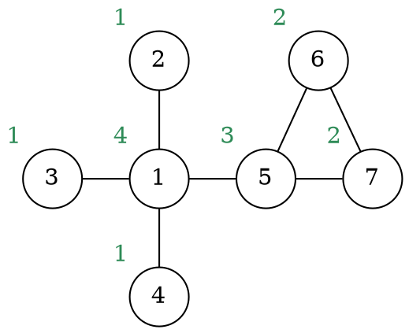
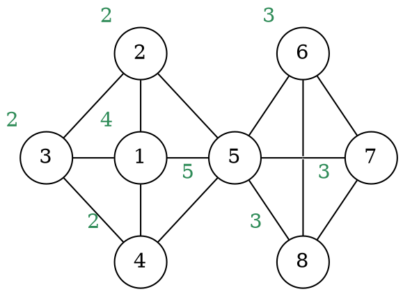

# Algoritmi greedy

Un algoritmo **greedy** è un algoritmo **iterativo** che effettua ad ogni passo la **miglior scelta locale** per arrivare alla miglior soluzione.
Per esempio, gli algoritmi _greedy_ già visti hanno come scelta migliore:
- [Kruskal](../02/02/02/README.md), gli **archi più leggeri**
- [Prim](../02/02/03/README.md), il nodo con **peso entrante più piccolo**
- [Dijkstra](../02/03/01/README.md), i nodi con **distanza minore**

Questi algoritmi seguono una **struttura generale** che può essere modellata come:
```c
greedy(X)
  sort(X)  // Ordinamento dei dati secondo un criterio greedy
  A = {}   // Inizializzazione di strutture dati
  for each x in X  // Estrazione ordinata degli elementi
    if ok(union(A, {x}))  // Scelta locale
      A = union(A, {x})
  return A
```

## Problema della selezione delle attività

Un altro esempio di algoritmo _greedy_ è quello per cui si vuole il **massimo numero** di attività $i, j = 1, ..., n$ che sono tra loro **compatibili** ovvero, data $s_{i,j}$ l'ora di inizio e $f_{i,j}$ l'ora di fine:
$$
[s_i, f_i) \cap [s_j, f_j) = \emptyset
$$

In questo caso il _criterio greedy_ consiste nell'**ordinare in base al tempo $f_i$**:
```c
greedy_activity_selector(s, f)
  n = s.length = f.length
  sort(s, f)  // Ordina i due array in base ad f
  A = {1}     // Contiene per prime quelle che finiscono prima
  j = 1       // Ultima attività inserita
  for i = 2 to n
    if s[i] >= f[j]  // Controlla che i sia compatibile con l'ultima attività j
      A = union(A, {i})
      j = i
  return A
```
che ha complessità $T(n) = O(n \log n)$ per il `sort`.

Altri criteri potevano **non funzionare**, per esempio se l'ordinamento fosse stato per:
- **durata**, un'attività corta scelta prima che ne coinvolge due più grandi può renderle incompatibili
- **tempo d'inizio**, un'attività che comincia prima potrebbe finire dopo le altre rendendole incompatibili

## Problema della clique massima

Un esempio in cui l'approccio _greedy_ **fallisce** è quello per **trovare la clique massima** di un grafo $G$:
```c
greedy_clique(G)
	sort(G.V)	// Ordinamento decrescente dei nodi in base al loro grado
	A = {}
	for each u in G.V
		if is_a_clique(G, A, u)
			A = union(A, {u})
	return A

is_a_clique(G, A, u)
	for each v in A
		if not contains(G.E, (u, v))
			return false
	return true
```
che avrebbe complessità $T(n) = O(n\log n + n^2) = O(n^2)$ dato che `is_a_clique` fa al più $n$ iterazioni.

Un esempio su cui fallisce è il grafo

infatti restituirebbe `{1, 5}` invece che `{5, 6, 7}`, perchè dopo `1` e `5` non potrebbe aggiungere altri nodi.

Anche se i nodi fossero stati ordinati in base ai **triangoli adiacenti**, esiste un grafo in cui fallisce:

perchè anche in questo caso restituirebbe `{5, 1, 2}` invece che `{5, 6, 7, 8}`.
