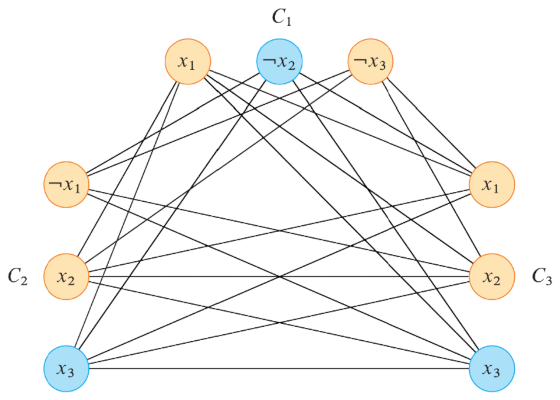

# Problema SAT

Il problema **SAT** cerca l'esistenza di un _istanza_ che porti un'**espressione logica** ad essere vera.
Analogamente, il problema del **CIRCUIT-SAT** cerca l'input che porti un **circuito logico** a restituire $1$.

Entrambi sono **NP completi**, e vengono detti **soddisfacibili** quando possiedono un'_istanza positiva_.

Per esempio, l'espressione $(x_1 \lor \neg x_2) \land (\neg x_1 \lor x_2) \land (x_1 \lor x_2)$ è _soddisfacibile_ con $x_1 = x_2 = 1$.

## Forma normale congiunta

Nell'algebra booleana è più comodo usare formule in [forma canonica](../../../ct0615-1/02/01/README.md), o **forma normale congiunta** (_FNC_).

In questa forma, la struttura è suddivisa in $q$ **clausole** ognuna composta da $k$ **letterali**:
$$
\Phi = (l_1 \lor ... \lor l_k) \land C_2 \land ... \land C_q
$$

In particolare, il **formato $k$-FNC** sono quelle espressioni che hanno $k$ _letterali_ su ogni _clausola_.

## Classe della clique

Si può dimostrare che il [problema della clique](../../03/README.md#problema-della-clique-massima) $\mathscr{P}$ è **NP completo**, infatti si [riconosce](../01/README.md#classe-np-c) da:
1. $\mathscr{P} \in \mathrm{NP}$, perchè è verificabile in $O(n^2)$ se ogni coppia di nodi ha un arco
2. Il problema **SAT-3FNC**, cioè il _SAT_ in _formato $3$-FNC_, è _riducibile_ a $\mathscr{P}$ \
	Questo è dimostrabile perchè una qualunque sua _istanza_ come
	$$
	\Phi = (x_1 \lor \neg x_2 \lor \neg x_3) \land (\neg x_1 \lor x_2 \lor x_3) \land (x_1 \lor x_2 \lor x_3)
	$$
	è trasformabile in un grafo, creando **un nodo per ogni letterale**, escludendo:
	- gli archi tra letterali della stessa clausola
	- archi tra letterali opposti

	con cui si ottiene il grafo:

	

	Di conseguenza, l'espressione $\Phi$ è **soddisfacibile** sse esiste una clique da $3$ nodi, infatti se si pongono a $1$ i nodi blu della clique scelta si ottengono $x_2 = 0$, $x_3 = 1$ e $x_1$ arbitrario, che _soddisfano_ $\Phi$.

## Gestire problemi intrattabili

Per poter **gestire** problemi **NP completi** si può ricorrere a:
1. **Algoritmi di approssimazioni**: trovano una soluzione, meno un errore $\epsilon$, in tempo polinomiale
2. **Gestire solo i casi speciali**, sperando che il problema ne rientri
3. **Affidarsi ad euristiche**: tentano di trovare la soluzione senza certezze
