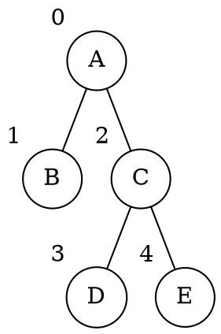

# Array

La _struttura dati_ può essere implementata con un array `P` contenente `(info, parent)`.

Per esempio, l'albero

sarà rappresentato dall'array `P = [(A, -1), (B, 0), (C, 0), (D, 2), (E, 2)]`.

Avendo $n$ _nodi_, la **complessità spaziale** sarà quindi $S(n) = \Theta(n)$.

## Implementazione

- **Padre**

	```c
	padre(Tree P, Node v) -> Node | NIL
	  p = P[v].parent
	  if p == -1
	    return NIL
	  else
	    return p
	```
	per cui $T(n) = \Theta(1)$.

- **Figli**

	```c
	figli(Tree P, Node v) -> [Node]
	  l = []
	  for i = 0 to P.length-1
	    if P[i].parent == v
	      push(l, i)  // Assunto 𝛩(1)
	  return l
	```
	per cui $T(n) = \Theta(n)$.
