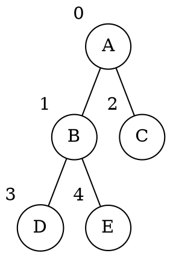
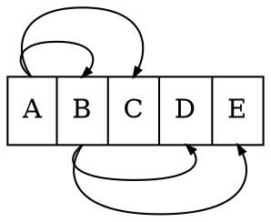

# Array

La _struttura dati_ può essere implementata con un array `P` contenente tutti i nodi.

In entrambe le rappresentazioni, avendo $n$ nodi, la **complessità spaziale** è data da $S(n) = \Theta(n)$.

Un albero di esempio può essere:


## Padri

In questa rappresentazione l'array è composto da coppie `(info, parent)`.

Nell'esempio, l'array `P` sarà rappresentato come `P = [(A, -1), (B, 0), (C, 0), (D, 1), (E, 1)]`.

### Implementazione

- **Padre**

	```c
	padre(Tree P, Node v) -> Node | NIL
	  if P[v].parent == -1
	    return NIL
	  else
	    return P[v].parent
	```
	per cui $T(n) = \Theta(1)$.

- **Figli**

	```c
	figli(Tree P, Node v) -> [Node]
	  l = []
	  for i = 0 to P.length-1
	    if P[i].parent == v
	      push(l, i)  // Assunto 𝛩(1)
	  return l
	```
	per cui $T(n) = \Theta(n)$.

## Posizionale

In questo caso la rappresentazione è applicabile per alberi $k$-ari **completi** con $k \geq 2$ salvato in `P.k`.
Solamente `info` è salvato nell'array, perchè la relazione tra i nodi è **conservata come indice** nell'array.

Nell'esempio, l'array `P` sarà rappresentato come `P = [A, B, C, D, E]`, ovvero:


La radice è in posizione $0$, mentre i figli del nodo $v$ sono in posizione $k \cdot v + 1 + i$ per $i = 0, ..., k-1$.
Definiamo $v$ padre di $f$ quando si ricava che:
$$
\begin{split}
&\Leftrightarrow k \cdot v + 1 \leq f \leq k \cdot v + 1 + k - 1 \\
&\Leftrightarrow k \cdot v \leq f - 1 \leq k \cdot v + k - 1 \\
&\Leftrightarrow v \leq \frac{f - 1}{k} \leq v + \underbrace{\frac{k - 1}{k}}_{< 1} \\
&\Leftrightarrow v \leq \frac{f - 1}{k} < v + 1 \\
&\Rightarrow v = \left\lfloor\frac{f - 1}{k}\right\rfloor
\end{split}
$$
dato che $v \in \mathbb{N}$.

### Implementazione

- **Padre**

	```c
	padre(Tree P, Node v) -> Node | NIL
	  if v == 0
	    return NIL
	  else
	    return floor((v - 1)/P.k)
	```
	per cui $T(n) = \Theta(1)$.

- **Figli**

	```c
	figli(Tree P, Node v) -> [Node]
	  l = []
	  if P.k*v + 1 >= P.length
	    return l
	  else
	    for i = 0 to P.k-1
	      push(l, P.k*v + 1 + i)  // Assunto 𝛩(1)
	    return l
	```
	per cui $T(n) = O(k)$ perchè nel caso migliore è $\Theta(1)$.
