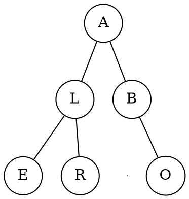
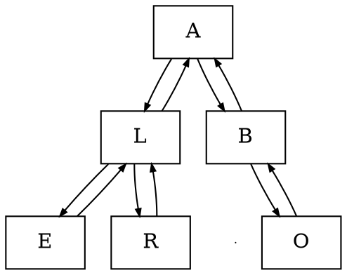
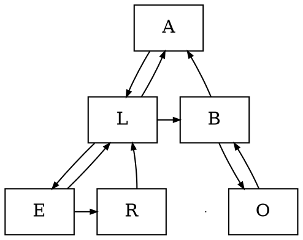

# Puntatori

La _struttura dati_ è implementata salvando su ogni nodo un puntatore al successivo.

Un albero di esempio può essere:


## Singoli figli

Nel caso di $k = 2$, ogni nodo della rappresentazione contiene `(info, parent, left, right)`.

Ogni nodo avrà allocato spazio per $k$ figli, di conseguenza la **complessità spaziale** è $S(n) = \Theta(kn)$.

Nell'esempio, l'albero avrà puntatori rappresentati come:


### Implementazione

- **Padre**

	```c
	padre(Tree P, Node v) -> Node | NIL
	  return v.parent
	```
	per cui $T(n) = \Theta(1)$.

- **Figli**

	```c
	figli(Tree P, Node v) -> [Node]
	  l = []
	  if v.left != NIL
	    push(l, v.left)  // Assunto 𝛩(1)
	  if v.right != NIL
	    push(l, v.right)
	  return l
	```
	per cui $T(n) = \Theta(\mathrm{grado}(v)) = O(k)$.

## Figlio sinistro e fratello destro

In questa rappresentazione ogni nodo contiene `(info, parent, left_child, right_sibling)`.

Nel caso dell'esempio i puntatori saranno rappresentati come:


### Implementazione

- **Padre**

	```c
	padre(Tree P, Node v) -> Node | NIL
	  return v.parent
	```
	per cui $T(n) = \Theta(1)$.

- **Figli**

	```c
	figli(Tree P, Node v) -> [Node]
	  l = []
	  iter = v.left_child
	  while iter != NIL
	    push(l, iter)  // Assunto 𝛩(1)
	    iter = iter.right_sibling
	  return l
	```
	per cui $T(n) = \Theta(\mathrm{grado}(v)) = O(k)$.
