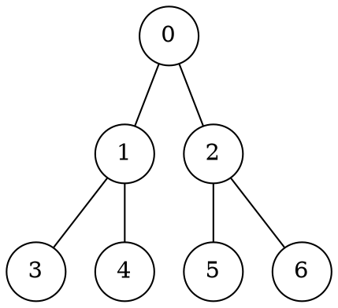

# Visite

Una visita generica su un albero può essere implementata come:
```c
visita(Node v)
  s = [v]             // Lista usata come pila LIFO
  while len(s) > 0
    n = pop(s)        // Assunto 𝛩(1)
    print(n.info)     // Visita il nodo
    for f in figli(n)
      push(s, f)      // Assunto 𝛩(1)
```
da cui si può dimostrare che la **complessità temporale** $T(n)$ e **spaziale** $S(n)$ sono entrambe $O(n)$, dato che i nodi vengono aggiunti e rimossi da `s` una sola volta, necessitando al più $O(n)$ iterazioni e spazio.

## Depth first search

La visita generica è una **visita in profondità** del tipo **pre-order**, e può essere espressa ricorsivamente come:
```c
DFS(Node r)
  if r != NIL
    print(r.info)  // Visita il nodo
    DFS(r.left)
    DFS(r.right)
```
che diventa **in-order** se la visita avviene dopo la prima `DFS` e **post-order** se avviene dopo la seconda.

Per esempio, sull'albero

la visita _in-order_ genera l'output `3140526`.
