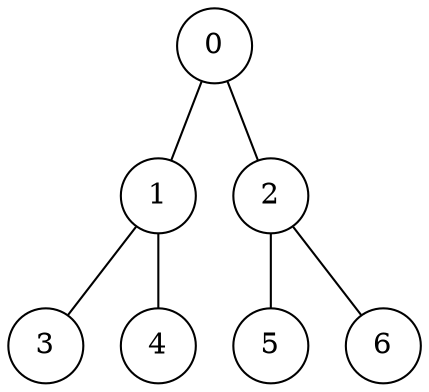

# Visite

Una visita generica su un albero può essere implementata come:
```c
visita(Node v)
  s = [v]               // Lista usata come pila LIFO
  while len(s) > 0
    n = pop(s)          // Assunto 𝛩(1)
    if n != NIL
      print(n.info)     // Visita il nodo
      for f in figli(n)
        push(s, f)      // Assunto 𝛩(1)
```
da cui si può dimostrare che la **complessità temporale** $T(n)$ e **spaziale** $S(n)$ sono entrambe $O(n)$, dato che i nodi vengono aggiunti e rimossi da `s` una sola volta, necessitando al più $O(n)$ iterazioni e spazio.

Un albero di esempio può essere

da cui verrà prodotto l'output `0134256`.

## Depth first search

La visita generica è una visita **in profondità** del tipo **pre-order**, e può essere espressa ricorsivamente come:
```c
DFS(Node r)
  if r != NIL
    print(r.info)  // Visita il nodo
    DFS(r.left)
    DFS(r.right)
```
che diventa **in-order** se la visita avviene dopo la prima `DFS` e **post-order** se avviene dopo la seconda.

Nell'esempio, la visita _in-order_ genera l'output `3140526` mentre quella _post-order_ l'output `3415620`.

Si può dimostrare per [sostituzione](../../../ct0371-1/01/03/README.md#metodo-della-sostituzione) che anche questa visita ha $T(n) = \Theta(n)$, partendo da:
$$
T(n) = \begin{cases}
c & \text{se } n = 0 \\
T(k) + T(n - k - 1) + d & \text{se } n > 0
\end{cases}
$$
dove $k$ è il numero di nodi nel sottoalbero sinistro e $c$ e $d$ sono costanti. Dato che $T(n)$ è lineare per ipotesi, si pone $T(n) = an + b$ e va dimostrato per [induzione completa](../../../ct0434/05/README.md#principio-di-induzione-completo) su $n$:
- **Caso base** per $n = 0$, si ha $T(0) = c$ ma anche $T(n) = a \cdot 0 + b$ quindi $b = c$
- **Passo induttivo** data l'_ipotesi induttiva_ $T(m) = am + b, \forall m < n$, si ha:

	$$
	\begin{split}
	T(n) &= T(\underbrace{k}_{< n}) + T(\underbrace{n-k-1}_{< n}) + d = \\
	&= ak + b + a(n - k - 1) + b + d = \\
	&= a(n - 1) + 2b + d = \\
	&= an - a + 2b + d = \\
	&= an + b \Leftrightarrow a = b + d
	\end{split}
	$$

	quindi $T(n) = (c + d)n + c$, per cui $T(n) = \Theta(n)$.

## Breadth first search

In questo caso la visita avviene **a livelli**, accedendo sequenzialmente ad ogni nodo dello stesso livello:
```c
BFS(Node r)
  q = [r]                 // Lista usata come coda FIFO
  while len(q) > 0
    n = dequeue(q)        // Assunto 𝛩(1)
    if n != NIL
      print(n.info)
      enqueue(q, n.left)  // Assunto 𝛩(1)
      enqueue(q, n.right)
```
che avrà **complessità temporale** $T(n) = \Theta(n)$ e **spaziale** $S(n) = \Theta(n)$.

Nell'esempio, la visita genera l'output `0123456`.
