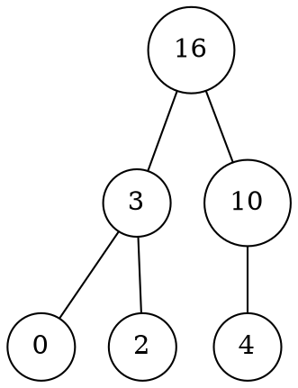

# Heap

Un albero binario è detto **heap** se è [completo](../README.md#alberi-k-ari) fino al livello $h-1$, e il resto delle foglie sono **verso sinistra**.

Per esempio, un albero può essere:

e potrà essere rappresentato in un array come `A = [16, 3, 10, 0, 2, 4]`.

Per cui il **padre** di `i` si raggiunge con `floor(i/2)`, mentre il **figlio sinistro** con `2*i` e il **destro** con `2*i+1`.

In base all'ordinamento di ogni nodo `i`, un _heap_ può essere specializzato in:
- **Max heap**, se `A[parent(i)] >= A[i]`
- **Min heap**, se `A[parent(i)] <= A[i]`

che **garantiscono** che la radice contiene il nodo **più grande** o **più piccolo** rispettivamente.

## Proprietà

Per un _heap_ di $n$, si ha che:

1. Ha **altezza** $h = \lfloor\log n\rfloor$.

	Questo si può dimostrare perchè:
	$$\left(\sum_{i = 0}^{n-1} 2^i\right) + 1 \leq n \leq \sum_{i = 0}^h 2^i$$
	cioè che $n$ è tra il numero di nodi di un albero completo alto $h-1$ e $h$, per cui:
	$$
	\begin{split}
	\frac{2^h - 1}{2 - 1} + 1 \leq n \leq \frac{2^{h + 1} - 1}{2 - 1}
	&\Leftrightarrow 2^h \leq n \leq 2^{h+1} - 1 < 2^{h+1} \\
	&\Leftrightarrow h \leq \log n < h+1
	\end{split}
	$$
	e quindi $h = \lfloor\log n\rfloor$ dato che $h \in \mathbb{N}$.

2. Le **foglie** occupano le posizioni $\left\lfloor\frac{n}{2}\right\rfloor + 1, \left\lfloor\frac{n}{2}\right\rfloor + 2, ..., n$.

3. Può possedere al più $\left\lceil\frac{n}{2^{h + 1}}\right\rceil$ **nodi** che hanno altezza $h$.

	Infatti con $h = 0$ ci sono $\left\lceil\frac{n}{2}\right\rceil$ foglie, mentre con $h = \lfloor\log n\rfloor$ ci sono $\left\lceil\frac{n}{2n}\right\rceil = \left\lceil\frac{1}{2}\right\rceil = 1$ nodi.

## Implementazione

- **Heapify**, per ripristinare l'_heap_ sapendo che `left(i)` e `right(i)` **sono** _max heap_

	```c
	max_heapify(Heap A, Node i)
	  l = left(i)
	  r = right(i)
	  max = i
	  if l <= A.heap_size and A[l] > A[i]
	    max = l
	  if r <= A.heap_size and A[r] > max
	    max = r
	  if i != max
	    swap(A[i], A[max])
	    max_heapify(A, max)
	```
	dove `A.heap_size` corrisponde a $n$ mentre $T(n) = O(h)$ cioè $O(\log n)$ per la _terza proprietà_.

- **Costruzione**, per generare gradualmente l'heap da $\left\lfloor\frac{n}{2}\right\rfloor$, cioè i nodi sopra le foglie, fino alla radice

	```c
	build_max_heap(Array A)
	  A.heap_size = A.length
	  for i = floor(A.length/2) down to 1
	    max_heapify(A, i)
	```
	che è **corretto** per l'[invariante](../../01/02/README.md#analisi-della-correttezza) del `for`:
	> Ogni nodo in `A[i+1..n]` **è radice** di un rispettivo _max heap_

	che al termine `i = 0` quindi `A[1..n]` sono radici di _max heap_, compreso `A[1]` che è la radice.

	Ha complessità $T(n) = O(n \log n)$, ma più precisamente:
	$$
	T(n) \leq \left(\sum_{h = 0}^{\lfloor\log n\rfloor} \left\lceil\frac{n}{2^{h + 1}}\right\rceil\right) O(h) =
	O\left(n \sum_{h = 0}^{\lfloor\log n\rfloor} \frac{h}{2^h}\right) =
	O\left(n \sum_{h = 0}^\infty \frac{h}{2^h}\right) = O(2n) = O(n)
	$$
	perchè $n \leq \sum\limits_{h = 0}^{\lfloor\log n\rfloor} \left\lceil\frac{n}{2^{h + 1}}\right\rceil$ per la _prima_ e _terza proprietà_ e $\sum\limits_{i = 0}^\infty ix^i = \frac{x}{(1 - x)^2}$ se $|x| < 1$.
