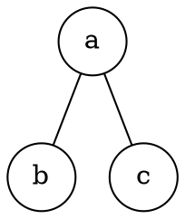
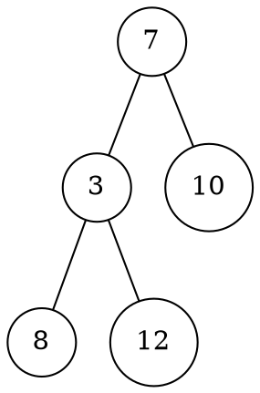
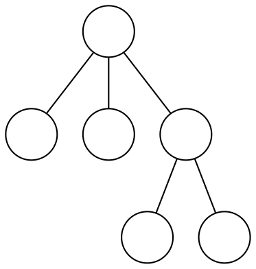

# Alberi

Un **albero radicato** è un _digrafo aciclico_ $T = (N, A)$ con un insieme finito di **nodi** $N$ e **archi** $A \subseteq N \times N$.

Ogni nodo di un albero $T$ ha **uno e un solo padre**, eccetto per la **radice** $r \in N$:
$$\forall v \in N \setminus \{r\}, \exists! u \in N : (u, v) \in A$$

Su questo _tipo di dato_ ci si aspettano le **operazioni**:
- `padre(Tree P, Node v) -> Node | NIL` che assume `v` presente in `P` e restituisce `NIL` se è _radice_
- `figli(Tree P, Node v) -> [Node]` che assume `v` presente in `P`

Per esempio, con

si ha $N = \{a, b, c\}$ e $A = \{(a, b), (a, c)\}$ che ha _radice_ $a$.

## Caratteristiche

Tra i nodi sono definiti dei **cammini** $(n_0, ..., n_k)$ da un nodo $u$ a $u'$, se:
$$
u = n_0\ \land\ u' = n_k\ \land\ (n_{i-1}, n_i) \in A, \forall i = 1, ..., k
$$
la cui **lunghezza** è il numero di archi $k$, di conseguenza esisterà **sempre** un cammino lungo $0$, i.e. da $u$ a $u$.

Inoltre, tra le **caratteristiche** di un albero sono definite anche:
- Un nodo $n \in N$ è detto **foglia** se $\nexists v \in N : (n, v) \in A$
- Tutti i nodi che non sono _foglie_ sono detti **nodi interni**
- Viene detto **grado** il numero di figli di un nodo
- I nodi con lo _stesso padre_ sono detti **fratelli**
- Un nodo $y$, nel _cammino_ dalla _radice_ $r$ a $x$, è detto **antenato** di $x$, mentre $x$ è il suo **discendente**
- Se $y$ è _antenato_ di $x$ e $y \neq x$ allora $y$ è **antenato proprio** di $x$, mentre $x$ **discendente proprio**
- Un **sottoalbero** di _radice_ $x \in N$ è formato dai _discendenti_ di $x$
- La **profondità** di un nodo $x$ è la _lunghezza_ del _cammino_ dalla _radice_ a $x$
- Un **livello** è l'insieme dei nodi con la stessa _profondità_
- L'**altezza di un nodo** $x$ è la _lunghezza_ del cammino più lungo da $x$ ad una _foglia_
- L'**altezza dell'albero** è l'_altezza_ della _radice_, che corrisponde alla _profondità_ massima

Per esempio, con

si ha che:
- $7$ e $3$ sono _nodi interni_ mentre $8$, $12$ e $10$ sono _foglie_
- $7$ ha _grado_ $2$, _altezza_ $2$ e _profondità_ $0$
- $3$ e $7$ sono _antenati propri_ di $12$, mentre $12$ è _discendente_ di $3$, $7$ e $12$
- $8$ e $12$ hanno _profondità_ $2$, mentre $10$ _profondità_ $1$
- $3$ e $10$ come $8$ e $12$ sono _fratelli_
- $\{7\}$ è al _livello_ $0$, $\{3, 10\}$ al _livello_ $1$ e $\{8, 12\}$ al _livello_ $2$
- $(7, 3)$, $(7, 3, 12)$, $(7, 10)$ e $(8, 8)$ sono alcuni dei possibili _cammini_
- $(\{3, 8, 12\}, \{(3, 8), (3, 12)\})$ è _sottoalbero_ con _radice_ $3$

## Alberi $k$-ari

Un albero si dice **$k$-ario** se ogni nodo ha **al più** $k$ figli.
È detto **binario** invece, se è **vuoto** o possiede ricorsivamente un _sottoalbero binario_ **sinistro** e uno **destro**, ovvero $k = 2$ figli.

Un albero **$k$-ario** è definito **bilanciato** se l'altezza $h = O(\log n)$.

Se è _bilanciato_, viene anche detto **completo** se ogni _foglia_ ha la **stessa profondità** e ogni nodo ha **grado** $k$.

Per esempio, l'albero

è $3$-ario perchè ha $k$ che è al **minimo** $3$, _bilanciato_ ma non _completo_.

### Numero di nodi

Si può dimostrare che, se l'albero è _$k$-ario completo_ con _altezza_ $h$, il **numero di foglie** sarà:
$$
n = k^h
$$
per _induzione_ su $h$:
- **Caso base**: per $h = 0$ ci sono $k^0 = 1$ _foglie_, cioè la _radice_
- **Passo induttivo**: si assume che $k^{h-1}$ sia il numero _foglie_ dell'albero alto $h-1$, allora dato che ogni sua _foglia_ ha a sua volta $k$ _foglie_, per _ipotesi induttiva_ $k^{h-1} \cdot k = k^h$

da cui si ricava che l'_altezza_ sarà $h = \log_k n$.

Inoltre, si può anche derivare che il **numero di nodi interni** è:
$$
\sum_{i = 0}^{n-1} k^i \underset{k \neq 1}{=} \frac{k^h - 1}{k - 1}
$$
cioè la somma del _numero di foglie_ per _altezza_ crescente.
