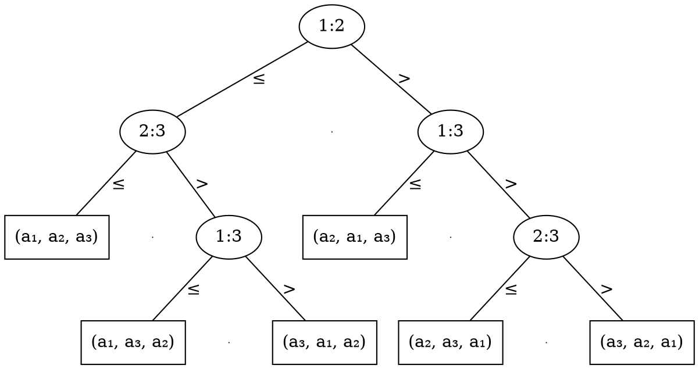

# Ordinamento lineare

Ipotizzando che ogni elemento da ordinare è distinto, è possibile dimostrare che gli [algoritmi a confronto](../03/README.md) sono sempre $\Omega(n \log n)$, infatti dato l'**albero dei confronti** $i:j$ di un array $(a_1, a_2, a_3)$

ci interessa l'**altezza** che corrisponde al numero di confronti e quindi al **tempo di esecuzione**.

Le **foglie**, per un input largo $n$, sono quindi:
$$
n! \leq f \leq 2^h
$$
dato che ci sono al minimo $n!$ **permutazioni** di $a_1, ..., a_n$, e al massimo $2^h$ perchè alcuni algoritmi possono ripetere alcuni confronti, e perchè un albero alto $h$ ha al più $2^h$ foglie:
- **Caso base** per $h = 0$, ci sono $f = 1 \leq 2^0$ foglie
- **Passo induttivo** assumendo che $f_{T_i} \leq 2^k, \forall k < h$, allora:
	$$
f = f_{T_1} + f_{T_2} \leq 2^{h_1} + 2^{h_2} \leq 2^{\max(h_1, h_2)} + 2^{\max(h_1, h_2)} = 2^{1 + \max(h_1, h_2)} = 2^h
$$
	dove $T_1$ e $T_2$ sono i sottoalberi figli.

Di conseguenza, si ha che:
$$
n! \leq 2^h \Leftrightarrow 2^{\log_2 n!} \leq 2^h \\
\Updownarrow \\
h \geq \log_2 n! \geq \log_2 \left(\frac{n}{e}\right)^n = n (\log_2 n - \log_2 e) = \Omega(n \log n)
$$
sapendo che $n! \approx \sqrt{2\pi n}\left(\frac{n}{e}\right)^n (1 + \Theta(\frac{1}{n}))$ e che per $n \to \infty$ il termine $\left(\frac{n}{e}\right)^n$ domina.

Per ottenere **prestazioni migliori** quindi, sarà necessario evitare la tecnica del **confronto**.
