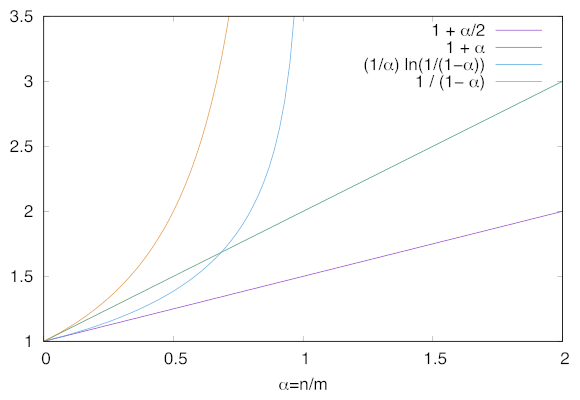

# Confronto

Dal grafico si nota che `T` è bene sia **ristrutturata** raddoppiando la dimensione, dopo un certo valore:
- $\alpha \geq 2$ per il _concatenamento_, e richiederà $O(m + n)$ dato che vanno visitate le liste nelle celle
- $\alpha \geq \frac{1}{2}$ per l'_indirizzamento aperto_, e richiederà $O(m)$
