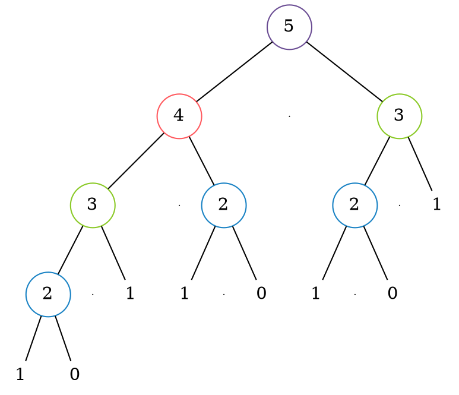

# Programmazione dinamica

La **programmazione dinamica** è una tecnica di **progettazione** di algoritmi che:
- Sono **riducibili** a molteplici sottoproblemi annidati
- Possiedono sottoproblemi detti **sovrapponibili**, ovvero che sono riutilizzati tra i vari sottoproblemi

La tecnica si basa quindi sul **salvare** il risultato dei sottoproblemi così da avere la soluzione a disposizione.

Per esempio, dall'albero ricorsivo della funzione di Fibonacci per $f(5)$

si nota che conviene _salvare_ il risultato di $f(2)$ e $f(3)$ per calcolarlo **una sola volta**.

Durante l'implementazione si può scegliere tra due **tecniche di costruzione** di algoritmi:
- **Top-down**, attraverso la **memoization**: salva le soluzioni in una tabella durante la ricorsione
- **Bottom-up**: ordina i sottoproblemi in base alla dimensione e li risolve dal più piccolo, salvandoli

Quando la soluzione non dipende da **tutti i sottoproblemi** conviene usare la **top-down** perchè evita di calcolarli tutti ed è più intuitiva, altrimenti conviene la **bottom-up** perchè **evita il carico** della ricorsione.
