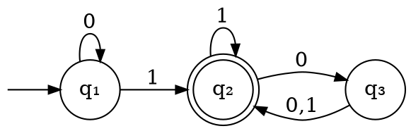

# Linguaggi

Un **linguaggio** $L(M)$ è l'insieme di **stringhe** arbitrariamente lunghe che un $M = (Q, \Sigma, \delta, q_0, F)$ **accetta**.
Dato poi un linguaggio $A$, esso si dice **regolare** quando esiste un qualsiasi _DFA_ $D$ per cui $L(D) = A$.

Per esempio dato $D$, il seguente _DFA_:

si può ricavare che $L(D)$ è l'insieme di stringhe con almeno un $1$ e un numero pari di $0$ dopo l'ultimo $1$. Questo si può verificare definendo le **proprietà** associate ad ogni stato:
1. $q_1$: $w$ è vuota o è composta da soli $0$, perchè al primo $1$ non si torna più su $q_1$
2. $q_2$: $w$ contiene almeno un $1$, dato che è uscito da $q_1$, e un numero pari di $0$ dopo l'ultimo $1$
3. $q_3$: $w$ contiene almeno un $1$ e un numero dispari di $0$ dopo l'ultimo $1$

Considerando che formano una **partizione** di tutte le possibili stringhe e $L(D)$ corrisponde all'unione delle _proprietà_ degli stati in $F$, il linguaggio è verificato. Essendo rappresentato da $D$, è anche _regolare_.
