# Equivalenza

## NFA e DFA

Si può dimostrare che per ogni _NFA_ $N$, esiste un _DFA_ $D$ tale che $L(D) = L(N)$.

Dato $N = (Q, \Sigma, \delta, q_0, F)$ con possibili $\epsilon$-transizioni, si vuole costruire $D = (Q', \Sigma, \delta', q_0', F')$:
- $Q' = P(Q)$, per cui ogni stato di $D$ rappresenta un livello dell'[albero di computazione](../README.md#nfa) di $N$
- $q_0' = \Epsilon(\{q_0\})$
- $F' = \Set{R \in Q' | \exists r \in R : r \in F}$
- $\delta'(R, a) = \bigcup\limits_{r \in R} \Epsilon(\delta(r, a))$

dove $E(R)$ è l'**insieme** degli stati $q$ raggiungibili da qualche $r \in R$ con **$0$ o più $\epsilon$-transizioni**.

Per esempio, l'_NFA_

```dot process
digraph {
	rankdir=LR
	node [shape=circle]
	edge [arrowsize=0.8]

	1 [label="1" shape=doublecircle]
	2 [label="2"]
	3 [label="3"]
	_0 [shape=point width=0 height=inf style=invis]

	_0 -> 1
	1 -> 3 [label="𝜀"]
	1 -> 2 [label="b"]
	2 -> 3 [label="a,b"]
	3 -> 1 [label="a"]
	2 -> 2 [label="a"]
}
```

è convertibile nel seguente _DFA_:

che è il risultato delle seguenti transizioni, che partono da $q_0' = \Epsilon(\{1\}) = \{1, 3\}$:
1. $\delta'(\{1, 3\}, a) = \Epsilon(\delta(1, a)) \cup \Epsilon(\delta(3, a)) = E(\emptyset) \cup E(\{1\}) = \emptyset \cup \{1, 3\} = \{1, 3\}$
2. $\delta'(\{1, 3\}, b) = \Epsilon(\{2\}) \cup \Epsilon(\emptyset) = \{2\} \cup \emptyset = \{2\}$
3. $\delta'(\{2\}, a) = \Epsilon(\{2, 3\}) = \{2, 3\}$
4. $\delta'(\{2\}, b) = \Epsilon(\{3\}) = \{3\}$
5. $\delta'(\{2, 3\}, a) = \Epsilon(\{2, 3\}) \cup \Epsilon(\{1\}) = \{1, 2, 3\}$
6. $\delta'(\{2, 3\}, b) = \Epsilon(\{3\}) \cup \Epsilon(\emptyset) = \{3\}$
7. $\delta'(\{3\}, a) = \Epsilon(\{1\}) = \{1, 3\}$
7. $\delta'(\{3\}, b) = \Epsilon(\emptyset) = \emptyset$
7. $\delta'(\{1, 2, 3\}, a) = \Epsilon(\emptyset) \cup \Epsilon(\{2, 3\}) \cup \Epsilon(\{1\}) = \{1, 2, 3\}$
7. $\delta'(\{1, 2, 3\}, b) = \Epsilon(\{2\}) \cup \Epsilon(\{3\}) \cup \Epsilon(\emptyset) = \{2, 3\}$
