# Operazioni su linguaggi

Tra due linguaggi $A$ e $B$ **qualsiasi** sono definite:
- **Unione**: $A \cup B = \Set{w | w \in A \lor w \in B}$
- **Concatenazione**: $A \circ B = \Set{w_1w_2 | w_1 \in A \land w_2 \in B}$, con $|A \circ B| = |A \times B|$
- **Star**: $A^\ast = \Set{w_1w_2 \cdots w_k | k \geq 0 \land w_i \in A,\ \forall i = 1, ..., k}$, che conterrà $\epsilon$

## Chiusure

La _classe dei linguaggi regolari_ è **chiusa** rispetto alle precedenti operazioni, ovvero se $A$ e $B$ sono **regolari** allora è **regolare anche il risultato** delle operazioni su di essi.

### Unione

Dati due linguaggi regolari $A$ e $B$, la **chiusura dell'unione** si può dimostrare perchè:
$$
\exists M_1 = (Q_1, \Sigma_1, \delta_1, q_1, F_1), M_2 = (Q_2, \Sigma_2, \delta_2, q_2, F_2) : L(M_1) = A \land L(M_2) = B \\
\Downarrow \\
\exists M = (Q, \Sigma, \delta, q_0, F) : L(M) = A \cup B
$$

Questo è possibile perchè $M_1$ e $M_2$ sono **simulabili** in parallelo, assumendo che $\Sigma = \Sigma_1 = \Sigma_2$:
- $Q = Q_1 \times Q_2$
- $q_0 = (q_1, q_2)$, composto dagli stati iniziali di $M_1$ e $M_2$
- $F = \Set{(r_1, r_2) \in Q | r_1 \in F_1 \lor r_2 \in F_2}$
- $\delta((r_1, r_2), a) = (\delta(r_1, a), \delta(r_2, a)),\ \forall (r_1, r_2) \in Q, a \in \Sigma$

L'assunzione per cui $\Sigma = \Sigma_1 = \Sigma_2$ non è limitante perchè basta aggiungere uno **stato pozzo**, per esempio

ha alfabeto $\{a, b\}$, e si può trasformare in $\{a, b, c\}$ con:

### Concatenazione

Se due linguaggi $A$ e $B$ sono regolari allora esistono gli _NFA_ $N_1$ e $N_2$ che li rappresentano, e concatenandoli si crea l'_NFA_ $N$ per cui $L(N) = A \circ B$ e si dimostra la **chiusura della concatenazione**:

```dot process
digraph {
	rankdir=LR
	node [shape=circle label="" fixedsize=true width=0.3 height=0.3]
	edge [arrowsize=0.6]

	subgraph cluster_3 {
		label="N"
		labeljust=l

		subgraph cluster_4 {
			label=""
			margin=11

			c1
			c2
			c3
			_c1 [shape=plaintext label="..."]

			c1 -> _c1 -> c2
			_c1 -> c3 [label=" "]
			_c1 -> c3 [dir=back label="𝜀"]
		}

		subgraph cluster_5 {
			label=""
			margin=10

			d1
			d2 [shape=doublecircle]
			_d0 [shape=plaintext label="..."]

			d1 -> _d0 -> d2
		}

		_e0 [shape=point width=0 height=inf style=invis]

		_e0 -> c1
		c2, c3 -> d1 [xlabel="𝜀"]
	}

	subgraph cluster_0 {
		label=""
		color="transparent"

		subgraph cluster_1 {
			label="N₁"
			labeljust=l
			color="black"

			a1
			a2 [shape=doublecircle]
			a3 [shape=doublecircle]
			_a0 [shape=point width=0 height=inf style=invis]
			_a1 [shape=plaintext label="..."]


			_a0 -> a1 -> _a1 -> a2
			_a1 -> a3 [label=" "]
			_a1 -> a3 [dir=back label="𝜀"]
		}

		subgraph cluster_2 {
			label="N₂"
			labeljust=l
			color="black"

			b1
			b2 [shape=doublecircle]
			_b0 [shape=point width=0 height=inf style=invis]
			_b1 [shape=plaintext label="..."]

			_b0 -> b1 -> _b1 -> b2
		}
	}

	a2, a3 -> _b0 [style=invis]
}
```

Quindi, se $N_1 = (Q_1, \Sigma_1, \delta_1, q_1, F_1)$ e $N_2 = (Q_2, \Sigma_2, \delta_2, q_2, F_2)$, allora $N = (Q, \Sigma, \delta, q_0, F)$ è definito:
- $Q = Q_1 \cup Q_2$
- $q_0 = q_1$
- $F = F_2$
- $\delta(q, a) = \begin{cases}\delta_1(q, a) & \text{se } q \in Q_1 \setminus F_1 \\ \delta_2(q, a) & \text{se } q \in Q_2 \\ \delta_1(q, a) & \text{se } q \in F_1 \land a \neq \epsilon \\ \{q_2\} \cup \delta_1(q, a) & \text{se } q \in F_1 \land a = \epsilon\end{cases}$

## Star

Come per la _concatenazione_, la **chiusura di star** rispetto ad $L(N) = A$ si dimostra costruendo un _NFA_ $M$:

```dot process
digraph {
	rankdir=LR
	node [shape=circle label="" fixedsize=true width=0.3 height=0.3]
	edge [arrowsize=0.6]

	subgraph cluster_1 {
		label="M"
		labeljust=l

		subgraph cluster_2 {
			label=""
			margin=11

			b1
			b2 [shape=doublecircle]
			_b0 [shape=plaintext label="..."]

			b1 -> _b0 -> b2 [weight=1000]
		}

		c1 [shape=doublecircle]
		_c0 [shape=point width=0 height=inf style=invis]

		{
			edge [constraint=false style=invis]

			b2 -> b1
			b2 -> b1
			b2 -> b1
			b2 -> b1
			b2 -> b1
		}
		b2 -> b1 [xlabel="𝜀" constraint=false]
		_c0 -> c1
		c1 -> b1 [label="𝜀"]
	}

	subgraph cluster_0 {
		label="N"
		labeljust=l

		a1
		a2 [shape=doublecircle]
		_a0 [shape=point width=0 height=inf style=invis]
		_a1 [shape=plaintext label="..."]

		_a0 -> a1 -> _a1 -> a2
	}
}
```

