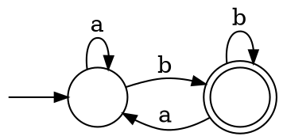
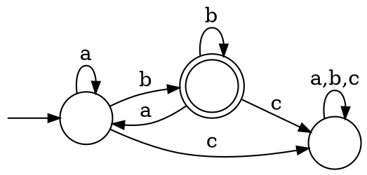

# Operazioni su linguaggi

Tra due linguaggi $A$ e $B$ **qualsiasi** sono definite:
- **Unione**: $A \cup B = \Set{w | w \in A \lor w \in B}$
- **Concatenazione**: $A \circ B = \Set{w_1w_2 | w_1 \in A \land w_2 \in B}$, con $|A \circ B| = |A \times B|$
- **Star**: $A^\ast = \Set{w_1w_2 \cdots w_k | k \geq 0 \land w_i \in A,\ \forall i = 1, ..., k}$, che conterrà $\epsilon$

## Chiusure

La _classe dei linguaggi regolari_ è **chiusa** rispetto alle precedenti operazioni, ovvero se $A$ e $B$ sono **regolari** allora è **regolare anche il risultato** delle operazioni su di essi.

### Unione

Dati due linguaggi _regolari_ $A$ e $B$, la _chiusura_ dell'unione si può dimostrare perchè:
$$
\exists M_1 = (Q_1, \Sigma_1, \delta_1, q_1, F_1), M_2 = (Q_2, \Sigma_2, \delta_2, q_2, F_2) : L(M_1) = A \land L(M_2) = B \\
\Downarrow \\
\exists M = (Q, \Sigma, \delta, q_0, F) : L(M) = A \cup B
$$

Questo è possibile perchè $M_1$ e $M_2$ sono **simulabili** in parallelo, assumendo che $\Sigma = \Sigma_1 = \Sigma_2$:
- $Q = Q_1 \times Q_2$
- $q_0 = (q_1, q_2)$, composto dagli stati iniziali di $M_1$ e $M_2$
- $F = \Set{(r_1, r_2) \in Q | r_1 \in F_1 \lor r_2 \in F_2}$
- $\delta((r_1, r_2), a) = (\delta(r_1, a), \delta(r_2, a)),\ \forall (r_1, r_2) \in Q, a \in \Sigma$

L'assunzione per cui $\Sigma = \Sigma_1 = \Sigma_2$ non è limitante perchè basta aggiungere uno **stato pozzo**, per esempio

ha alfabeto $\{a, b\}$, e si può trasformare in $\{a, b, c\}$ con:

