# Equivalenza

## NFA e DFA

Si può dimostrare che per ogni _NFA_ $N$, esiste un _DFA_ $D$ tale che $L(D) = L(N)$.

Dato $N = (Q, \Sigma, \delta, q_0, F)$ con possibili $\epsilon$-transizioni, si vuole costruire $D = (Q', \Sigma, \delta', q_0', F')$:
- $Q' = P(Q)$, per cui ogni stato di $D$ rappresenta un livello dell'[albero di computazione](../README.md#nfa) di $N$
- $q_0' = \Epsilon(\{q_0\})$
- $F' = \Set{R \in Q' | \exists r \in R : r \in F}$
- $\delta'(R, a) = \bigcup\limits_{r \in R} \Epsilon(\delta(r, a))$

dove $E(R)$ è l'**insieme** degli stati $q$ raggiungibili da qualche $r \in R$ con **$0$ o più $\epsilon$-transizioni**.

Per esempio, l'_NFA_

```dot process
digraph {
	rankdir=LR
	node [shape=circle]
	edge [arrowsize=0.8]

	1 [label="1" shape=doublecircle]
	2 [label="2"]
	3 [label="3"]
	_0 [shape=point width=0 height=inf style=invis]

	_0 -> 1
	1 -> 3 [label="𝜀"]
	1 -> 2 [label="b"]
	2 -> 3 [label="a,b"]
	3 -> 1 [label="a"]
	2 -> 2 [label="a"]
}
```

è convertibile nel seguente _DFA_:

che è il risultato delle seguenti transizioni, che partono da $q_0' = \Epsilon(\{1\}) = \{1, 3\}$:
1. $\delta'(\{1, 3\}, a) = \Epsilon(\delta(1, a)) \cup \Epsilon(\delta(3, a)) = E(\emptyset) \cup E(\{1\}) = \emptyset \cup \{1, 3\} = \{1, 3\}$
2. $\delta'(\{1, 3\}, b) = \Epsilon(\{2\}) \cup \Epsilon(\emptyset) = \{2\} \cup \emptyset = \{2\}$
3. $\delta'(\{2\}, a) = \Epsilon(\{2, 3\}) = \{2, 3\}$
4. $\delta'(\{2\}, b) = \Epsilon(\{3\}) = \{3\}$
5. $\delta'(\{2, 3\}, a) = \Epsilon(\{2, 3\}) \cup \Epsilon(\{1\}) = \{1, 2, 3\}$
6. $\delta'(\{2, 3\}, b) = \Epsilon(\{3\}) \cup \Epsilon(\emptyset) = \{3\}$
7. $\delta'(\{3\}, a) = \Epsilon(\{1\}) = \{1, 3\}$
7. $\delta'(\{3\}, b) = \Epsilon(\emptyset) = \emptyset$
7. $\delta'(\{1, 2, 3\}, a) = \Epsilon(\emptyset) \cup \Epsilon(\{2, 3\}) \cup \Epsilon(\{1\}) = \{1, 2, 3\}$
7. $\delta'(\{1, 2, 3\}, b) = \Epsilon(\{2\}) \cup \Epsilon(\{3\}) \cup \Epsilon(\emptyset) = \{2, 3\}$

## Regex

L'equivalenza si dimostra perchè $A$ è regolare sse esiste una _regex_ $R$ tale che $L(R) = A$:
1. **Condizione necessaria** ($\Leftarrow$)

	Si può dimostrare che $A$ è regolare per induzione sulla struttura di $R$, infatti:
	1. Sia $R = a$ per qualche $a$ allora $L(R) = \{a\}$ è regolare perchè:
		```dot process
		digraph {
			rankdir=LR
			node [shape=circle label="" fixedsize=true width=0.3 height=0.3]
			edge [arrowsize=0.8]

			1
			2 [shape=doublecircle]
			_0 [shape=point width=0 height=inf style=invis]

			_0 -> 1
			1 -> 2 [label="a"]
		}
		```

	2. Sia $R = \epsilon$ allora $L(R) = \{\epsilon\}$ è regolare perchè:
		```dot process
		digraph {
			rankdir=LR
			node [shape=circle label="" fixedsize=true width=0.3 height=0.3]
			edge [arrowsize=0.8]

			1 [shape=doublecircle]
			_0 [shape=point width=0 height=inf style=invis]

			_0 -> 1
		}
		```

	3. Sia $R = \emptyset$ allora $L(R) = \emptyset$ è regolare perchè:
		```dot process
		digraph {
			rankdir=LR
			node [shape=circle label="" fixedsize=true width=0.3 height=0.3]
			edge [arrowsize=0.8]

			1
			_0 [shape=point width=0 height=inf style=invis]

			_0 -> 1
		}
		```

	4. Sia $R = R_1 \cup R_2$ allora $L(R) = L(R_1) \cup L(R_2)$ è regolare per _ipotesi induttiva_, ovvero perchè l'operazione di _unione_ è chiusa e a causa dei casi precedenti $L(R_1)$ e $L(R_2)$ sono già regolari

	5. Sia $R = R_1 \circ R_2$ allora $L(R) = L(R_1) \circ L(R_2)$ è regolare per _ipotesi induttiva_

	6. Sia $R = {R_1}^\ast$ allora $L(R) = L(R)^\ast$ è regolare per _ipotesi induttiva_

2. **Condizione sufficiente** ($\Rightarrow$)

	Essendo $A$ regolare, esiste un _DFA_ associato e lo si potrà **trasformare** in _GNFA_ (o _NFA_ generalizzato):
	```dot process
	digraph {
		rankdir=LR
		node [shape=box]
		edge [arrowsize=0.8]

		1 [label="DFA\nda k stati"]
		2 [label="GNFA\nda k+2 stati"]
		3 [label="GNFA\nda k+1 stati"]
		4 [label="GNFA\nda 2 stati"]
		5 [shape=plaintext label="Regex"]
		_0 [shape=plaintext label="..."]

		1 -> 2 -> 3 -> _0 -> 4 -> 5
	}
	```

	La **riduzione** è possibile perchè ogni arco del _GNFA_ è etichettato da _regex_, e il processo consisterà nel:
	1. Aggiungere un **nuovo stato iniziale** $q_s$ che va verso $q_0$ con una $\epsilon$-transizione
	2. Aggiungere un **nuovo stato finale** $q_f$ verso cui vanno gli stati di $F$ con $\epsilon$-transizioni
	3. Modificare il _GNFA_ **rimuovendo uno stato** di $Q$ e usando le _regex_ perchè riconosca $A$
	4. Ripetere l'ultimo punto finchè non rimangono più stati di $Q$

	Per esempio, partendo con un _DFA_:
	1. ```dot process
		digraph {
			rankdir=LR
			node [shape=circle fixedsize=true width=0.4 height=0.4]
			edge [arrowsize=0.8]

			1
			2 [shape=doublecircle]
			_0 [shape=point width=0 height=inf style=invis]

			_0 -> 1
			1 -> 1 [label="a"]
			1 -> 2 [label="b"]
			2 -> 2 [label="a,b"]
		}
		```

	2. ```dot process
		digraph {
			node [shape=circle fixedsize=true width=0.4 height=0.4]
			edge [arrowsize=0.8]

			s
			1
			2
			f [shape=doublecircle]
			_0 [shape=point width=0 height=inf style=invis]

			{
				rank=same
				_0 -> s
				s -> 1 [label="𝜀"]
			}
			s -> f [weight=100 style=invis]
			1 -> 1 [label=" a"]
			1 -> 2 [label=" b"]
			2 -> 2 [label=" a ∪ b"]
			{
				rank=same
				f -> 2 [dir=back label="𝜀"]
			}
		}
		```

	3. ```dot process
		digraph {
			rankdir=LR
			node [shape=circle fixedsize=true width=0.4 height=0.4]
			edge [arrowsize=0.8]

			s
			1
			f [shape=doublecircle]
			_0 [shape=point width=0 height=inf style=invis]

			_0 -> s
			s -> 1 [label="𝜀"]
			1 -> 1 [label="a"]
			1 -> f [label="b(a ∪ b)*"]
		}
		```

	4. ```dot process
		digraph {
			rankdir=LR
			node [shape=circle fixedsize=true width=0.4 height=0.4]
			edge [arrowsize=0.8]

			s
			f [shape=doublecircle]
			_0 [shape=point width=0 height=inf style=invis]

			_0 -> s
			s -> f [label="a*b(a ∪ b)*"]
		}
		```
