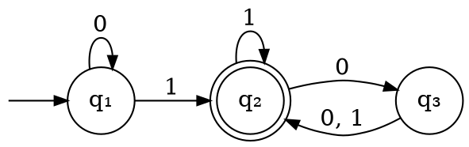

# Linguaggi regolari

## DFA

Un **automa a stati finiti deterministico** (o _DFA_) $D$ è definito come una **quintupla** $(Q, \Sigma, \delta, q_0, F)$, dove:
- $Q$ è l'insieme di **stati**
- $\Sigma$ è l'alfabeto degli **input**
- $\delta\colon Q \times \Sigma \to Q$ è la **funzione di transizione**, definita per ogni input
- $q_0 \in Q$ è lo **stato iniziale**
- $F \subseteq Q$ è l'insieme degli **stati accentanti** finali

Per esempio, l'automa

sarà rappresentato dalla quintupla $D = (Q, \Sigma, \delta, q_0, F)$, dove:
$$
\begin{split}
Q &= \Set{q_1, q_2, q_3} \\
\Sigma &= \Set{0, 1} \\
q_0 &= q_1 \\
F &= \Set{q_2}
\end{split} \hspace{0.8em}\land\hspace{1em} \begin{cases}
\delta(q_1, 0) = q_1 \\
\delta(q_1, 1) = q_2 \\
\delta(q_2, 0) = q_3 \\
\delta(q_2, 1) = q_2 \\
\delta(q_3, 0) = q_2 \\
\delta(q_3, 1) = q_2
\end{cases}
$$

## Linguaggio

Il **linguaggio** $L(M)$ di un $M = (Q, \Sigma, \delta, q_0, F)$ è l'insieme di **stringhe** arbitrariamente lunghe che **accetta**.

Una stringa $w = w_1w_2...w_n : w_i \in \Sigma,\ \forall i=1, ..., n$ è **accettata** da $M$ sse $\exists r_0,r_1,...,r_n \in Q$ tale che:
1. $r_0 = q_0$: la sequenza di stati **comincia** dallo stato iniziale
2. $r_n \in F$: alla **fine dell'input** si trova su uno stato _accettante_
3. $\delta(r_i, w_{i+1}) = r_{i+1},\ \forall i=0, ..., n-1$: l'$(i+1)$-esimo input porta allo **prossimo stato** della sequenza

Un linguaggio $A$ dice anche **regolare** quando esiste un _DFA_ $M$ per cui $L(M) = A$.

Nell'esempio precedente si può ricavare che $L(D)$ è l'insieme di stringhe con almeno un $1$ e un numero pari di $0$ dopo l'ultimo $1$. Questo si può verificare definendo le **proprietà** associate ad ogni stato:
1. $q_1$: $w$ è vuota o è composta da soli $0$, perchè al primo $1$ non si torna più su $q_1$
2. $q_2$: $w$ contiene almeno un $1$, dato che è uscito da $q_1$, e un numero pari di $0$ dopo l'ultimo $1$
3. $q_3$: $w$ contiene almeno un $1$ e un numero dispari di $0$ dopo l'ultimo $1$

Considerando che formano una **partizione** di tutte le possibili stringhe e $L(D)$ corrisponde all'unione delle _proprietà_ degli stati in $F$, il linguaggio è verificato. Essendo rappresentato da $D$, è anche _regolare_.

## Operazioni regolari

Tra due linguaggi $A$ e $B$ **qualsiasi** sono definite:
- **Unione**: $A \cup B = \Set{w | w \in A \lor w \in B}$
- **Concatenazione**: $A \circ B = \Set{w_1w_2 | w_1 \in A \land w_2 \in B}$, con $|A \circ B| = |A \times B|$
- **Star**: $A^\ast = \Set{w_1w_2 \cdots w_k | k \geq 0 \land w_i \in A\ \forall i = 1, ..., k}$, che conterrà $\epsilon$

La _classe dei linguaggi regolari_ è **chiusa** rispetto alle precedenti operazioni, ovvero se $A$ e $B$ sono regolari anche il risultato delle operazioni su di esse è regolare.

### Unione

Dati $A$ e $B$ regolari, allora:
$$
\exists M_1 = (Q_1, \Sigma_1, \delta_1, q_1, F_1), M_2 = (Q_2, \Sigma_2, \delta_2, q_2, F_2) : L(M_1) = A \land L(M_2) = B
$$
da cui si può costruire un $M = (Q, \Sigma, \delta, q_0, F)$ per cui $L(M) = A \cup B$.

Questo è possibile perchè $M_1$ e $M_2$ sono **simulabili** in parallelo, assumendo che $\Sigma = \Sigma_1 = \Sigma_2$:
- $Q = Q_1 \times Q_2$
- $q_0 = (q_1, q_2)$, composto dagli stati iniziali di $M_1$ e $M_2$
- $F = \Set{(r_1, r_2) \in Q | r_1 \in F_1 \lor r_2 \in F_2}$
- $\delta((r_1, r_2), a) = (\delta(r_1, a), \delta(r_2, a)),\ \forall (r_1, r_2) \in Q, a \in \Sigma$
