# Automi finiti

## DFA

Un'**automa a stati finiti deterministico** (o _DFA_) $D$ è definito come una **quintupla** $(Q, \Sigma, \delta, q_0, F)$, dove:
1. $Q$ è l'insieme finito di **stati**
2. $\Sigma$ è l'alfabeto finito degli **input**
3. $\delta\colon Q \times \Sigma \to Q$ è la **funzione di transizione**, definita per ogni input
4. $q_0 \in Q$ è lo **stato iniziale**
5. $F \subseteq Q$ è l'insieme degli **stati accentanti** finali

Una stringa $w = w_1 w_2 \cdots w_n : w_i \in \Sigma, \forall i=1, ..., n$ è **accettata** da $M$ sse $\exists r_0,r_1,...,r_n \in Q$ tale che:
- $r_0 = q_0$: la sequenza di stati **comincia** dallo stato iniziale
- $r_n \in F$: alla **fine dell'input** si trova su uno stato _accettante_
- $\delta(r_i, w_{i+1}) = r_{i+1},\ \forall i=0, ..., n-1$: l'$(i+1)$-esimo input porta allo **prossimo stato** della sequenza

Per esempio, l'automa

```dot process
digraph {
	rankdir=LR
	node [shape=circle]
	edge [arrowsize=0.8]

	q1 [label="q₁"]
	q2 [label="q₂" shape=doublecircle]
	_0 [shape=point width=0 height=inf style=invis]

	_0 -> q1
	q1 -> q2 [label="1"]
	q1 -> q2 [style=invis]
	q2 -> q1 [label="0"]
	q1 -> q1 [label="0"]
	q2 -> q2 [label="1"]
}
```

sarà rappresentato dalla quintupla $D = (Q, \Sigma, \delta, q_0, F)$, dove:
$$
\begin{split}
Q &= \{q_1, q_2\} \\
\Sigma &= \{0, 1\} \\
q_0 &= q_1 \\
F &= \{q_2\}
\end{split} \hspace{0.8em}\land\hspace{1em} \begin{cases}
\delta(q_1, 0) = q_1 \\
\delta(q_1, 1) = q_2 \\
\delta(q_2, 0) = q_1 \\
\delta(q_2, 1) = q_2
\end{cases}
$$

## NFA

Un'**automa a stati finiti non-deterministico** (o _NFA_) è definito $N = (Q, \Sigma, \delta, q_0, F)$ come un _DFA_, ma:
$$
\delta\colon Q \times (\Sigma \cup \{\epsilon\}) \to P(Q)
$$
dove $\epsilon$ è la **stringa vuota**, infatti $|\epsilon| = 0$, $P(Q)$ è l'[insieme delle parti](../../ct0434/02/README.md#insiemi-delle-parti), e $\emptyset \in P(Q)$ è l'assenza di transizione.

Una stringa $w = y_1y_2 \cdots y_m : y_i \in \Sigma \cup \{\epsilon\}, \forall i = 1, ..., m$ è **accettata** sse $\exists r_0, r_1, ..., r_m \in Q$ tale che:
- $r_0 = q_0$
- $r_m \in F$
- $r_{i+1} \in \delta(r_i, y_{i+1}),\ \forall i = 1, ..., m-1$

con $\epsilon$ che fa parte di $w$ perchè $0010$ si può anche riscrivere come $00 \epsilon 10$ o $\epsilon 0010$.

Per esempio,

```dot process
digraph {
	rankdir=LR
	node [shape=circle]
	edge [arrowsize=0.8]

	q1 [label="q₁"]
	q2 [label="q₂"]
	q3 [label="q₃"]
	q4 [label="q₄" shape=doublecircle]
	_0 [shape=point width=0 height=inf style=invis]

	_0 -> q1
	q1 -> q1 [label="0,1"]
	q1 -> q2 [label="1"]
	q2 -> q3 [label="0,𝜀"]
	q3 -> q4 [label="1"]
}
```

accetta $101$, $11$ e $0111$. Nell'ultimo caso, i percorsi tentati sono illustrati dall'**albero di computazione**:

```dot process
digraph {
	node [shape=circle]
	edge [arrowsize=0.8]

	{
		node [label="q₁"]
		q11
		q12
		q13
		q14
		q15 [color="brown"]
	}

	{
		node [label="q₂"]
		q21 [color="brown"]
		q22 [color="brown"]
		q23 [color="brown"]
		q23
	}

	{
		node [label="q₃"]
		q31
		q32
		q33 [color="brown"]
	}

	{
		node [label="q₄" shape=doublecircle]
		q41 [color="brown"]
		q42 [color="seagreen"]
	}


	// 0
	q11 -> q12 [label=" 0" color="seagreen"]

	// 1
	q12 -> q13 [label="1" color="seagreen"]
	q12 -> q21 [label=" 1"]
	q12 -> q31 [label="1𝜀"]

	// 1
	q13 -> q14 [label="1"]
	q13 -> q22 [label=" 1"]
	q13 -> q32 [label="1𝜀" color="seagreen"]
	q31 -> q41

	// 1
	q14 -> q15 [label="1"]
	q14 -> q23 [label=" 1"]
	q14 -> q33 [label="1𝜀"]
	q32 -> q42 [label=" 1" color="seagreen"]
}
```

perchè $0111$ è riscrivibile come $011 \epsilon 1$.

Un altro esempio è l'automa che riconosce stringhe la cui lunghezza è divisibile per $2$ o $3$:

```dot process
digraph {
	rankdir=LR
	node [shape=circle]
	edge [arrowsize=0.8]

	{
		node [label=""]
		1
		2 [shape=doublecircle]
		3 [shape=doublecircle]
		4
		5
		6
	}
	_0 [shape=point width=0 height=inf style=invis]

	_0 -> 1
	1 -> 2, 3 [label="𝜀"]
	{
		edge [label="0"]
		2 -> 4
		4 -> 2 [style=invis]
		4 -> 2
		3 -> 5
		{
			rank=same
			5 -> 6
		}
		6 -> 3
	}
}
```

