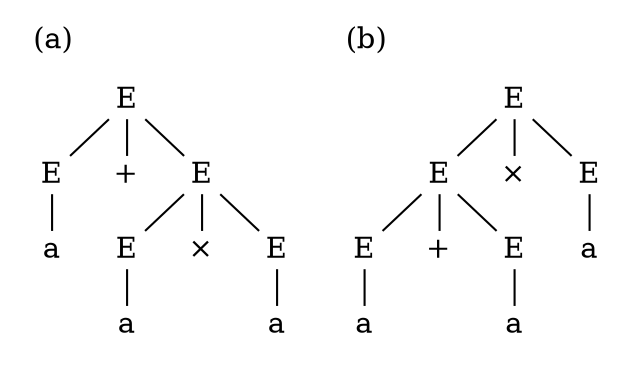

# Ambiguità

Una _CFG_ è **ambigua** sse esiste $w \in L(G)$ tale che $w$ ha almeno **due parse tree diversi**.

Per esempio, se $G$ è
$$
E \rightarrow E + E \mid E \times E \mid a
$$
allora $a + a \times a \in L(G)$ produce i seguenti parse tree:

Questo **non vale con derivazioni diverse**, perchè per esempio con $R = \{S \rightarrow AB, A \rightarrow 0, B \rightarrow 1\}$ si possono avere le derivazioni $AB \Rightarrow 0B \Rightarrow 01$ e $AB \Rightarrow A1 \Rightarrow 01$ ma la grammatica non è ambigua.
