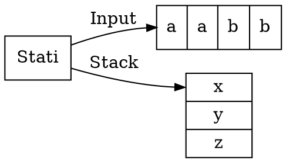

# Automi a pila

Un **automa a pila** (o _PDA_) è una **sestupla** $(Q, \Sigma, \Gamma, \delta, q_0, F)$ equivalente alle _CFG_ che sfrutta uno **stack**:

e i suoi componenti sono definiti come:
1. $Q$ è l'insieme degli **stati**
2. $\Sigma$ è l'**alfabeto dell'input**
3. $\Gamma$ è l'**alfabeto dello stack**
4. $\delta\colon Q \times \Sigma_\epsilon \times \Gamma_\epsilon \to P(Q \times \Gamma_\epsilon)$ è la **funzione di transizione**, con $\Sigma_\epsilon = \Sigma \cup \{\epsilon\}$ e $\Gamma_\epsilon = \Gamma \cup \{\epsilon\}$
5. $q_0 \in Q$ è lo **stato iniziale**
6. $F \subseteq Q$ è l'insieme degli **stati finali**
