# Automi a pila

Un **automa a pila** (o _PDA_) è una **sestupla** $(Q, \Sigma, \Gamma, \delta, q_0, F)$ equivalente alle _CFG_ che sfrutta uno **stack**:

e i suoi componenti sono definiti come:
1. $Q$ è l'insieme degli **stati**
2. $\Sigma$ è l'**alfabeto dell'input**
3. $\Gamma$ è l'**alfabeto dello stack**
4. $\delta\colon Q \times \Sigma_\epsilon \times \Gamma_\epsilon \to P(Q \times \Gamma_\epsilon)$ è la **funzione di transizione**, con $\Sigma_\epsilon = \Sigma \cup \{\epsilon\}$ e $\Gamma_\epsilon = \Gamma \cup \{\epsilon\}$
5. $q_0 \in Q$ è lo **stato iniziale**
6. $F \subseteq Q$ è l'insieme degli **stati finali**

Un _PDA_ **accetta** $w = w_1 w_2 \cdots w_m : w_i \in \Sigma_\epsilon$ se esistono $r_0, r_1, ..., r_m \in Q$ e $s_0, s_1, ..., s_m \in \Gamma^\ast$ per cui:
- $r_0 = q_0$ e $s_0 = \epsilon$: $M$ **comincia** dallo stato iniziale e con la pila $s_0$ vuota
- $r_m \in F$: alla **fine dell'input**, $M$ è su uno stato _accettante_
- $(r_{i+1}, b) \in \delta(r_i, w_{i+1}, a), \forall i = 0, ..., m-1$, con $s_i = at, s_{i+1} = bt$ per $a, b \in \Gamma_\epsilon$ e $t \in \Gamma^\ast$: il **prossimo** stato $r_{i+1}$ e pila $s_{i+1}$ sono determinati dallo stato $r_i$, l'input $w_{i+1}$ e la cima $a$ della pila $s_i$

Per esempio, l'automa che riconosce $\Set{0^n1^n | n \geq 0}$

```dot process
digraph {
	node [shape=circle]
	edge [arrowsize=0.8]

	q1 [label="q₁" shape=doublecircle]
	q2 [label="q₂"]
	q3 [label="q₃"]
	q4 [label="q₄" shape=doublecircle]
	_0 [shape=point width=0 height=inf style=invis]

	{
		rank=same
		_0 -> q1
		q1 -> q2 [label="𝜀,𝜀→$"]
	}
	q1 -> q4 [weight=100 style=invis]
	q2 -> q2 [label=" 0,𝜀→0"]
	q2 -> q3 [label=" 1,0→𝜀" weight=100]
	q3 -> q3 [label=" 1,0→𝜀"]
	{
		rank=same
		q4 -> q3 [dir=back label=" 𝜀,$→𝜀"]
	}
}
```

sarà rappresentato da $M = (Q, \Sigma, \Gamma, \delta, q_0, F)$, dove:
$$
\begin{split}
Q &= \{q_1, q_2, q_3, q_4\} \\
\Sigma &= \{0, 1\} \\
\Gamma &= \{0, \$\} \\
q_0 &= q_1 \\
F &= \{q_1, q_4\}
\end{split} \hspace{0.8em}\land\hspace{1em} \begin{cases}
\delta(q_1, \epsilon, \epsilon) = \{(q_2, \$)\} \\
\delta(q_2, 0, \epsilon) = \{(q_2, 0)\} \\
\delta(q_2, 1, 0) = \{(q_3, \epsilon)\} \\
\delta(q_3, 1, 0) = \{(q_3, \epsilon)\} \\
\delta(q_3, \epsilon, \$) = \{(q_4, \epsilon)\} \\
\end{cases}
$$

Un altro esempio è l'automa che riconosce $\Set{a^ib^jc^k | i,j,k \geq 0 \land i = j \lor i = k}$:

```dot process
digraph {
	rankdir=LR
	node [shape=circle label="" fixedsize=true width=0.4 height=0.4]
	edge [arrowsize=0.8]

	1
	2
	3
	4 [shape=doublecircle]
	5
	6
	7 [shape=doublecircle]
	_0 [shape=point width=0 height=inf style=invis]

	_0 -> 1
	1 -> 2 [label="𝜀,𝜀→$"]
	2 -> 2 [label="a,𝜀→a"]
	2 -> 3 [label="𝜀,𝜀→𝜀"]
	3 -> 3 [label="b,a→𝜀"]
	3 -> 4 [label="𝜀,$→𝜀"]
	4 -> 4 [label="c,𝜀→𝜀"]
	2 -> 5 [label="𝜀,𝜀→𝜀"]
	5 -> 5 [label="b,𝜀→𝜀"]
	5 -> 6 [label="𝜀,𝜀→𝜀"]
	6 -> 6 [label="c,a→𝜀"]
	6 -> 7 [label="𝜀,$→𝜀"]
}
```


## Equivalenza

Si può dimostrare che un linguaggio $A$ è context-free sse esiste un _PDA_ $P$ tale che $L(P) = A$, infatti:
1. **Condizione sufficiente** ($\Rightarrow$)

	Dato che $A$ è context-free esiste una _CFG_ $G$ che lo riconosce. Basterà quindi trasformare la _CFG_ in _PDA_:
	1. Inserire sullo stack prima $\$$ e poi $S$, ovvero lo _start symbol_
	2. Per ogni regola $A \rightarrow w$, alla lettura di $A$ sullo stack rimuovere $A$ e inserirci $w$
	3. Per ogni terminale $a$, alla lettura di $a$ sullo stack rimuovere $a$ mentre viene anche letto sull'input

	Per esempio, la _CFG_
	$$
	\begin{split}
	&S \rightarrow aTb \mid b \\
	&T \rightarrow Ta \mid \epsilon
	\end{split}
	$$
	si potrà convertire nel seguente _PDA_:
	```dot process
	digraph {
		ranksep=0.2
		node [shape=circle label="" fixedsize=true width=0.4 height=0.4]
		edge [arrowsize=0.8]

		qs [label="qₛ"]
		ql [label="qₗ"]
		qa [label="qₐ" shape=doublecircle]
		_0 [shape=point width=0 height=inf style=invis]

		{
			rank=same
			_0 -> qs
		}
		qs -> ql [taillabel="\n𝜀,𝜀→S$ "]
		ql -> ql [label=" 𝜀,S→aTb\l 𝜀,S→b\l 𝜀,T→Ta\l 𝜀,T→𝜀\l a,a→𝜀\l b,b→𝜀\l"]
		ql -> qa [taillabel="\n𝜀,$→𝜀 "]
	}
	```

2. **Condizione necessaria** ($\Leftarrow$)
