# Automi a pila

Un **automa a pila** (o _PDA_) è una **sestupla** $(Q, \Sigma, \Gamma, \delta, q_0, F)$ equivalente alle _CFG_ che sfrutta uno **stack**:

e i suoi componenti sono definiti come:
1. $Q$ è l'insieme degli **stati**
2. $\Sigma$ è l'**alfabeto dell'input**
3. $\Gamma$ è l'**alfabeto dello stack**
4. $\delta\colon Q \times \Sigma_\epsilon \times \Gamma_\epsilon \to P(Q \times \Gamma_\epsilon)$ è la **funzione di transizione**, con $\Sigma_\epsilon = \Sigma \cup \{\epsilon\}$ e $\Gamma_\epsilon = \Gamma \cup \{\epsilon\}$
5. $q_0 \in Q$ è lo **stato iniziale**
6. $F \subseteq Q$ è l'insieme degli **stati finali**

Un _PDA_ **accetta** $w = w_1 w_2 \cdots w_m : w_i \in \Sigma_\epsilon$ se esistono $r_0, r_1, ..., r_m \in Q$ e $s_0, s_1, ..., s_m \in \Gamma^\ast$ per cui:
- $r_0 = q_0$ e $s_0 = \epsilon$: $M$ **comincia** dallo stato iniziale e con la pila $s_0$ vuota
- $r_m \in F$: alla **fine dell'input**, $M$ è su uno stato _accettante_
- $(r_{i+1}, b) \in \delta(r_i, w_{i+1}, a), \forall i = 0, ..., m-1$, con $s_i = at, s_{i+1} = bt$ per $a, b \in \Gamma_\epsilon$ e $t \in \Gamma^\ast$: il **prossimo** stato $r_{i+1}$ e pila $s_{i+1}$ sono determinati dallo stato $r_i$, l'input $w_{i+1}$ e la cima $a$ della pila $s_i$

Per esempio, l'automa che riconosce $\Set{0^n1^n | n \geq 0}$

```dot process
digraph {
	node [shape=circle]
	edge [arrowsize=0.8]

	q1 [label="q₁" shape=doublecircle]
	q2 [label="q₂"]
	q3 [label="q₃"]
	q4 [label="q₄" shape=doublecircle]
	_0 [shape=point width=0 height=inf style=invis]

	{
		rank=same
		_0 -> q1
		q1 -> q2 [label="𝜀,𝜀→$"]
	}
	q1 -> q4 [weight=100 style=invis]
	q2 -> q2 [label=" 0,𝜀→0"]
	q2 -> q3 [label=" 1,0→𝜀" weight=100]
	q3 -> q3 [label=" 1,0→𝜀"]
	{
		rank=same
		q4 -> q3 [dir=back label=" 𝜀,$→𝜀"]
	}
}
```

sarà rappresentato da $M = (Q, \Sigma, \Gamma, \delta, q_0, F)$, dove:
$$
\begin{split}
Q &= \{q_1, q_2, q_3, q_4\} \\
\Sigma &= \{0, 1\} \\
\Gamma &= \{0, \$\} \\
q_0 &= q_1 \\
F &= \{q_1, q_4\}
\end{split} \hspace{0.8em}\land\hspace{1em} \begin{cases}
\delta(q_1, \epsilon, \epsilon) = \{(q_2, \$)\} \\
\delta(q_2, 0, \epsilon) = \{(q_2, 0)\} \\
\delta(q_2, 1, 0) = \{(q_3, \epsilon)\} \\
\delta(q_3, 1, 0) = \{(q_3, \epsilon)\} \\
\delta(q_3, \epsilon, \$) = \{(q_4, \epsilon)\} \\
\end{cases}
$$

Un altro esempio è l'automa che riconosce $\Set{a^ib^jc^k | i,j,k \geq 0 \land i = j \lor i = k}$:

```dot process
digraph {
	rankdir=LR
	node [shape=circle label="" fixedsize=true width=0.4 height=0.4]
	edge [arrowsize=0.8]

	1
	2
	3
	4 [shape=doublecircle]
	5
	6
	7 [shape=doublecircle]
	_0 [shape=point width=0 height=inf style=invis]

	_0 -> 1
	1 -> 2 [label="𝜀,𝜀→$"]
	2 -> 2 [label="a,𝜀→a"]
	2 -> 3 [label="𝜀,𝜀→𝜀"]
	3 -> 3 [label="b,a→𝜀"]
	3 -> 4 [label="𝜀,$→𝜀"]
	4 -> 4 [label="c,𝜀→𝜀"]
	2 -> 5 [label="𝜀,𝜀→𝜀"]
	5 -> 5 [label="b,𝜀→𝜀"]
	5 -> 6 [label="𝜀,𝜀→𝜀"]
	6 -> 6 [label="c,a→𝜀"]
	6 -> 7 [label="𝜀,$→𝜀"]
}
```


## Equivalenza

Si può dimostrare che un linguaggio $A$ è context-free sse esiste un _PDA_ $P$ tale che $L(P) = A$, infatti:
1. **Condizione sufficiente** ($\Rightarrow$)

	Dato che $A$ è context-free esiste una _CFG_ $G$ che lo riconosce. Basterà quindi trasformare la _CFG_ in _PDA_:
	1. Inserire sullo stack prima $\$$ e poi $S$, ovvero lo _start symbol_
	2. Per ogni regola $A \rightarrow w$, alla lettura di $A$ sullo stack rimuovere $A$ e inserirci $w$
	3. Per ogni _terminale_ $a$, alla lettura di $a$ sullo stack rimuovere $a$ mentre viene anche letto sull'input

	Per esempio, la _CFG_
	$$
	\begin{split}
	&S \rightarrow aTb \mid b \\
	&T \rightarrow Ta \mid \epsilon
	\end{split}
	$$
	si potrà convertire nel seguente _PDA_:
	```dot process
	digraph {
		ranksep=0.2
		node [shape=circle label="" fixedsize=true width=0.4 height=0.4]
		edge [arrowsize=0.8]

		qs [label="qₛ"]
		ql [label="qₗ"]
		qa [label="qₐ" shape=doublecircle]
		_0 [shape=point width=0 height=inf style=invis]

		{
			rank=same
			_0 -> qs
		}
		qs -> ql [taillabel="\n𝜀,𝜀→S$ "]
		ql -> ql [label=" 𝜀,S→aTb\l 𝜀,S→b\l 𝜀,T→Ta\l 𝜀,T→𝜀\l a,a→𝜀\l b,b→𝜀\l"]
		ql -> qa [taillabel="\n𝜀,$→𝜀 "]
	}
	```

2. **Condizione necessaria** ($\Leftarrow$)

	Per dimostrarlo si vuole **semplificare** $P$ in modo che:
	- Abbia un unico stato accettante $q_a$: con $\epsilon$-transizioni dagli stati finali a $q_a$
	- Svuoti lo stack prima di accettare: con $\epsilon,a \rightarrow \epsilon, \forall a \in \Gamma$ sullo stato finale
	- Inserisca o rimuova un simbolo sullo stack ad ogni transizione: sostituendo le transizioni $a,b \rightarrow c$ con $a,b \rightarrow \epsilon$ e $\epsilon,\epsilon \rightarrow c$, e le transizioni $a,\epsilon \rightarrow \epsilon$ con $a,\epsilon \rightarrow b$ e $\epsilon,b \rightarrow \epsilon$

	Sia quindi $P = (Q, \Sigma, \Gamma, \delta, q_0, \{q_a\})$, $\Set{A_{pq} | p, q \in Q}$ i _non-terminali_ e $A_{q_0,q_a}$ lo _start symbol_ di $G$:
	1. Per ogni $p, q, r, s \in Q$, $u \in \Gamma$ e $a, b \in \Sigma_\epsilon$ se $\delta(p, a, \epsilon)$ contiene $(r, u)$ e $\delta(s, b, u)$ contiene $(q, \epsilon)$, allora a $G$ viene aggiunta la regola $A_{pq} \rightarrow aA_{rs}b$
	2. Per ogni $p, q, r \in Q$ viene aggiunta la regola $A_{pq} \rightarrow A_{pr}A_{rq}$ a $G$
	3. Per ogni $p \in Q$ viene aggiunta la regola $A_{pp} \rightarrow \epsilon$ a $G$

	Il primo punto è il caso in cui per andare da $p$ a $q$ il primo simbolo aggiunto e l'ultimo rimosso dallo stack è lo stesso, mentre il secondo è il caso in cui il simbolo viene rimosso prima di arrivare a $q$.

	Si può quindi dimostrare che $A_{pq} \Rightarrow^\ast x$ sse $x$ porta $P$ da $p$ con lo stack vuoto a $q$ con lo stack vuoto:
	1. **Condizione sufficiente** ($\Rightarrow$), per induzione sul numero di passi di derivazione:

		- **Caso base** con $1$ passo, ovvero senza _non-terminali_: usa $A_{pp} \rightarrow \epsilon$ che non tocca lo stack
		- **Passo induttivo** con $k+1$ passi, assumendo che valga fino a $k \geq 1$:

			Il primo passo può essere $A_{pq} \Rightarrow aA_{rs}b$ oppure $A_{pq} \Rightarrow A_{pr}A_{rq}$.

			Nel primo caso, con $x = ayb$, si ha che $A_{rs} \Rightarrow^\ast y$ in $k$ passi, quindi per ipotesi induttiva parte da $r$ e arriva a $s$ con lo stack uguale. Essendo una regola di $G$, da $p$ a $r$ aggiunge $u$ sullo stack e da $s$ a $q$ lo rimuove, verificando la proprietà.

			Nel secondo caso, con $x = yz$, si ha che $A_{pr} \Rightarrow^\ast y$ e $A_{rq} \Rightarrow^\ast z$, entrambe fino a $k$ passi.
			Per ipotesi induttiva lo stack ritorna vuoto da $p$ a $r$ e da $r$ a $q$, verificando la proprietà.

	2. **Condizione necessaria** ($\Leftarrow$), per induzione sul numero di passi della computazione di $P$ da $p$ a $q$:
		- **Caso base** con $0$ passi: va da un $p$ a $p$ senza leggere nulla, quindi $x = \epsilon$ e infatti $A_{pp} \Rightarrow \epsilon$
		- **Passo induttivo** con $k+1$ passi, assumendo che valga fino a $k \geq 1$:

			I $k+1$ passi per $x$ da $p$ a $q$ hanno lo stack vuoto all'inizio e alla fine oppure anche altrove.

			Nel primo caso, lo stesso simbolo $u$ va inserito leggendo $a$ da $p$ ad uno stato $r$ e rimosso leggendo $b$ da uno stato $s$ a $q$, quindi $A_{pq} \Rightarrow aA_{rs}b$. Ci sono $k-1$ passi da $r$ a $s$ quindi, dato $x = ayb$, per ipotesi induttiva $A_{rs} \Rightarrow^\ast y$ e allora $A_{pq} \Rightarrow^\ast ayb = x$.

			Nel secondo caso lo stack si svuota anche su $r$ quindi da $p$ a $r$ e da $r$ a $q$ sono al più $k$ passi, per cui, dato $x = yz$, per ipotesi induttiva $A_{pr} \Rightarrow^\ast y$ e $A_{rq} \Rightarrow^\ast z$ e allora $A_{pq} \Rightarrow^\ast yz = x$.
