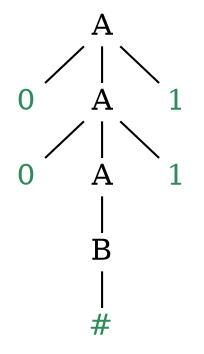

# Linguaggi context-free

Una **grammatica non contestuale** (o _CFG_) $G$ è una **quadrupla** $(V, \Sigma, R, S)$, dove:
1. $V$ è l'insieme finito dei **non-terminali** (o variabili)
2. $\Sigma$ è l'insieme finito di **terminali**, per cui $V \cap \Sigma = \emptyset$
3. $R$ è l'insieme finito di **regole** della forma $A \rightarrow w$, dove $A \in V$ e $w \in (V \cup \Sigma)^\ast$
4. $S \in V$ è lo **start symbol**

Dati $u, v, w \in (V \cup \Sigma)^\ast$ e $A \rightarrow w \in R$, si dice **produce** la relazione $uAv \Rightarrow uwv$ e si dice **deriva** la relazione $u \Rightarrow^\ast v$ se $u = v$ o esiste una sequenza $u_1, ..., u_k$ con $k \geq 0$ tale che $u \Rightarrow u_1 \Rightarrow ... \Rightarrow u_k \Rightarrow v$.

Inoltre, un linguaggio $A$ è **context-free** se esiste una _CFG_ $G$ tale che $L(G) = \Set{w \in \Sigma^\ast | S \Rightarrow^\ast w} = A$.

Per esempio, con
$$
\begin{split}
&A \rightarrow 0A1 \mid B \\
&B \rightarrow \#
\end{split}
$$
si ottiene $G = (\{A, B\}, \{0, 1, \#\}, \{A \rightarrow 0A1, A \rightarrow B, B \rightarrow \#\}, A)$ e per esempio $A \Rightarrow^\ast 00\#11$ perchè $A \Rightarrow 0A1 \Rightarrow 00A11 \Rightarrow 00B11 \Rightarrow 00\#11$, che si può rappresentare con un **parse tree**:

la cui **frontiera** rappresenta la stringa generata.
