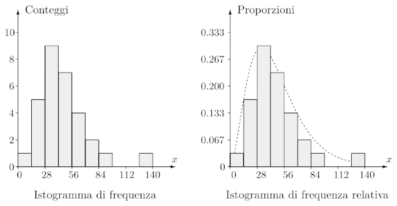
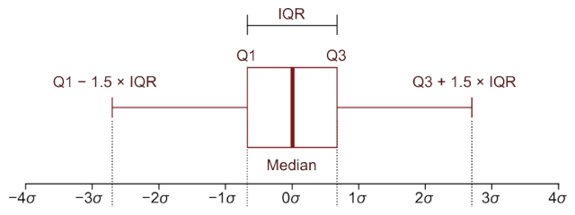
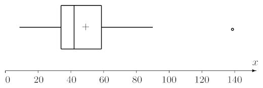
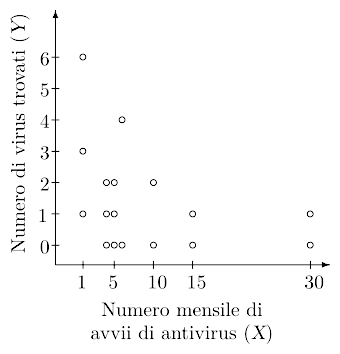

# Analisi grafiche

Attraverso i **grafici** si possono ricavare **modelli** probabilistici e statistici sui dati e osservazioni **anomale**.

Come esempio, si considera il campione [precedente](../01/README.md).

## Istogrammi

Gli **istogrammi** permettono di visualizzare la **forma di distribuzione**, dividendo il **range** dei dati nelle ascisse in intervalli chiamati **bins** e rappresentando nelle ordinate il valore della:
- **Frequenza**: il numero di osservazioni che appartengono ad ogni _bin_
- **Frequenza relativa**: la percentuale di osservazioni in ogni _bin_

Nell'esempio, usando intervalli larghi $14$:

## Grafici a scatola

I **grafici a scatola**, o _boxplot_, visualizzano la _stima_ delle _posizioni_ e della _variabilità_ della _popolazione_:

Nell'esempio, con la media rappresentata da una $+$, si può notare il _valore anomalo_ $139$:

## Grafici a dispersione

I **grafici a dispersione** servono a comprendere la relazione tra due variabili.

Se ci sono più valori sullo stesso $(x, y)$ si tende a spostarli leggermente, in modo che non si sovrappongano.

Per esempio, senza spostarli:

