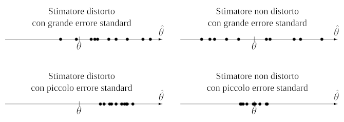

# Concetti

Si dice **popolazione** l'insieme delle unità di interesse.
Osservandole per intero, processo detto **censimento**, si possono trovare delle caratteristiche numeriche $\theta$ associate, chiamate **parametri**.

In alternativa si può cercare la **stima** $\hat\theta$ attraverso una **statistica**, ovvero una funzione applicata ad un sottoinsieme della _popolazione_ detto **campione**, definita anche **stimatore** perchè stima il valore di $\theta$.

L'errore fra $\hat\theta$ e $\theta$ può dipendere da **errori campionari** inevitabili, dovuti dalla dimensione del _campione_, o da **errori non campionari** evitabili, dovuti dall'uso di un _campione_ o di uno _stimatore_ inappropriato.

Per evitare gli _errori non campionari_ si può effettuare un **campionamento casuale semplice**, estraendo le unità dalla _popolazione_ in maniera **casuale** e **indipendente**, risultando in osservazioni che sono [variabili casuali](../../ct0111/03/README.md) **indipendenti e identicamente distribuite** (_i.i.d._), cioè [indipendenti](../../ct0111/02/README.md#eventi-indipendenti) e aventi la stessa distribuzione.

Le **statistiche campionarie** sono una variabile casuale quando calcolate su un _campione casuale_ e stimano un _parametro_ di _popolazione_ come **media**, **mediana**, **quantili**, **varianza**, etc.

## Distorsione

Uno _stimatore_, anch'esso indicato da $\hat\theta$, si dice **non distorto** se:
$$
E(\hat\theta) = \theta, \forall\theta
$$
altrimenti la sua **distorsione** si può ricavare con $\mathrm{Bias}(\hat\theta) = E(\hat\theta) - \theta$.

## Consistenza

Uno _stimatore_ su un _campione_ grande $n$ si dice **consistente** se[^1]:
$$
\hat\theta \overset{p}{\rightarrow} \theta \Leftrightarrow \lim_{n \to \infty} \mathrm{Bias}(\hat\theta) = \lim_{n \to \infty} \mathrm{Var}(\hat\theta) = 0
$$
ovvero se almeno **asintoticamente** per $n$ la _distorsione_ e la _varianza_ convergono a zero.

## Normalità asintotica

Uno _stimatore_ è **asintoticamente normale** se al crescere di $n$ approssima la _distribuzione normale_, cioè[^2]:
$$
\hat\theta \overset{d}{\rightarrow} N(E(\hat\theta), \mathrm{Var}(\hat\theta))
$$

## Trasformazioni

- $X \overset{p}{\rightarrow} \theta \Rightarrow g(X) \overset{p}{\rightarrow} g(\theta)$ sse $g$ è continua
- $X \overset{d}{\rightarrow} N(\mu, \sigma^2) \Rightarrow g(X) \overset{d}{\rightarrow} N(g(\mu), g'(\mu)^2 \sigma^2)$ sse $g'(\mu) \neq 0$

## Errore standard

Assieme allo _stimatore_ si considera anche un suo **indice di qualità**, cioè il suo **errore standard**:
$$
\mathrm{SE}(\hat\theta) = SD(\hat\theta)
$$
dove $\mathrm{SD}(\hat\theta)$ è la _deviazione standard_ di $\hat\theta$, così che sia esplicito quanto **varia** al cambiare del _campione_.

L'effetto che ha si può notare da:

## Precisione e accuratezza

Uno _stimatore_ si dice che ha più **precisione** quando è **meno variabile**, e si dice che ha più **accuratezza** quando è **meno distorto**.
Entrambe le proprietà sono rappresentate dall'**errore quadratico medio**:
$$
\mathrm{MSE}(\hat\theta) = E(\hat\theta - \theta)^2 = \mathrm{Var}(\hat\theta) + \mathrm{Bias}(\hat\theta)^2
$$

Di conseguenza, se due _stimatori_ sono _non distorti_ si preferisce quello con _varianza_ inferiore, altrimenti se anche uno o entrambi sono _distorti_ si sceglie quello con l'_errore quadratico medio_ minore.

[^1]: [Convergenza in probabilità](https://it.wikipedia.org/wiki/Convergenza_di_variabili_casuali#Convergenza_in_probabilit%C3%A0)

[^2]: [Convergenza in distribuzione](https://it.wikipedia.org/wiki/Convergenza_di_variabili_casuali?useskin=vector#Convergenza_in_distribuzione)
